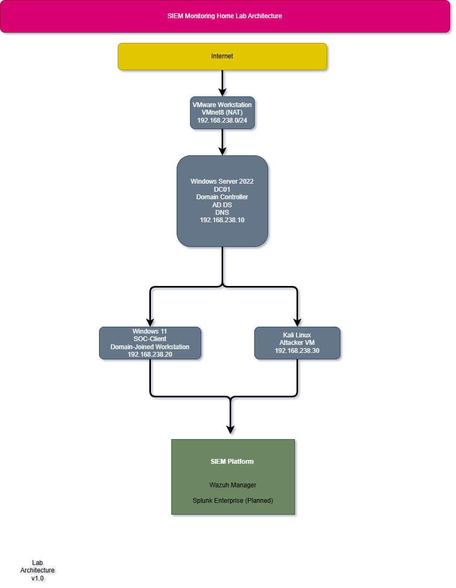

# SIEM Monitoring Home Lab

## Project Overview

This project demonstrates the design, deployment, and validation of an enterprise-style Security Information and Event Management (SIEM) home lab. The environment simulates a Windows enterprise network by integrating Active Directory, Group Policy, Sysmon endpoint telemetry, and a native Wazuh SIEM deployment to collect, analyze, and validate security events. 

The project is currently transitioning from infrastructure deployment to adversary simulation, detection engineering, and threat hunting using realistic attack scenarios.

Unlike installation tutorials, this repository documents an end-to-end enterprise security lab built incrementally, including deployment decisions, validation procedures, troubleshooting, and detection engineering.

## Lab Architecture

  

Enterprise Active Directory environment integrated with a native Wazuh SIEM deployment.

## Technologies

- VMware Workstation Pro
- Windows Server 2022
- Windows 11
- Kali Linux
- Active Directory Domain Services (AD DS)
- DNS
- PowerShell
- Sysmon
- Wazuh

## Project Progress

- [x] Lab planning and architecture design
- [x] VMware Workstation environment
- [x] Windows Server 2022 installation
- [x] Network configuration and troubleshooting
- [x] Active Directory Domain Services (AD DS) deployment
- [x] Domain Controller promotion
- [x] DNS installation and integration
- [x] Organizational Unit (OU) design
- [x] User and Security Group management
- [x] Windows 11 workstation deployment and domain join
- [x] Group Policy configuration
- [x] Sysmon deployment
- [x] Wazuh SIEM deployment
- [x] Wazuh agent deployment
- [ ] Attack simulation (in progress)
- [ ] Detection engineering and analysis (planned)

## Lab Components

The home lab consists of:

- Windows Server 2022 (Domain Controller)
- Windows 11 Client
- Kali Linux Attacker Machine
- Wazuh SIEM Server
- VMware Workstation Pro virtual network

## 📚 Documentation

The lab is documented step by step, covering the complete deployment process from infrastructure planning to security monitoring. Each document includes configuration details, screenshots, validation steps, and troubleshooting notes where applicable.

| Step | Documentation | Description |
|------|---------------|-------------|
| 01 | [Lab Planning](docs/01-Lab-Planning.md) | Define the project scope, objectives, and lab architecture. |
| 02 | [VMware Setup](docs/02-VMware-Setup.md) | Create the virtual networking environment and virtual machines. |
| 03 | [Windows Server Installation](docs/03-Windows-Server-Installation.md) | Install Windows Server 2022 and perform the initial system configuration. |
| 04 | [Network Configuration and VMware Troubleshooting](docs/04-Network-Configuration-and-Troubleshooting.md) | Configure networking, troubleshoot connectivity issues, and validate VMware NAT functionality. |
| 05 | [Active Directory Domain Services (AD DS) Installation](docs/05-Active-Directory-Domain-Services-Installation.md) | Install the AD DS role, create the first forest, and promote the server to a Domain Controller. |
| 06 | [Organizational Units and User Management](docs/06-Organizational-Units-and-User-Management.md) | Design the Active Directory OU structure, create users and security groups, and implement role-based access control (RBAC). |
| 07 | [Workstation Deployment and Domain Join](docs/07-Workstation-Deployment-and-Domain-Join.md) | Deploy a Windows 11 Pro workstation, configure networking, install VMware Tools, join the workstation to the Active Directory domain, and organize the computer object within the Workstations OU. |
| 08 | [Group Policy Configuration](docs/08-Group-Policy-Configuration.md) | Configure enterprise audit policies, enable command-line process logging, and validate Windows Security Event ID 4688 generation. |
| 09 | [Endpoint Telemetry with Sysmon](docs/09-Sysmon-Deployment.md) | Deploy Sysmon on the Domain Controller and Windows 11 client, validate endpoint telemetry, and confirm dynamic configuration updates. |
| 10 | [Wazuh SIEM Deployment](docs/10-Wazuh-SIEM-Deployment.md) | Deploy the Wazuh SIEM platform using a native Ubuntu installation, configure secure TLS communication, integrate the Indexer, Manager, Filebeat, and Dashboard, validate the complete event pipeline, and document troubleshooting throughout the deployment. |
| 11 | [Wazuh Agent Deployment](docs/11-Wazuh-Agent-Deployment.md) | Deploy and register Wazuh agents on the Domain Controller and Windows 11 client, validate endpoint communication, troubleshoot Sysmon telemetry ingestion, and confirm successful event collection across both endpoints. |
| 12 | *Coming Soon* | Attack Simulation and Detection Engineering |

---

## Skills Demonstrated

- Active Directory Administration
- Windows Server Administration
- DNS Configuration
- Virtualization
- Network Configuration
- Security Monitoring
- SIEM Deployment
- Windows Event Logging
- Documentation
- Git & GitHub

## Disclaimer

This lab is built for educational purposes only. All attacks, detections, and security testing are performed in an isolated virtual environment.