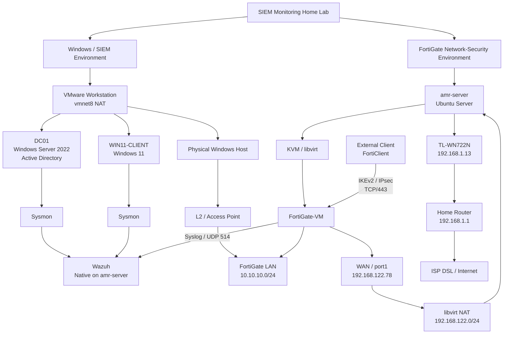

# SIEM Monitoring Home Lab

## Project Overview

The **SIEM Monitoring Home Lab** is an evolving security lab built to simulate and investigate security activity across enterprise-style Windows infrastructure, endpoint telemetry, SIEM monitoring, adversary simulation, and network security controls.

The project was built incrementally rather than as a single deployment. The initial environment focused on establishing a Windows enterprise foundation with Active Directory, DNS, Group Policy, Sysmon, and Wazuh. Controlled attack simulation was then introduced to generate security telemetry and validate visibility across the endpoint and SIEM layers.

The environment has since been expanded with a virtualized FortiGate network-security layer running on an Ubuntu Server host using KVM/libvirt. The FortiGate provides the network edge for the dedicated lab network and has been extended with a remote-access IKEv2/IPsec VPN over TCP/443.

The current lab therefore combines **identity, endpoint, SIEM, adversary simulation, and network-security capabilities**, with FortiGate telemetry integrated into Wazuh. Further telemetry correlation and security-operations workflows remain planned.

---

## Current Architecture

```mermaid
flowchart TB
    LAB[SIEM Monitoring Home Lab]

    LAB --> WINENV[Windows / SIEM Environment]
    LAB --> FGENV[FortiGate Network-Security Environment]

    %% Windows / SIEM environment
    WINENV --> VMWARE[VMware Workstation<br/>vmnet8 NAT]

    VMWARE --> DC[DC01<br/>Windows Server 2022<br/>Active Directory]
    VMWARE --> WIN11[WIN11-CLIENT<br/>Windows 11]

    DC --> SYS1[Sysmon]
    WIN11 --> SYS2[Sysmon]

    SYS1 --> WAZUH[Wazuh<br/>Native on amr-server]
    SYS2 --> WAZUH

    VMWARE --> WINHOST[Physical Windows Host]
    WINHOST --> AP[L2 / Access Point]
    AP --> FGLAN[FortiGate LAN<br/>10.10.10.0/24]

    %% FortiGate / KVM / WAN
    FGENV --> UBUNTU[amr-server<br/>Ubuntu Server]
    UBUNTU --> KVM[KVM / libvirt]
    KVM --> FGT[FortiGate-VM]

    FGT --> FGLAN
    FGT --> WAN[WAN / port1<br/>192.168.122.78]

    WAN --> LIBVIRT[libvirt NAT<br/>192.168.122.0/24]
    LIBVIRT --> UBUNTU

    UBUNTU --> WIFI[TL-WN722N<br/>192.168.1.13]
    WIFI --> ROUTER[Home Router<br/>192.168.1.1]
    ROUTER --> ISP[ISP DSL / Internet]

    %% Remote access VPN
    REMOTE[External Client<br/>FortiClient]
    REMOTE -->|IKEv2 / IPsec<br/>TCP/443| FGT

        %% FortiGate → Wazuh Syslog integration
    FGT -->|Syslog / UDP 514| WAZUH
```

> **Current-state note:** Solid paths represent currently implemented components and relationships. The FortiGate → Wazuh Syslog path is operational and has been validated through network transport, Wazuh ingestion, native FortiGate decoding, and rule processing. Planned work remains focused on broader telemetry correlation and detection engineering.

For the detailed architecture, network boundaries, implementation status, and telemetry integration, see [Current Lab Architecture](docs/00-Current-Lab-Architecture.md).

---

## Project Scope

The lab is being developed around several complementary security capabilities:

- **Enterprise Windows Infrastructure** — Windows Server, Active Directory, DNS, Group Policy, and Windows 11.
- **Endpoint Telemetry** — Windows Security auditing and Sysmon.
- **SIEM Monitoring** — Native Wazuh deployment with endpoint agents and centralized event collection.
- **Adversary Simulation** — Controlled security testing using Atomic Red Team techniques.
- **Network Security** — FortiGate virtual firewall providing routing, firewall enforcement, network-edge control, and remote-access VPN capability.
- **Security Operations** — Centralized endpoint and FortiGate network telemetry through Wazuh, with correlation, detection engineering, and threat-hunting workflows forming the next development stage.

The project intentionally documents both successful implementation and troubleshooting. Configuration decisions, validation evidence, and implementation problems are retained where they provide useful technical context.

---

## Project Evolution

The lab has developed through several implementation stages:

### 1. Core Infrastructure

The project began with the design and deployment of the virtualization environment and Windows Server infrastructure.

### 2. Enterprise Windows Environment

Active Directory, DNS, organizational structure, user management, Group Policy, and the Windows 11 workstation were introduced to create the enterprise-style Windows foundation.

### 3. Endpoint Visibility

Sysmon and Windows auditing were configured to generate detailed endpoint telemetry.

### 4. SIEM Deployment

Wazuh was deployed natively on the Ubuntu `amr-server` host, followed by Wazuh agents on the Windows endpoints.

### 5. Security Validation

Atomic Red Team techniques were used to generate controlled security activity and validate endpoint telemetry and SIEM visibility.

### 6. Network Security Expansion

A FortiGate virtual firewall was introduced using KVM/libvirt on the Ubuntu host. The FortiGate provides the network edge for the dedicated lab network.

### 7. Remote Access

The FortiGate environment was extended with an IKEv2/IPsec remote-access VPN over TCP/443 and validated using FortiClient and FortiGate-side diagnostics.

### 8. FortiGate → Wazuh Integration

FortiGate Syslog forwarding was integrated with the existing Wazuh Manager using UDP/514. The integration was validated at the configuration, network transport, ingestion, decoding, and detection layers using the native FortiGate Wazuh decoders and rules.

### 9. Detection and Security Operations Expansion

The next stage focuses on correlating FortiGate network telemetry with existing Windows endpoint telemetry, expanding detection coverage, developing threat-hunting workflows, and building incident investigation scenarios.

---

## Technology Stack

### Infrastructure & Virtualization

- Ubuntu Server — `amr-server` host
- VMware Workstation Pro — Windows lab virtualization
- KVM / libvirt — FortiGate virtualization

### Windows & Identity

- Windows Server 2022
- Windows 11 Pro
- Active Directory Domain Services (AD DS)
- DNS
- Group Policy
- PowerShell

### Endpoint Security & Telemetry

- Sysmon
- Windows Security Event Logging
- Wazuh Agents

### SIEM

- Wazuh Manager
- Wazuh Indexer
- Filebeat
- Wazuh Dashboard

### Network Security

- FortiGate-VM
- FortiOS
- Firewall policies
- Static routing
- DHCP
- IKEv2 / IPsec Remote-Access VPN
- IPsec over TCP/443
- Syslog
- UDP/514

### Security Testing

- Atomic Red Team
- MITRE ATT&CK techniques

---

## Implementation Progress

### Core Infrastructure

- [x] Lab planning and architecture design
- [x] VMware Workstation environment
- [x] Windows Server 2022 installation
- [x] Network configuration and troubleshooting

### Windows Enterprise Environment

- [x] Active Directory Domain Services (AD DS)
- [x] Domain Controller promotion
- [x] DNS installation and integration
- [x] Organizational Unit (OU) design
- [x] User and Security Group management
- [x] Windows 11 workstation deployment
- [x] Active Directory domain join
- [x] Group Policy configuration

### Endpoint Telemetry

- [x] Sysmon deployment
- [x] Windows Security auditing
- [x] Wazuh agent deployment
- [x] Endpoint telemetry validation

### SIEM

- [x] Native Wazuh deployment on Ubuntu
- [x] Wazuh Manager configuration
- [x] Wazuh Indexer configuration
- [x] Filebeat integration
- [x] Wazuh Dashboard
- [x] Windows endpoint integration
- [x] Event collection validation

### Security Validation

- [x] Atomic Red Team attack simulation
- [x] Endpoint telemetry validation
- [x] SIEM visibility validation

### Network Security

- [x] FortiGate-VM deployment
- [x] KVM/libvirt integration
- [x] FortiGate WAN/LAN configuration
- [x] Routing configuration
- [x] DHCP configuration
- [x] Dedicated lab network
- [x] FortiGate network edge implementation
- [x] Remote-access VPN
- [x] IKEv2/IPsec over TCP/443
- [x] FortiClient VPN validation
- [x] IKE/IPsec Security Association validation
- [x] Active tunnel and traffic validation
- [x] Wazuh Syslog receiver configuration
- [x] FortiGate Syslog forwarding
- [x] FortiGate → Wazuh UDP/514 transport validation
- [x] Native FortiGate log decoding
- [x] FortiGate-specific Wazuh rule validation

### Planned

- [ ] Network and endpoint telemetry correlation
- [ ] Detection engineering
- [ ] Threat hunting workflows
- [ ] Incident investigation scenarios
- [ ] Additional attacker infrastructure

---

## Current Lab Components

| Component | Role | Platform / Location | Current State |
|---|---|---|---|
| `amr-server` | Physical virtualization and SIEM host | Ubuntu Server | Active |
| Wazuh | SIEM and centralized security monitoring | Native on `amr-server` | Active |
| FortiGate-VM | Network security gateway, routing, firewall, and remote-access VPN | KVM/libvirt on `amr-server` | Active |
| DC01 | Domain Controller, AD DS, and DNS | Windows Server 2022 / VMware | Active |
| WIN11-CLIENT | Domain workstation and endpoint telemetry source | Windows 11 / VMware | Active |
| Sysmon | Endpoint telemetry collection | DC01 and WIN11-CLIENT | Active |
| Wazuh Agents | Endpoint log forwarding | DC01 and WIN11-CLIENT | Active |
| VMware Workstation | Windows VM virtualization and virtual networking | Windows host | Active |
| KVM / libvirt | FortiGate virtualization and WAN-side NAT networking | `amr-server` | Active |
| FortiClient | Remote-access VPN client | External client | Used for VPN validation |
| Atomic Red Team | Controlled adversary simulation | Windows lab | Used for security validation |
| Kali Linux | Planned attacker platform | Not currently deployed | Planned |

---

## Documentation

The documentation follows the implementation history of the lab. Documents `01–12` cover the original Windows/SIEM build, while `13–16` document the subsequent network-security expansion and FortiGate-to-Wazuh telemetry integration.

### Architecture

| # | Documentation | Description |
|---|---|---|
| 00 | [Current Lab Architecture](docs/00-Current-Lab-Architecture.md) | Current-state architecture, network boundaries, implemented components, and telemetry integration status. |

### Core Infrastructure

| # | Documentation | Description |
|---|---|---|
| 01 | [Lab Planning](docs/01-Lab-Planning.md) | Define the project scope, objectives, and initial lab architecture. |
| 02 | [VMware Setup](docs/02-VMware-Setup.md) | Create the virtualization environment, virtual networking, and lab VMs. |
| 03 | [Windows Server Installation](docs/03-Windows-Server-Installation.md) | Install and initially configure Windows Server 2022. |
| 04 | [Network Configuration and VMware Troubleshooting](docs/04-Network-Configuration-and-Troubleshooting.md) | Configure networking, troubleshoot connectivity, and validate VMware NAT functionality. |

### Windows Enterprise Environment

| # | Documentation | Description |
|---|---|---|
| 05 | [Active Directory Domain Services](docs/05-Active-Directory-Domain-Services-Installation.md) | Install AD DS, create the forest, and promote the Domain Controller. |
| 06 | [Organizational Units and User Management](docs/06-Organizational-Units-and-User-Management.md) | Design OUs and configure users, groups, and access structure. |
| 07 | [Workstation Deployment and Domain Join](docs/07-Workstation-Deployment-and-Domain-Join.md) | Deploy the Windows 11 workstation and join it to the domain. |
| 08 | [Group Policy Configuration](docs/08-Group-Policy-Configuration.md) | Configure enterprise audit policies and validate Windows security event generation. |

### Endpoint Telemetry

| # | Documentation | Description |
|---|---|---|
| 09 | [Endpoint Telemetry with Sysmon](docs/09-Sysmon-Deployment.md) | Deploy Sysmon and validate endpoint telemetry across the Windows environment. |

### SIEM

| # | Documentation | Description |
|---|---|---|
| 10 | [Wazuh SIEM Deployment](docs/10-Wazuh-SIEM-Deployment.md) | Deploy and validate the native Wazuh platform on Ubuntu. |
| 11 | [Wazuh Agent Deployment](docs/11-Wazuh-Agent-Deployment.md) | Deploy Wazuh agents and validate endpoint event collection. |

### Security Validation

| # | Documentation | Description |
|---|---|---|
| 12 | [Attack Simulation](docs/12-Attack-Simulation.md) | Execute controlled Atomic Red Team techniques and validate endpoint/SIEM visibility. |

### Network Security

| # | Documentation | Description |
|---|---|---|
| 13 | [FortiGate Network Edge](docs/13-fortigate-network-edge.md) | Deploy the FortiGate VM, configure the WAN/LAN edge, routing, DHCP, and dedicated lab network. |
| 14 | [FortiGate Remote Access VPN](docs/14-FortiGate-Remote-Access-VPN.md) | Implement and validate IKEv2/IPsec remote access over TCP/443 using FortiClient. |
| 15 | [Wazuh Dashboard Port Migration](docs/15-Wazuh-Dashboard-Port-Migration.md) | Migrate the Wazuh Dashboard HTTPS listener from TCP/443 to TCP/8443 to resolve the port conflict introduced by the FortiGate VPN forwarding path. |
| 16 | [FortiGate → Wazuh Integration](docs/16-FortiGate-Wazuh-Integration.md) | Integrate FortiGate Syslog with Wazuh over UDP/514 and validate transport, ingestion, native decoding, and FortiGate-specific rule processing. |

---

## Current State & Roadmap

The core Windows/SIEM environment and FortiGate network-security layer are operational. Remote-access VPN functionality has been implemented and validated, and the FortiGate has been integrated with Wazuh using Syslog over UDP/514.

The next stages focus on correlating FortiGate network telemetry with endpoint telemetry and expanding the lab toward detection engineering, threat hunting, and security-operations workflows.

### Next Engineering Objectives

- [x] Integrate FortiGate security telemetry with Wazuh.
- [x] Validate FortiGate log ingestion and parsing.
- [ ] Correlate network and endpoint telemetry.
- [ ] Develop custom detection logic and rules.
- [ ] Build investigation and threat-hunting scenarios.
- [ ] Perform incident investigation using correlated telemetry.
- [ ] Expand adversary simulation scenarios.
- [ ] Deploy additional attacker infrastructure, including Kali Linux, when required.

> **Current architecture boundary:** The Windows endpoints, Wazuh SIEM, and FortiGate network-security layer are operational components of the lab. FortiGate security telemetry is now forwarded to Wazuh over Syslog/UDP 514 and has been validated through transport, ingestion, native decoding, and rule processing. The next development stage is focused on correlating network and endpoint telemetry and building broader detection and investigation workflows.

---

## Skills Demonstrated

### Infrastructure

- Virtualization
- Linux administration
- VMware Workstation
- KVM/libvirt

### Windows & Identity

- Windows Server administration
- Active Directory
- DNS
- Group Policy
- Windows endpoint administration

### Security Monitoring

- Windows Event Logging
- Sysmon
- Wazuh
- SIEM deployment
- Endpoint telemetry collection
- Security event validation
- Syslog ingestion
- Log parsing and decoding
- FortiGate SIEM integration

### Network Security

- Network segmentation
- Routing
- Firewall configuration
- DHCP
- FortiGate administration
- IPsec VPN
- IKEv2
- IPsec over TCP/443
- Network telemetry forwarding

### Security Testing

- Atomic Red Team
- MITRE ATT&CK
- Controlled adversary simulation
- Security telemetry validation

### Engineering & Documentation

- Troubleshooting
- Evidence-based validation
- Git
- GitHub
- Technical documentation
- Infrastructure planning

---

## Disclaimer

This lab is built for educational and defensive security research purposes. All testing and adversary simulation are performed within the user's controlled lab environment.