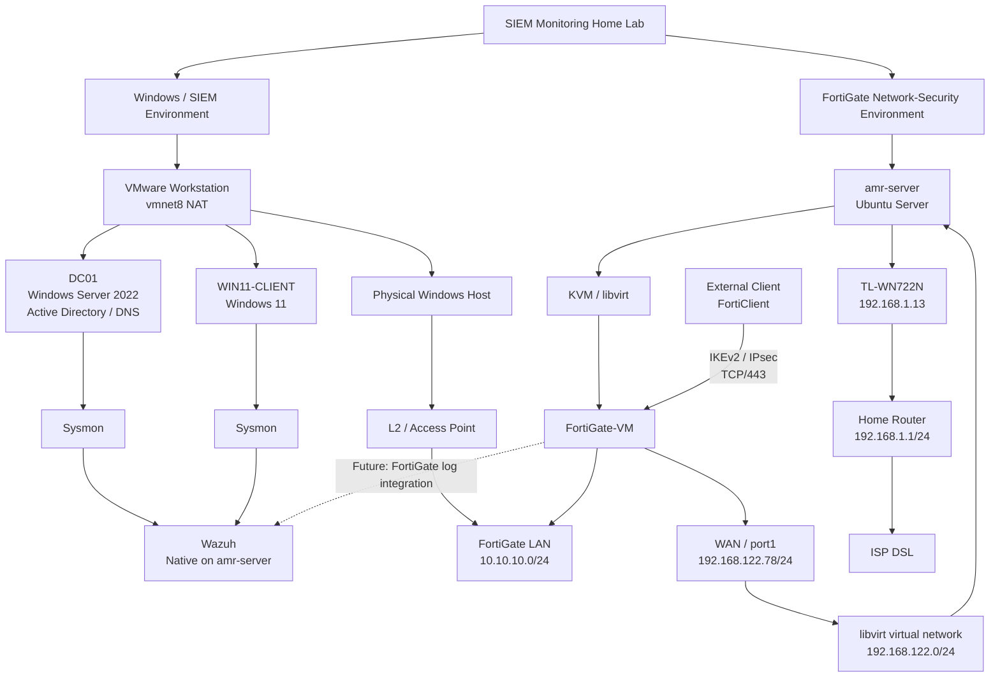

# 00 - Current Lab Architecture

## 1. Overview

The **SIEM Monitoring Home Lab** is an evolving security environment designed to combine enterprise Windows infrastructure, endpoint telemetry, SIEM monitoring, controlled attack simulation, and network security technologies.

The project was initially developed around a VMware Workstation environment containing the Windows infrastructure and Wazuh monitoring components. The environment has since been expanded with a FortiGate-VM deployed using KVM/libvirt to introduce a dedicated network-security layer.

At the current stage of the project, the Windows/SIEM environment can reach the FortiGate-controlled lab network through the VMware virtual networking/NAT layer and the physical network path.

DC01 and WIN11-CLIENT remain VMware virtual machines behind the VMware `vmnet8` NAT layer. Their traffic reaches the FortiGate LAN through the following path:

```text
DC01 / WIN11-CLIENT
        |
        v
VMware vmnet8 NAT
        |
        v
Physical Windows Host
        |
        v
L2 / Access Point
        |
        v
FortiGate LAN
10.10.10.0/24
```

The FortiGate WAN uses a separate libvirt virtual network hosted on the Ubuntu server `amr-server`:

```text
FortiGate WAN
192.168.122.78
        |
        v
libvirt virtual network
192.168.122.0/24
        |
        v
Native Ubuntu Server
amr-server
        |
        v
TL-WN722N
192.168.1.13
        |
        v
Home Router
192.168.1.1/24
        |
        v
ISP DSL
```

The Windows VMs are therefore part of the FortiGate network path, but they are **not individually addressed or directly attached to the FortiGate `10.10.10.0/24` LAN**.

This document describes the current architecture and explicitly distinguishes implemented components from planned future integration.

---

## 2. Current Architecture

The current environment consists of two major implementation areas:

1. The existing VMware-based Windows/SIEM environment.

2. The newly implemented FortiGate network-security environment hosted on `amr-server`.

### Existing Windows/SIEM Environment

The original lab environment was developed using VMware Workstation.

The currently documented Windows infrastructure consists of:

- **DC01** — Windows Server 2022 / Active Directory Domain Controller

- **WIN11-CLIENT** — Windows 11 domain workstation

- **Sysmon** — endpoint telemetry

- **Wazuh** — SIEM and security monitoring

DC01 and WIN11-CLIENT remain VMware virtual machines behind the VMware `vmnet8` NAT layer.

The VMware NAT layer places the Windows VMs behind the physical Windows host. The physical host reaches the FortiGate-controlled lab network through the L2/access-point segment.

The Windows VMs therefore reach the FortiGate network indirectly through NAT. They are **not individually addressed or directly attached to the FortiGate `10.10.10.0/24` LAN**.

### FortiGate Network-Security Environment

A FortiGate-VM has subsequently been deployed using KVM/libvirt on the Ubuntu server `amr-server`.

The FortiGate provides the newly implemented network-security boundary and currently uses:

- **WAN:** `192.168.122.78/24`

- **LAN:** `10.10.10.1/24`

- **Lab LAN:** `10.10.10.0/24`

The FortiGate WAN is connected to the libvirt `default` network (`192.168.122.0/24`), while the LAN interface is connected to the dedicated physical lab network through the L2/access-point segment.

The existing Windows VMs reach this FortiGate LAN indirectly through the VMware `vmnet8` NAT layer, the physical Windows host, and the L2/access-point segment.

The Windows VMs have not been migrated to a native network adapter or virtual switch that directly attaches them to the FortiGate LAN.

---

## 3. Architecture Diagram



> **Current-state note:** Solid paths represent currently established components and relationships. Dashed paths represent planned work and are **not currently implemented**.

> **Network-path clarification:** DC01 and WIN11-CLIENT are VMware NAT guests. They are not directly attached to or individually addressed on the FortiGate `10.10.10.0/24` LAN. Their traffic reaches the FortiGate-controlled network through the VMware `vmnet8` NAT layer, the physical Windows host, and the L2/access-point segment.

---

## 4. Environment Components

| Component | Platform | Current Role | Current State |
|---|---|---|---|
| `amr-server` | Ubuntu Server | Host infrastructure | Active |
| Wazuh | Native Ubuntu installation | SIEM and security monitoring | Active |
| FortiGate-VM | KVM/libvirt | Firewall, routing, and remote-access VPN | Active |
| DC01 | VMware Workstation | Active Directory Domain Controller | Active; behind VMware `vmnet8` NAT |
| WIN11-CLIENT | VMware Workstation | Domain workstation / endpoint telemetry source | Active; behind VMware `vmnet8` NAT |
| Sysmon | Windows endpoints | Endpoint telemetry | Active |
| Kali Linux | — | Future attack simulation platform | Not currently deployed |

---

## 5. Network Segments

### 5.1 Existing VMware Environment

The original Windows infrastructure was built using VMware Workstation and its NAT networking environment.

The historical VMware network configuration and troubleshooting process is documented in:

- [02 - VMware Setup](02-VMware-Setup.md)

- [04 - Network Configuration and Troubleshooting](04-Network-Configuration-and-Troubleshooting.md)

DC01 and WIN11-CLIENT remain on the VMware `vmnet8` NAT environment.

The VMware NAT layer places the Windows VMs behind the physical Windows host. The physical host then reaches the FortiGate-controlled lab network through the L2/access-point segment.

The resulting path is:

```text
DC01 / WIN11-CLIENT
        |
        v
VMware vmnet8 NAT
        |
        v
Physical Windows Host
        |
        v
L2 / Access Point
        |
        v
FortiGate LAN
10.10.10.0/24
```

The Windows VMs are therefore not direct FortiGate LAN clients.

---

### 5.2 FortiGate WAN Network

The FortiGate WAN interface is connected to the libvirt `default` network.

| Property | Value |
|---|---|
| Network | `192.168.122.0/24` |
| Gateway | `192.168.122.1` |
| FortiGate WAN | `192.168.122.78` |
| Interface | `port1` |

The FortiGate receives its WAN address through the libvirt DHCP service, with a DHCP reservation configured for the FortiGate VM's MAC address.

The libvirt network is hosted by the Ubuntu server `amr-server`. The Ubuntu host reaches the upstream home network through the TL-WN722N interface, which has a DHCP binding of `192.168.1.13` configured on the home router.

The resulting upstream path is:

```text
FortiGate WAN
192.168.122.78
        |
        v
libvirt virtual network
192.168.122.0/24
        |
        v
Native Ubuntu Server
amr-server
        |
        v
TL-WN722N
192.168.1.13
        |
        v
Home Router
192.168.1.1/24
        |
        v
ISP DSL
```

---

### 5.3 FortiGate Lab LAN

The FortiGate provides the gateway for the newly implemented lab LAN.

| Property | Value |
|---|---|
| Network | `10.10.10.0/24` |
| FortiGate LAN | `10.10.10.1` |
| Interface | `port2` |

The FortiGate DHCP service provides addresses to clients on this network.

The existing Windows VMs reach this network indirectly through the VMware `vmnet8` NAT layer, the physical Windows host, and the L2/access-point segment. The VMs themselves are not directly attached to the FortiGate LAN interface.

---

## 6. Current Connectivity Model

### Existing Windows Environment

The current Windows VM path toward the FortiGate-controlled network is:

```text
DC01 / WIN11-CLIENT
        |
        v
VMware vmnet8 NAT
        |
        v
Physical Windows Host
        |
        v
L2 / Access Point
        |
        v
FortiGate LAN
10.10.10.0/24
```

The VMware NAT layer means that DC01 and WIN11-CLIENT are not individually visible to the FortiGate as `10.10.10.x` LAN clients.

### FortiGate WAN Environment

The FortiGate WAN path toward the upstream home network is:

```text
FortiGate WAN
192.168.122.78
        |
        v
libvirt virtual network
192.168.122.0/24
        |
        v
Native Ubuntu Server
amr-server
        |
        v
TL-WN722N
192.168.1.13
        |
        v
Home Router
192.168.1.1/24
        |
        v
ISP DSL
```

The FortiGate therefore uses the libvirt virtual network as its WAN-side upstream, while the Ubuntu host provides the physical upstream connectivity through the TL-WN722N interface.

### FortiGate LAN

The FortiGate LAN provides the gateway for the dedicated lab network:

```text
FortiGate port2
10.10.10.1
        |
        v
L2 / Access Point
        |
        v
Physical Windows Host
        |
        v
VMware vmnet8 NAT
        |
        v
DC01 / WIN11-CLIENT
```

Clients directly connected to the FortiGate LAN receive addressing and gateway services from the FortiGate DHCP configuration.

### Remote-Access VPN

The FortiGate also provides remote-access VPN functionality using IKEv2/IPsec over TCP/443.

Remote clients connect through the FortiGate WAN endpoint:

```text
External Client
      |
      v
IKEv2 / IPsec over TCP/443
      |
      v
FortiGate WAN
192.168.122.78
```

The VPN implementation and validation are documented separately in:

- [14 - FortiGate Remote Access VPN](14-FortiGate-Remote-Access-VPN.md)

---

## 7. Security Architecture

The project currently contains several security layers.

### Identity

Active Directory provides the enterprise identity layer through DC01.

### Endpoint Security

The Windows endpoints use native Windows security auditing together with Sysmon for detailed endpoint telemetry.

### SIEM

Wazuh provides centralized security event collection, analysis, and visualization. Wazuh is installed natively on `amr-server`.

### Adversary Simulation

Controlled attack simulation has been performed against the Windows environment to validate endpoint telemetry and SIEM visibility.

### Network Security

The newly implemented FortiGate introduces:

- Network-edge control

- Stateful firewalling

- Routing

- DHCP

- Remote-access VPN capability

The FortiGate provides the gateway and security boundary for the dedicated `10.10.10.0/24` lab LAN.

---

## 8. Architecture Evolution

### Phase 1 — Core SIEM Lab

The project initially focused on establishing the Windows enterprise and SIEM environment.

The implementation included:

- VMware Workstation

- Windows Server 2022

- Active Directory

- Windows 11

- Group Policy

- Sysmon

- Wazuh

- Wazuh agents

- Controlled attack simulation

See documentation `01`–`12` for the original implementation sequence.

---

### Phase 2 — Network Security Expansion

The project was subsequently expanded with a FortiGate-VM deployed using KVM/libvirt.

The objective of this phase was to introduce a dedicated network-security layer including:

- WAN/LAN separation

- Network-edge control

- Routing

- Firewall policies

- DHCP

- Remote management

- Remote-access VPN

The FortiGate implementation is documented separately from the original Windows/SIEM build.

---

### Phase 3 — Network and SIEM Integration

The current Windows/SIEM environment already reaches the FortiGate-controlled lab network through the VMware virtual networking/NAT layer.

The next architectural step is therefore not simply moving the Windows VMs "behind" FortiGate, but expanding the integration between the network-security and SIEM layers.

Future work includes:

- FortiGate security telemetry integration with Wazuh

- Network and endpoint event correlation

- Detection engineering

- Threat hunting

- Incident investigation workflows

Additional network restructuring may be performed later if required by the lab's security objectives, but it is not currently represented as an implemented migration.

---

### Phase 4 — Future Network Telemetry Integration

A future objective is to integrate FortiGate security telemetry with Wazuh.

This would allow network-level security events to be analyzed alongside endpoint telemetry.

**This integration has not yet been implemented and is therefore not represented as a current capability.**

---

## 9. Current Implementation Status

### Implemented

- VMware-based Windows environment

- Windows Server 2022

- Active Directory

- Windows 11 domain workstation

- Group Policy configuration

- Sysmon

- Wazuh SIEM

- Wazuh endpoint agents

- Controlled attack simulation

- Ubuntu `amr-server` host infrastructure

- FortiGate-VM under KVM/libvirt

- FortiGate WAN/LAN configuration

- FortiGate routing

- FortiGate DHCP

- FortiGate firewall configuration

- FortiGate remote-access VPN

### Not Yet Integrated

- FortiGate security logs integrated into Wazuh

- Network and endpoint telemetry correlated within the SIEM

### Future

- Kali Linux deployment

- FortiGate-to-Wazuh integration

- Network/endpoint event correlation

- Detection engineering

- Threat hunting

- Incident investigation scenarios

---

## 10. Related Documentation

### Foundation

- [01 - Lab Planning](01-Lab-Planning.md)

- [02 - VMware Setup](02-VMware-Setup.md)

- [03 - Windows Server Installation](03-Windows-Server-Installation.md)

- [04 - Network Configuration and Troubleshooting](04-Network-Configuration-and-Troubleshooting.md)

### Active Directory and Endpoint Security

- [05 - Active Directory Domain Services](05-Active-Directory-Domain-Services-Installation.md)

- [06 - Organizational Units and User Management](06-Organizational-Units-and-User-Management.md)

- [07 - Workstation Deployment and Domain Join](07-Workstation-Deployment-and-Domain-Join.md)

- [08 - Group Policy Configuration](08-Group-Policy-Configuration.md)

- [09 - Sysmon Deployment](09-Sysmon-Deployment.md)

### SIEM and Security Monitoring

- [10 - Wazuh SIEM Deployment](10-Wazuh-SIEM-Deployment.md)

- [11 - Wazuh Agent Deployment](11-Wazuh-Agent-Deployment.md)

- [12 - Attack Simulation](12-Attack-Simulation.md)

### Network Security

- [13 - FortiGate Network Edge](13-fortigate-network-edge.md)

- [14 - FortiGate Remote Access VPN](14-FortiGate-Remote-Access-VPN.md)

---

## 11. Current-State Boundary

This document intentionally describes the architecture **as currently implemented**.

The following statements define the current implementation boundary:

- DC01 and WIN11-CLIENT remain VMware virtual machines.

- DC01 and WIN11-CLIENT use VMware `vmnet8` NAT.

- The VMware NAT layer places the Windows VMs behind the physical Windows host.

- The physical Windows host reaches the FortiGate-controlled network through the L2/access-point segment.

- The FortiGate provides the gateway and security boundary for the dedicated `10.10.10.0/24` lab LAN.

- DC01 and WIN11-CLIENT are not individually addressed or directly attached to the FortiGate `10.10.10.0/24` LAN.

- The FortiGate WAN uses the libvirt `192.168.122.0/24` network hosted on `amr-server`.

- `amr-server` reaches the home network through the TL-WN722N interface at `192.168.1.13`.

- Kali Linux is not currently deployed.

- FortiGate security logs are not currently integrated into Wazuh.

- Network and endpoint telemetry are not yet correlated within Wazuh.

These items represent the current implementation state and planned future work. Additional capabilities will only be marked as implemented after deployment and validation evidence has been collected.