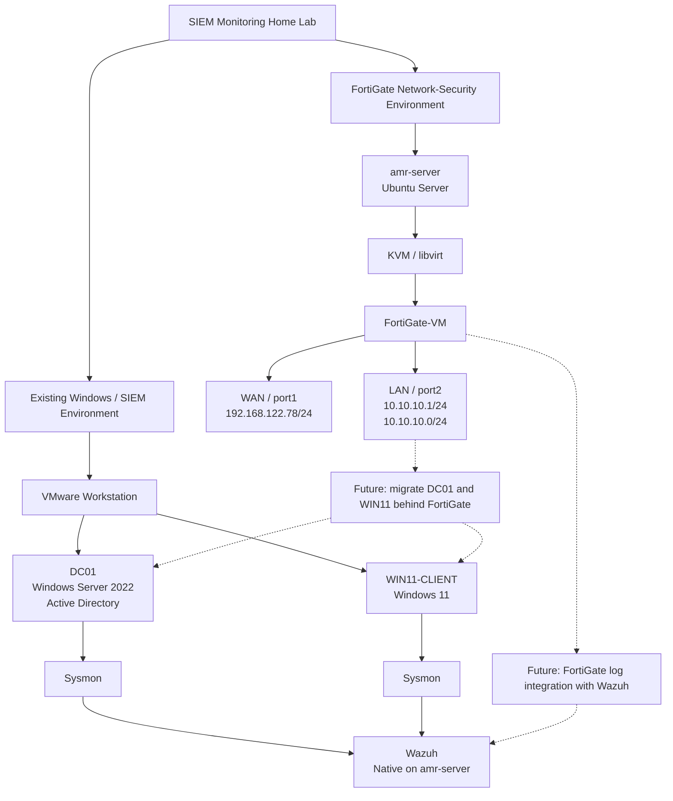

# 00 - Current Lab Architecture

## 1. Overview

The **SIEM Monitoring Home Lab** is an evolving security environment designed to combine enterprise Windows infrastructure, endpoint telemetry, SIEM monitoring, controlled attack simulation, and network security technologies.

The project was initially developed around a VMware Workstation environment containing the Windows infrastructure and Wazuh monitoring components. The environment has since been expanded with a FortiGate-VM deployed using KVM/libvirt to introduce a dedicated network-security layer.

At the current stage of the project, the original Windows/SIEM environment and the new FortiGate network are intentionally maintained as separate environments. The Windows virtual machines have **not yet been migrated behind the FortiGate**.

This document describes the current architecture and explicitly distinguishes implemented components from planned future integration.

---

## 2. Current Architecture

The current environment consists of two major implementation areas:

1. The existing VMware-based Windows/SIEM environment.
2. The newly implemented FortiGate network-security environment hosted on `amr-server`.

### Existing Windows/SIEM Environment

The original lab environment was developed using VMware Workstation.

The currently documented Windows infrastructure consists of:

- **DC01** — Windows Server 2022 / Active Directory Domain Controller
- **WIN11-CLIENT** — Windows 11 domain workstation
- **Sysmon** — endpoint telemetry
- **Wazuh** — SIEM and security monitoring

DC01 and WIN11-CLIENT remain on the VMware NAT environment at this stage.

### FortiGate Network-Security Environment

A FortiGate-VM has subsequently been deployed using KVM/libvirt on the Ubuntu server `amr-server`.

The FortiGate provides the newly implemented network-security boundary and currently uses:

- **WAN:** `192.168.122.78/24`
- **LAN:** `10.10.10.1/24`
- **Lab LAN:** `10.10.10.0/24`

The FortiGate WAN is connected to the libvirt `default` network (`192.168.122.0/24`), while the LAN interface is connected to the dedicated lab network.

The existing Windows VMs are **not yet connected to this FortiGate LAN**.

---

## 3. Architecture Diagram



> **Current-state note:** The solid paths represent currently established components or relationships. The dashed paths represent planned work and are **not currently implemented**.

---

## 4. Environment Components

| Component | Platform | Current Role | Current State |
|---|---|---|---|
| `amr-server` | Ubuntu Server | Host infrastructure | Active |
| Wazuh | Native Ubuntu installation | SIEM and security monitoring | Active |
| FortiGate-VM | KVM/libvirt | Firewall, routing, and remote-access VPN | Active |
| DC01 | VMware Workstation | Active Directory Domain Controller | Active; separate VMware network |
| WIN11-CLIENT | VMware Workstation | Domain workstation / endpoint telemetry source | Active; separate VMware network |
| Sysmon | Windows endpoints | Endpoint telemetry | Active |
| Kali Linux | — | Future attack simulation platform | Not currently deployed |

---

## 5. Network Segments

### 5.1 Existing VMware Environment

The original Windows infrastructure was built using VMware Workstation and its NAT networking environment.

The historical VMware network configuration and troubleshooting process is documented in:

- [02 - VMware Setup](02-VMware-Setup.md)
- [04 - Network Configuration and Troubleshooting](04-Network-Configuration-and-Troubleshooting.md)

DC01 and WIN11-CLIENT remain on this VMware network at the current stage.

---

### 5.2 FortiGate WAN Network

The FortiGate WAN interface is connected to the libvirt `default` network.

| Property | Value |
|---|---|
| Network | `192.168.122.0/24` |
| Gateway | `192.168.122.1` |
| FortiGate WAN | `192.168.122.78` |
| Interface | `port1` |

The FortiGate receives its WAN address through the libvirt DHCP service, with a DHCP reservation configured for the FortiGate VM's MAC address.

---

### 5.3 FortiGate Lab LAN

The FortiGate provides the gateway for the newly implemented lab LAN.

| Property | Value |
|---|---|
| Network | `10.10.10.0/24` |
| FortiGate LAN | `10.10.10.1` |
| Interface | `port2` |

The FortiGate DHCP service provides addresses to clients on this network.

This network is currently a separate environment and does not yet contain the existing DC01 and WIN11-CLIENT virtual machines.

---

## 6. Current Connectivity Model

### Existing Windows Environment

At the current stage:

```text
DC01 / WIN11-CLIENT
        |
        v
VMware NAT
        |
        v
Upstream connectivity
```

These systems have **not yet been migrated to the FortiGate LAN**.

### FortiGate Environment

The current FortiGate path is:

```text
Upstream Network
      |
      v
Ubuntu Server (amr-server)
      |
      v
libvirt default network
192.168.122.0/24
      |
      v
FortiGate WAN
192.168.122.78
      |
      v
FortiGate LAN
10.10.10.1
      |
      v
10.10.10.0/24
```

Internet connectivity through the FortiGate environment has been validated independently.

---

## 7. Security Architecture

The project currently contains several security layers.

### Identity

Active Directory provides the enterprise identity layer through DC01.

### Endpoint Security

The Windows endpoints use native Windows security auditing together with Sysmon for detailed endpoint telemetry.

### SIEM

Wazuh provides centralized security event collection, analysis, and visualization. Wazuh is installed natively on `amr-server`.

### Adversary Simulation

Controlled attack simulation has been performed against the Windows environment to validate endpoint telemetry and SIEM visibility.

### Network Security

The newly implemented FortiGate introduces:

- Network segmentation
- Stateful firewalling
- Routing
- DHCP
- Remote-access VPN capability

The FortiGate environment is currently separate from the VMware Windows environment.

---

## 8. Architecture Evolution

### Phase 1 — Core SIEM Lab

The project initially focused on establishing the Windows enterprise and SIEM environment.

The implementation included:

- VMware Workstation
- Windows Server 2022
- Active Directory
- Windows 11
- Group Policy
- Sysmon
- Wazuh
- Wazuh agents
- Controlled attack simulation

See documentation `01`–`12` for the original implementation sequence.

---

### Phase 2 — Network Security Expansion

The project was subsequently expanded with a FortiGate-VM deployed using KVM/libvirt.

The objective of this phase was to introduce a dedicated network-security layer including:

- WAN/LAN separation
- Network segmentation
- Routing
- Firewall policies
- DHCP
- Remote management
- Remote-access VPN

The FortiGate implementation is documented separately from the original Windows/SIEM build.

---

### Phase 3 — Future Environment Integration

The existing VMware Windows environment is planned to be migrated behind the FortiGate.

**This phase has not yet been implemented.**

The future target is:

```text
Internet
   |
   v
FortiGate
   |
   v
10.10.10.0/24
   |
   +-- DC01
   +-- WIN11-CLIENT
   +-- Future Kali
```

The migration will be documented separately when it is actually performed and validated.

---

### Phase 4 — Future Network Telemetry Integration

A future objective is to integrate FortiGate security telemetry with Wazuh.

This would allow network-level security events to be analyzed alongside endpoint telemetry.

**This integration has not yet been implemented and is therefore not represented as a current capability.**

---

## 9. Current Implementation Status

### Implemented

- VMware-based Windows environment
- Windows Server 2022
- Active Directory
- Windows 11 domain workstation
- Group Policy configuration
- Sysmon
- Wazuh SIEM
- Wazuh endpoint agents
- Controlled attack simulation
- Ubuntu `amr-server` host infrastructure
- FortiGate-VM under KVM/libvirt
- FortiGate WAN/LAN configuration
- FortiGate routing
- FortiGate DHCP
- FortiGate firewall configuration
- FortiGate remote-access VPN

### Not Yet Integrated

- DC01 behind FortiGate
- WIN11-CLIENT behind FortiGate
- VMware environment migrated to the FortiGate LAN
- FortiGate security logs integrated into Wazuh

### Future

- Kali Linux deployment
- VMware-to-FortiGate migration
- FortiGate-to-Wazuh integration
- Network/endpoint event correlation
- Detection engineering
- Threat hunting
- Incident investigation scenarios

---

## 10. Related Documentation

### Foundation

- [01 - Lab Planning](01-Lab-Planning.md)
- [02 - VMware Setup](02-VMware-Setup.md)
- [03 - Windows Server Installation](03-Windows-Server-Installation.md)
- [04 - Network Configuration and Troubleshooting](04-Network-Configuration-and-Troubleshooting.md)

### Active Directory and Endpoint Security

- [05 - Active Directory Domain Services](05-Active-Directory-Domain-Services-Installation.md)
- [06 - Organizational Units and User Management](06-Organizational-Units-and-User-Management.md)
- [07 - Workstation Deployment and Domain Join](07-Workstation-Deployment-and-Domain-Join.md)
- [08 - Group Policy Configuration](08-Group-Policy-Configuration.md)
- [09 - Sysmon Deployment](09-Sysmon-Deployment.md)

### SIEM and Security Monitoring

- [10 - Wazuh SIEM Deployment](10-Wazuh-SIEM-Deployment.md)
- [11 - Wazuh Agent Deployment](11-Wazuh-Agent-Deployment.md)
- [12 - Attack Simulation](12-Attack-Simulation.md)

### Network Security

- FortiGate implementation documentation — to be added during the reconstruction phase.

---

## 11. Current-State Boundary

This document intentionally describes the architecture **as currently implemented**.

The following statements should not be interpreted as current connectivity:

- DC01 is not currently behind the FortiGate.
- WIN11-CLIENT is not currently behind the FortiGate.
- Kali Linux is not currently deployed.
- FortiGate logs are not currently integrated into Wazuh.
- The FortiGate LAN is not currently the production network for the existing Windows environment.

These items represent planned future stages and will only be marked as implemented after deployment and validation evidence has been collected.
