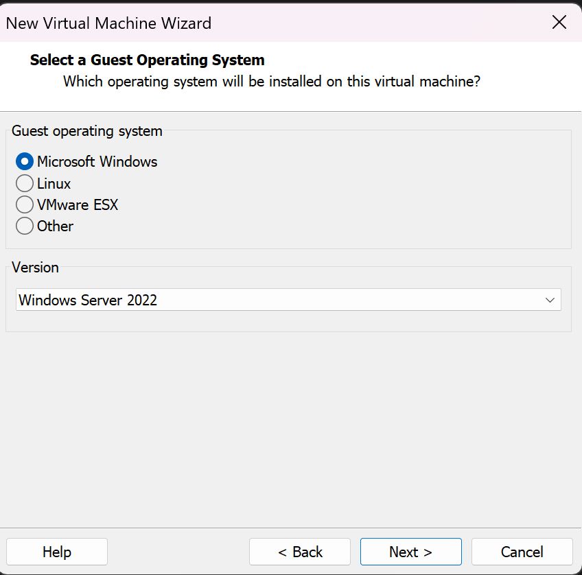
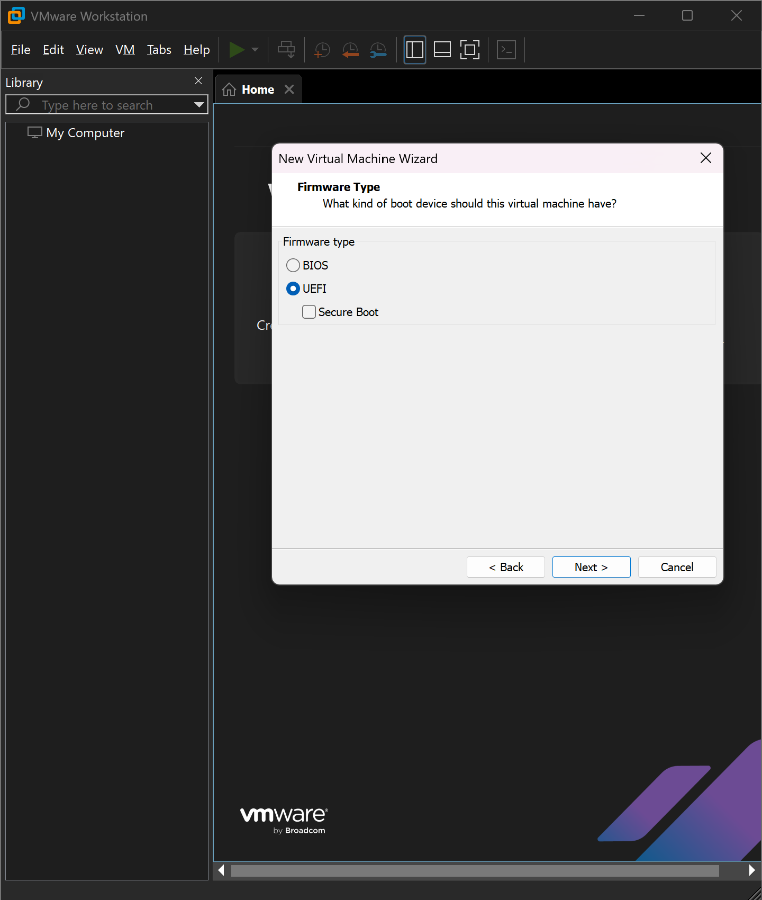
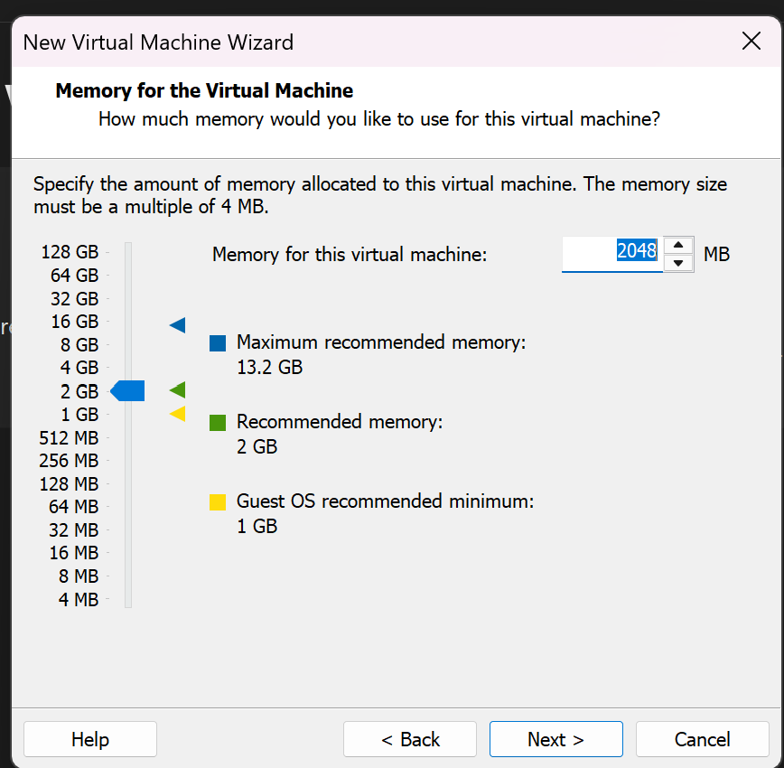
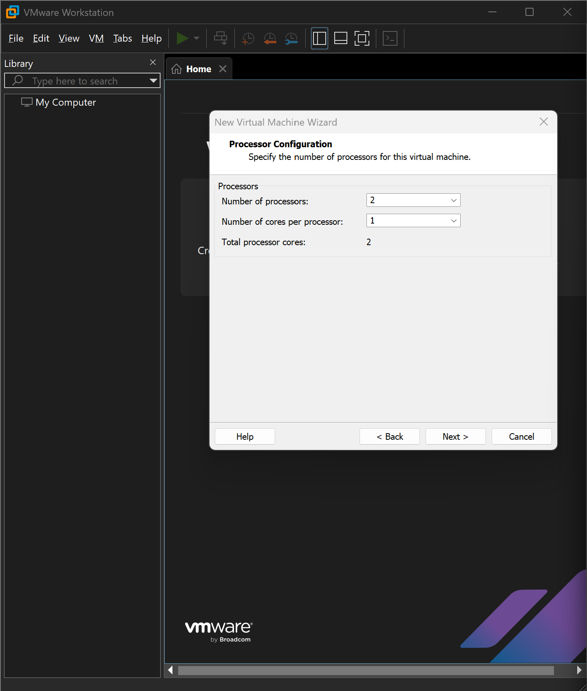
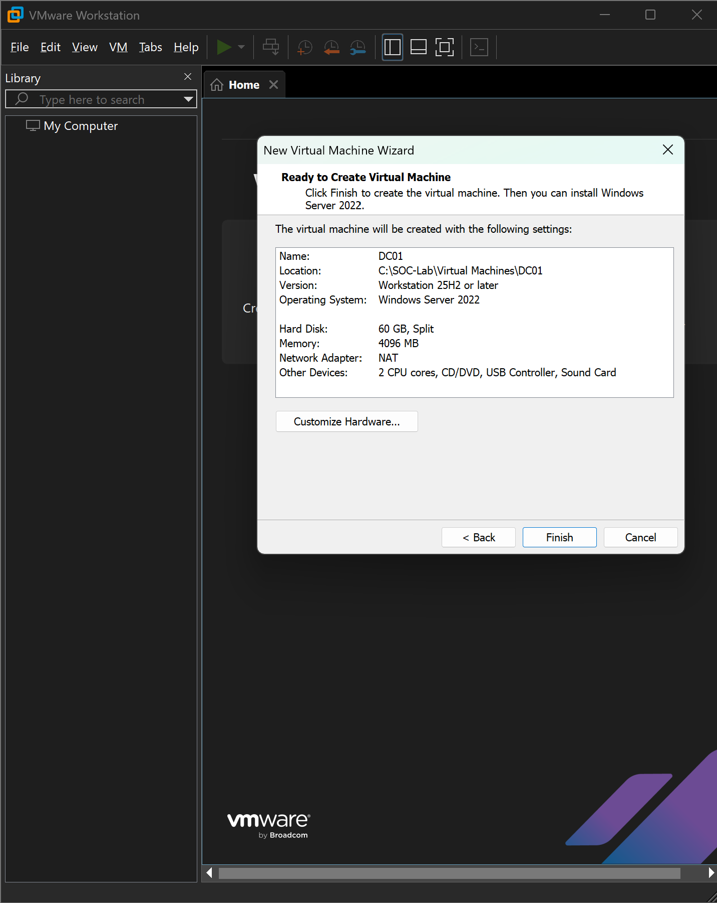
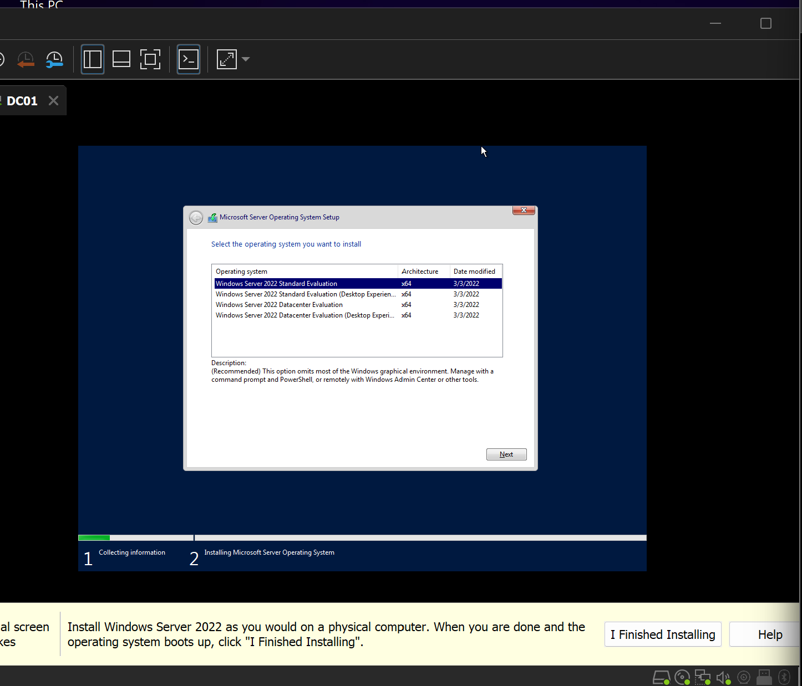
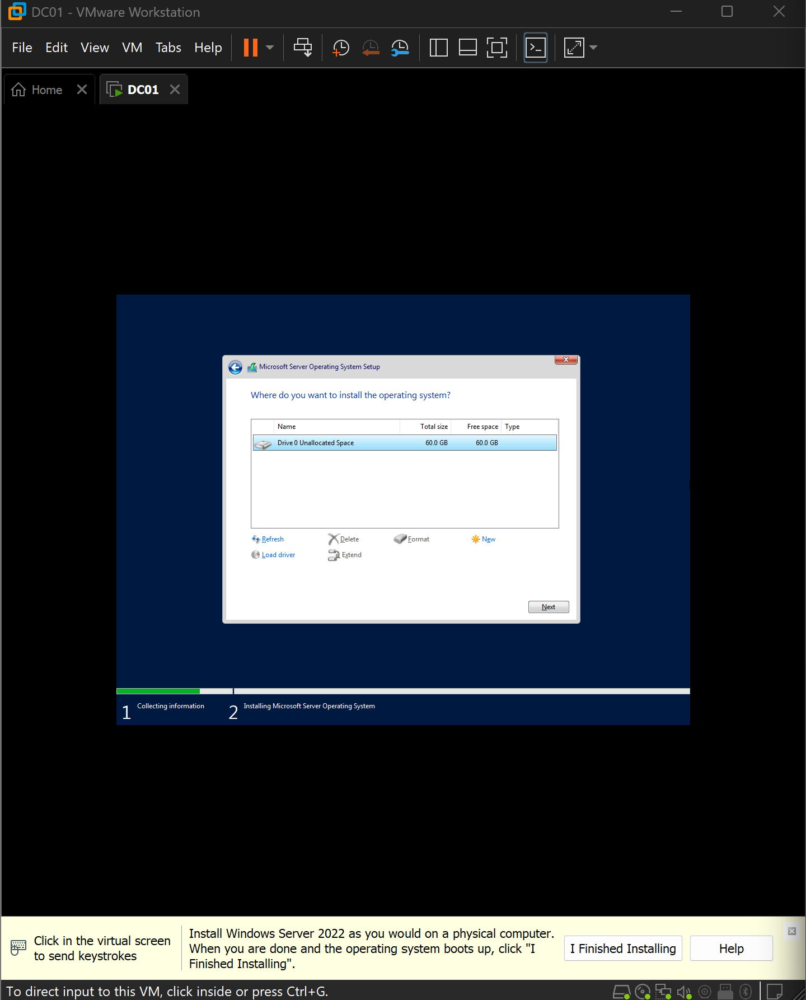
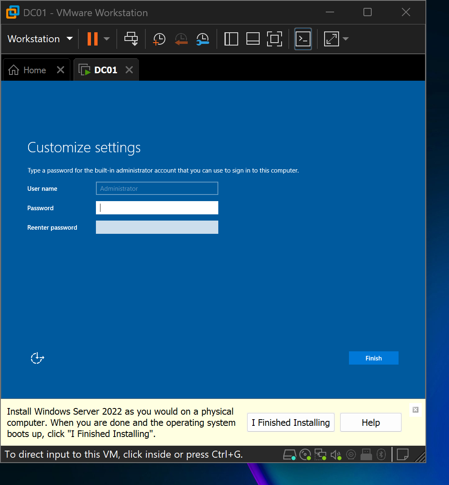
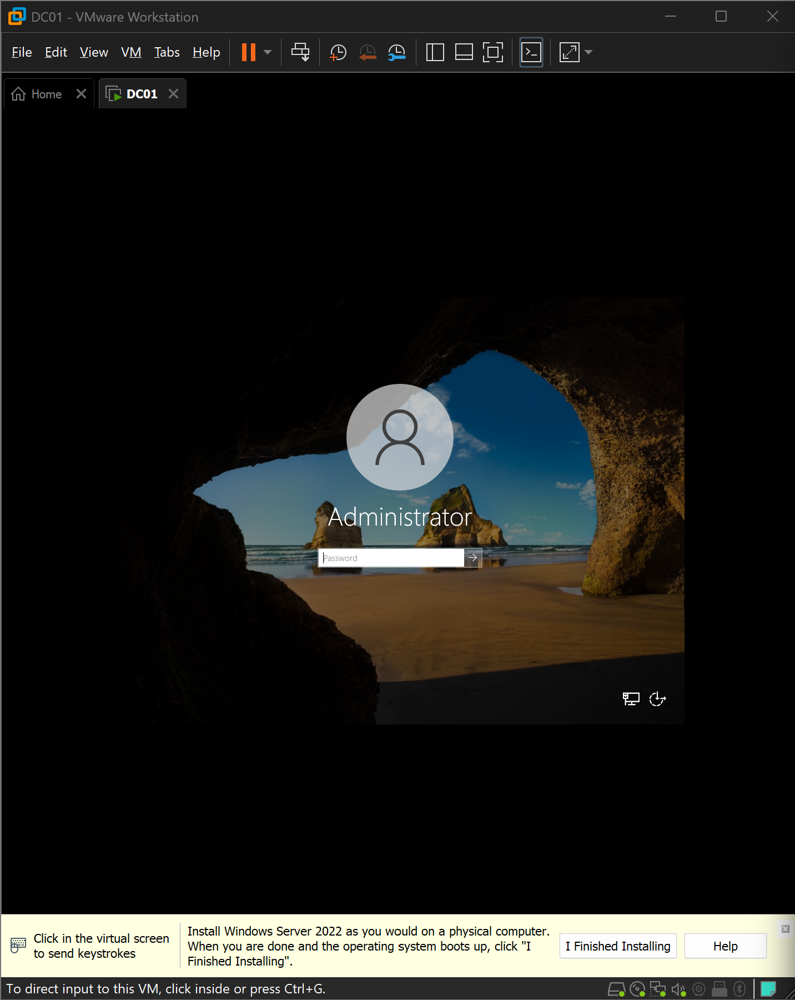
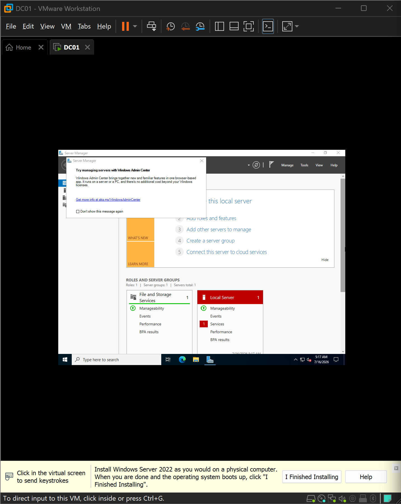

# Windows Server 2022 Installation

## Objective

The objective of this phase was to deploy the Windows Server 2022 virtual machine that will serve as the foundation of the Active Directory environment throughout this project.

Windows Server 2022 was selected because it provides the infrastructure services required to build a realistic enterprise network, including Active Directory Domain Services (AD DS), DNS, Group Policy, and centralized authentication.

The server was deployed as a virtual machine in VMware Workstation Pro using Windows Server 2022 (Desktop Experience) to simplify administration during the learning process.

---

## System Configuration

The virtual machine was created using the following configuration.

| Component | Configuration |
|----------|---------------|
| Hypervisor | VMware Workstation Pro |
| Operating System | Windows Server 2022 (Desktop Experience) |
| Firmware | UEFI |
| Memory | 4 GB RAM |
| Processors | 2 vCPUs |
| Virtual Disk | 60 GB |
| Network Adapter | NAT (VMnet8) |

---

## Virtual Machine Configuration

A dedicated virtual machine named **DC01** was created to host Windows Server 2022.

During the VM creation process, the guest operating system, firmware, processor, memory, storage, and networking settings were configured according to the planned lab design before installing Windows Server 2022.

### Guest Operating System

Windows Server 2022 was selected as the guest operating system to ensure compatibility with Active Directory and other Windows Server roles required later in the project.

### Firmware Configuration

The virtual machine was configured to use **UEFI firmware**, providing a modern boot environment compatible with current Windows Server installations.

### Memory Allocation

Memory was allocated according to the available host resources while providing sufficient capacity for Windows Server and future Active Directory services.

### Processor Configuration

The server was configured with two virtual processors to provide adequate performance for the lab environment.

### Virtual Machine Summary

Before the virtual machine was created, VMware presented a summary of the selected hardware configuration.

This step was used to verify that all hardware settings matched the planned deployment.

---

## Installing Windows Server 2022

After the virtual machine was created, the Windows Server 2022 installation media was attached and the virtual machine was powered on.

The installation wizard guided the deployment process, including operating system edition selection, storage configuration, and initial administrator account setup.

### Windows Edition Selection

The **Windows Server 2022 Standard Evaluation (Desktop Experience)** edition was selected.

The Desktop Experience edition was chosen because it includes the graphical user interface (GUI), making it easier to perform server administration while learning Active Directory and Windows infrastructure management.

### Storage Configuration

The default 60 GB virtual disk was selected as the installation target. Windows Server automatically created the required system partitions before copying the operating system files.

### Administrator Account

At the end of the installation, Windows Server prompted for the built-in **Administrator** account password.

A strong password was configured to secure the local administrator account before the first login.

### First Login

After completing the installation, the server booted successfully and presented the Windows logon screen.

The built-in **Administrator** account was used to sign in for the initial configuration.

### Initial Server Environment

Following the first successful login, **Server Manager** launched automatically.

Server Manager provides centralized access to server roles, features, and administrative tools, making it the primary interface for configuring Windows Server.

---

## Verification

The installation was verified by confirming the following:

- Windows Server 2022 booted without errors.
- The Administrator account was able to sign in successfully.
- Server Manager launched automatically after login.
- The virtual machine was ready for post-installation configuration.

---

## Lessons Learned

- Careful virtual machine planning simplifies the operating system deployment process.
- Selecting the Desktop Experience edition provides a user-friendly environment for learning Windows Server administration.
- Verifying the virtual machine configuration before installation helps prevent deployment issues later in the project.
- Deploying the operating system inside a virtual machine allows the environment to be rebuilt quickly if configuration issues occur later in the project.

---

## Next Step

With Windows Server 2022 successfully installed, the next phase focuses on preparing the server for its role within the lab environment by configuring network settings, verifying VMware Tools functionality, assigning a static IP address, and renaming the server before installing Active Directory.