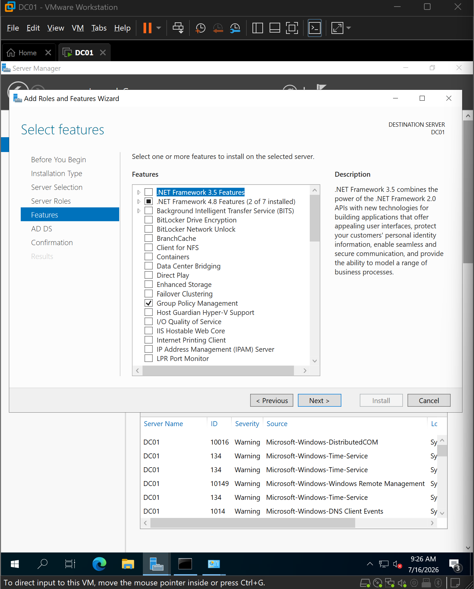
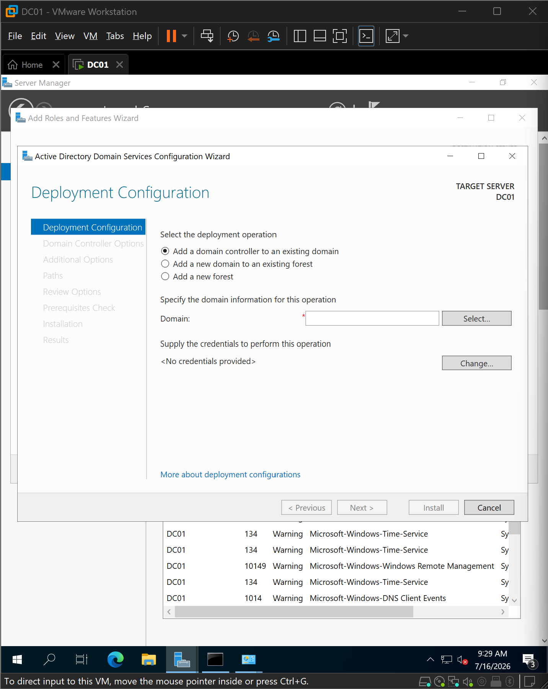
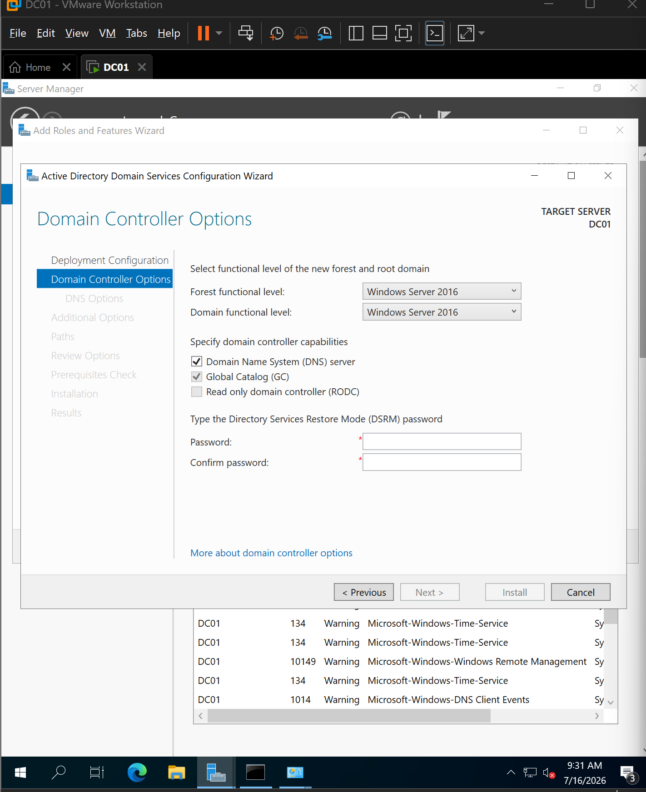
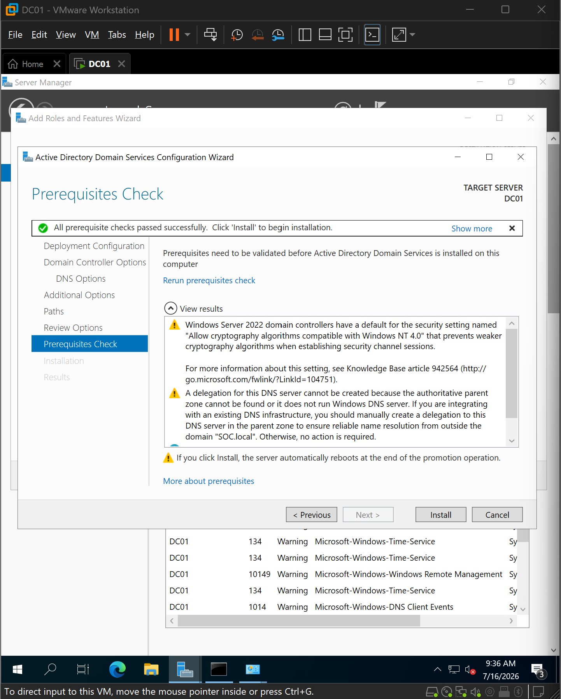
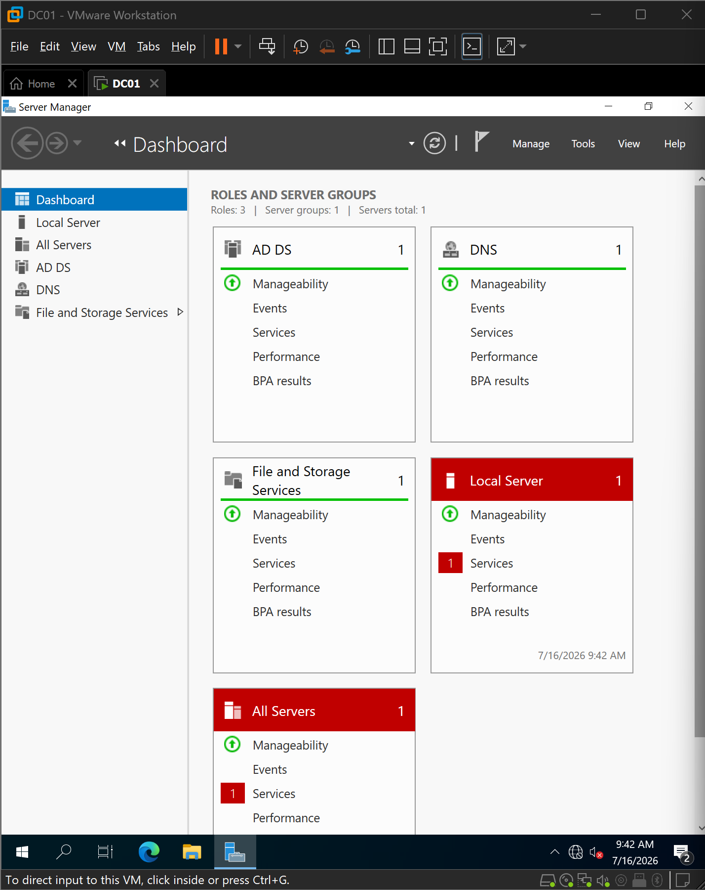
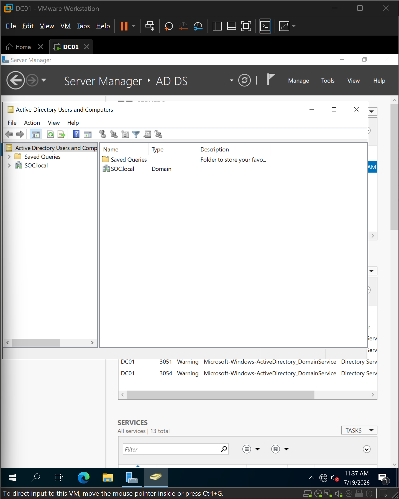
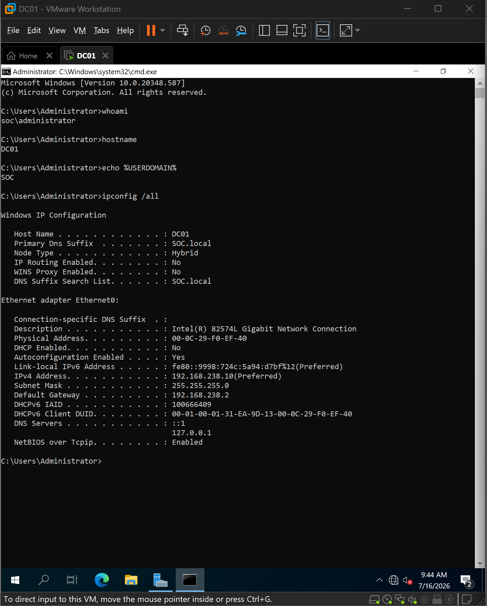

# Active Directory Domain Services (AD DS) Installation

## Overview

After preparing the Windows Server environment and validating its network configuration, the next step was to transform the server into the first Domain Controller for the lab. This was accomplished by installing the Active Directory Domain Services (AD DS) role and promoting the server to create a new Active Directory forest.

Active Directory provides centralized identity management for Windows environments by maintaining a directory of users, computers, groups, and security policies. It serves as the foundation for authentication and authorization across the domain.

Deploying the first Domain Controller establishes the core identity infrastructure required for the remaining stages of this project, including Organizational Unit (OU) management, Group Policy configuration, Windows 11 domain enrollment, Sysmon deployment, and Wazuh monitoring.

---

## Lab State Before Installation

Before installing Active Directory Domain Services, the server had already been prepared during the previous stages of the project.

The environment met the following prerequisites:

- Windows Server 2022 installed successfully
- Static IPv4 configuration applied
- Internet connectivity verified
- VMware NAT networking validated
- Server operating normally without networking issues

The Server Manager dashboard confirmed the server was ready for role installation.


---

## Installing the Active Directory Domain Services Role

The installation began by launching the **Add Roles and Features Wizard** from Server Manager.

During role selection, **Active Directory Domain Services (AD DS)** was chosen. Windows automatically prompted for the required management tools, ensuring the server would include the administrative consoles needed to manage the directory after installation.

At this stage, the server was only receiving the AD DS role. It had **not yet become a Domain Controller**. The promotion process occurs after the role installation completes.



---

## Promoting the Server to a Domain Controller

Once the AD DS role was installed, the server was promoted to a Domain Controller.

Because this was the first Domain Controller in the lab environment, a **new Active Directory forest** was created rather than joining an existing domain.

The root domain selected for the environment was:

```
SOC.local
```

Creating a new forest establishes the highest-level logical structure within Active Directory and becomes the trust boundary for all future domains inside the environment.



---

## Configuring Domain Controller Options

The promotion wizard required several configuration decisions before the installation could proceed.

The server was configured as:

- DNS Server
- Global Catalog (GC)
- First Domain Controller in the forest

A **Directory Services Restore Mode (DSRM)** password was also configured.

The DSRM account is used for offline maintenance and recovery operations if Active Directory becomes unavailable or requires repair.

Since this was the first Domain Controller in a new forest, the Global Catalog option was mandatory and could not be disabled.



---

## Prerequisites Validation

Before beginning the promotion process, Windows performed a series of prerequisite checks.

These validations verify that the server satisfies the requirements necessary to become a Domain Controller, including Active Directory configuration, DNS requirements, and operating system compatibility.

No blocking errors were identified, allowing the installation to continue successfully.



---

## Completing the Promotion

After the prerequisite validation completed successfully, Windows installed the remaining Active Directory components and promoted the server to a Domain Controller.

The promotion process automatically restarted the server to complete the installation.

After rebooting, Server Manager confirmed that the server was now running the Active Directory Domain Services role.



---

## Verifying Active Directory

Following the successful promotion, the **Active Directory Users and Computers (ADUC)** management console became available through Server Manager.

Opening the console confirmed that the newly created **SOC.local** domain had been created successfully and was accessible for administration.

This verified that Active Directory services were operational and ready for future management tasks, including creating users, computers, Organizational Units, and security groups.



---

## Validating the Domain Controller

As a final verification step, the server configuration was reviewed using the `systeminfo` command.

The output confirmed that:

- The computer was operating as a Domain Controller.
- The server belonged to the newly created **SOC.local** domain.
- Active Directory installation completed successfully.

This validation provides operating-system-level confirmation that the server promotion completed successfully.



---

## Lessons Learned

During this deployment, several important Active Directory concepts became clear:

- Installing the AD DS role does **not** automatically create a Domain Controller; a separate promotion process is required.
- The first Domain Controller in an environment must create a new forest when no existing domain is available.
- Active Directory automatically integrates DNS when deploying the first Domain Controller unless an external DNS infrastructure already exists.
- The Directory Services Restore Mode (DSRM) password is independent of normal domain administrator credentials and is required for recovery operations.
- Windows performs prerequisite validation before promotion to reduce the risk of configuration failures.

---

## Outcome

The Windows Server was successfully promoted to the first Domain Controller for the lab environment.

The deployment created the **SOC.local** Active Directory forest, installed DNS integration, and established the centralized identity infrastructure required for enterprise administration.

With Active Directory now operational, the environment is prepared for the next stages of the project, including Organizational Unit design, user and group management, Group Policy configuration, and joining Windows 11 clients to the domain.