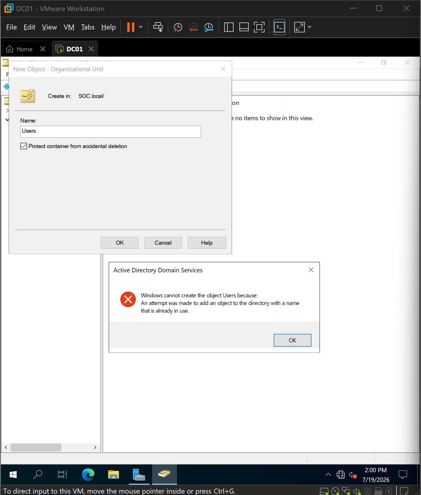
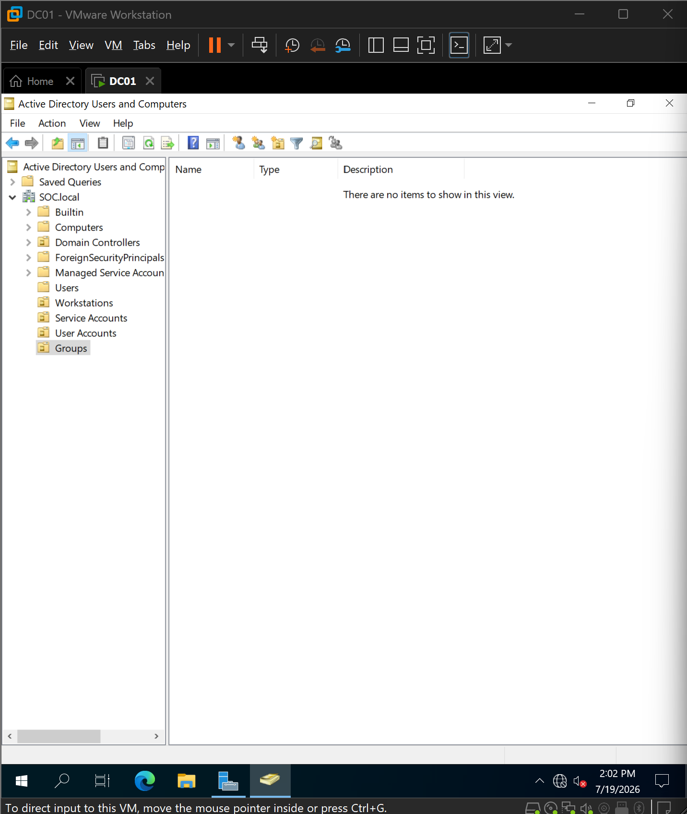
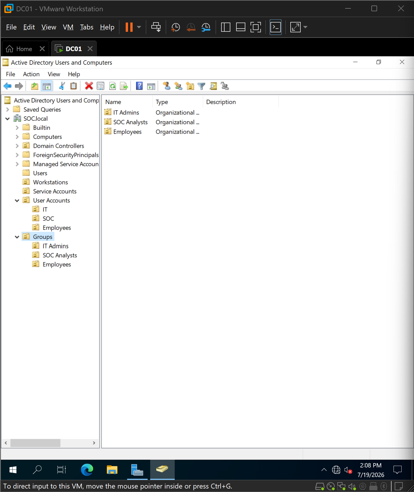
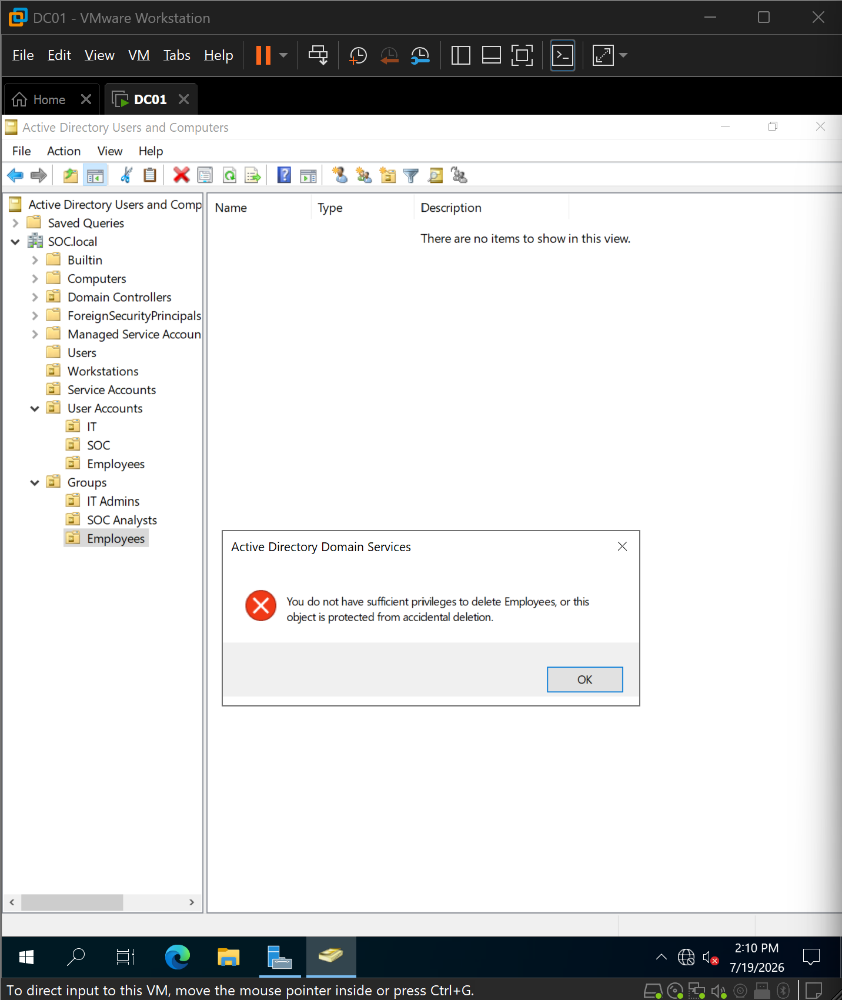
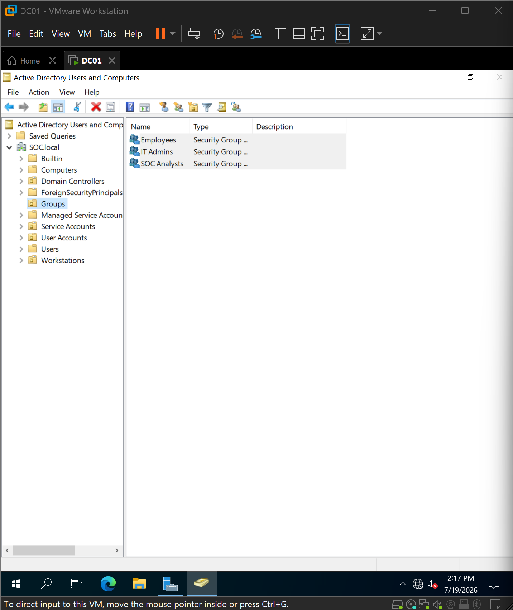
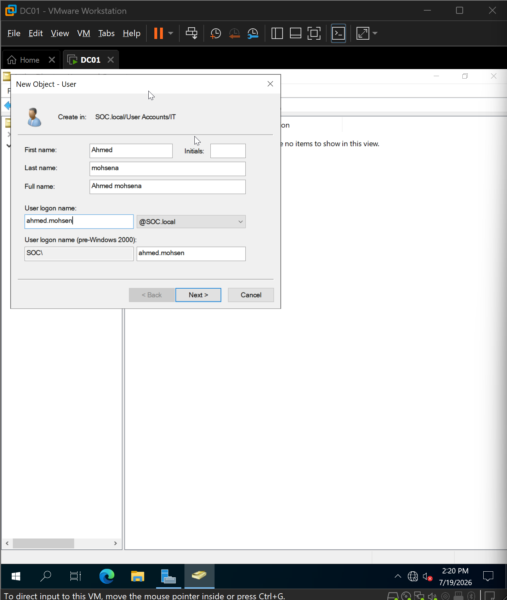
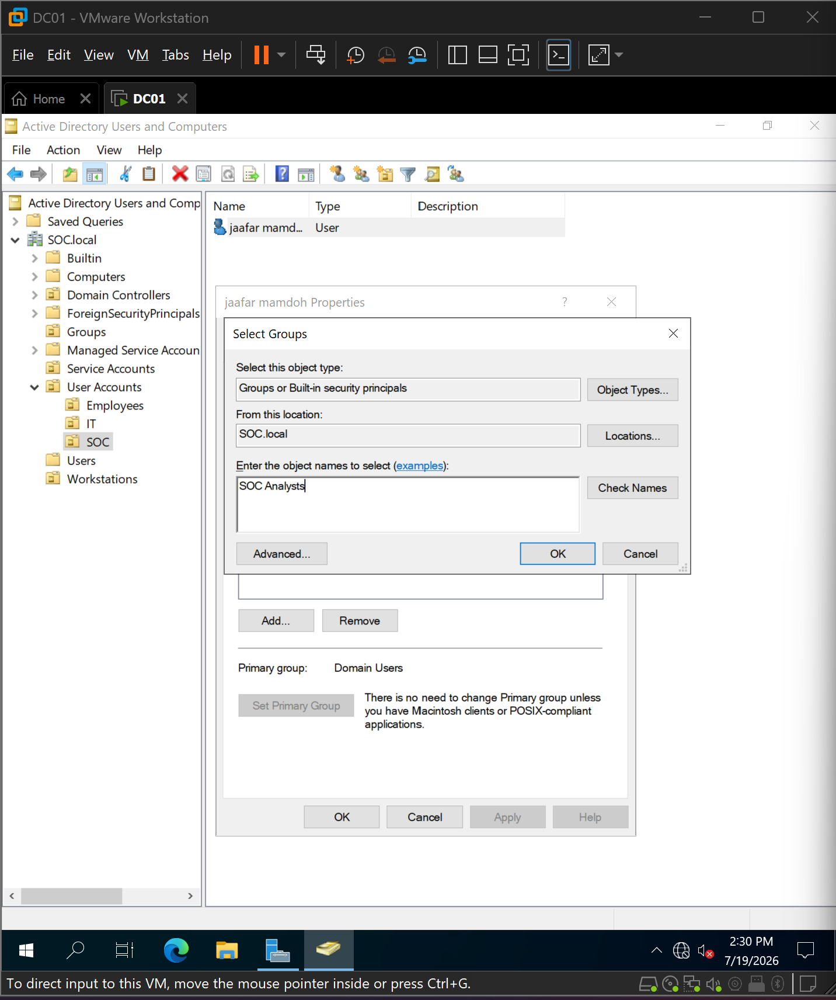
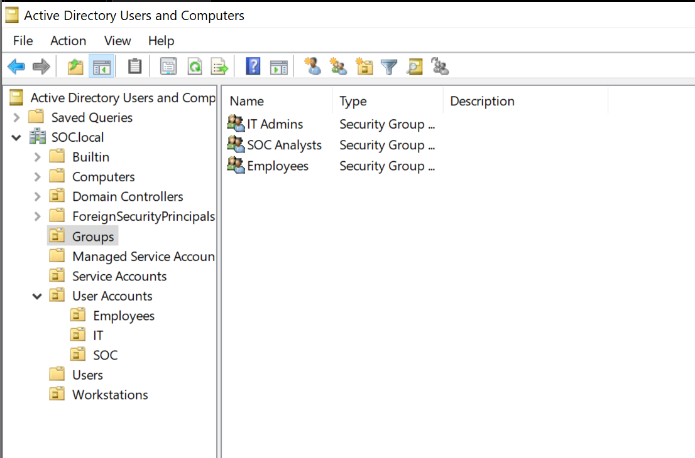
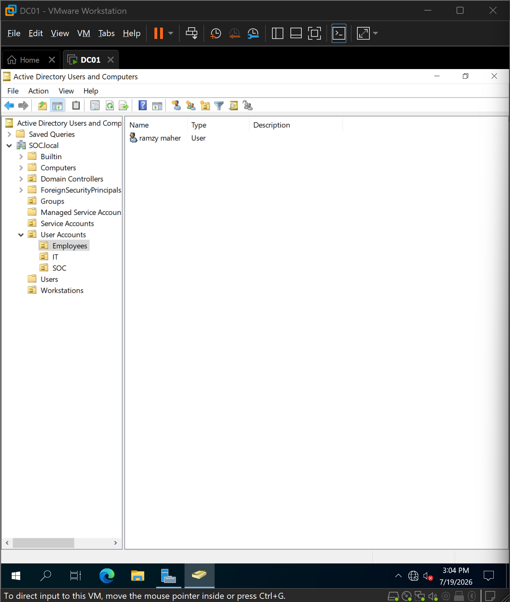

# 06 - Organizational Units and User Management

## Overview

After promoting the Windows Server to a Domain Controller and creating the Active Directory domain, the next step was to organize the directory structure following common enterprise practices.

Instead of placing all users inside the default Active Directory containers, Organizational Units (OUs) were created to logically separate departments. Security Groups were then created independently to simplify permission management using role-based access control (RBAC).

This structure provides a scalable foundation for future Group Policies, delegated administration, and security monitoring within the lab.

---

## Objectives

- Organize Active Directory using Organizational Units (OUs)
- Create departmental Security Groups
- Create user accounts within their appropriate OUs
- Assign users to department-specific Security Groups
- Prepare the environment for Group Policy Objects (GPOs) and future SIEM monitoring

---

# 1. Initial Directory Structure

Before creating custom Organizational Units, Active Directory contained the default containers generated during domain installation.

Attempting to create an Organizational Unit named **Users** resulted in an error because the default **Users** container already exists within every Active Directory domain.

This highlighted the importance of understanding the difference between built-in containers and administrator-created Organizational Units.

---

# 2. Designing the Organizational Unit Structure

To improve organization and simplify administration, a dedicated parent Organizational Unit named **User Accounts** was created.

Three child OUs were then created to represent the departments used throughout the lab:

- Employees
- IT
- SOC

This structure allows user accounts to be grouped logically by department and provides a clean foundation for future Group Policy deployment.

---

# 3. Correcting the Security Group Design

During the initial configuration, Organizational Units were mistakenly created for security groups.

After reviewing Active Directory best practices, the design was corrected by separating Organizational Units from Security Groups.

A dedicated **Groups** Organizational Unit was created to store all Security Groups independently from user accounts.

This separation follows common enterprise practices where:

- Organizational Units organize directory objects.
- Security Groups manage permissions and access control.

---

# 4. Accidental Deletion Protection

While correcting the directory structure, an attempt to remove an Organizational Unit generated an error indicating that the object was protected from accidental deletion.

This protection is enabled by default when creating Organizational Units and helps prevent administrators from unintentionally deleting important sections of Active Directory.

After temporarily removing the protection, the incorrect Organizational Units were deleted and recreated correctly.

---

# 5. Creating Security Groups

After correcting the directory design, three Global Security Groups were created inside the **Groups** Organizational Unit:

- Employees
- IT Admins
- SOC Analysts

These groups will later be used to assign permissions, apply Group Policies, and simplify administration using role-based access control.

---

# 6. Creating User Accounts

User accounts were then created inside their respective Organizational Units.

Each user was configured with:

- First and last name
- User logon name
- Initial password
- Password configured to never expire (lab environment)

Creating users inside department-specific OUs simplifies administration and allows future policies to target specific departments.

---

# 7. Assigning Group Memberships

After creating the user accounts, each user was added to the appropriate Security Group.

Examples include:

- IT users → IT Admins
- SOC users → SOC Analysts
- Employee users → Employees

Using Security Groups rather than assigning permissions directly to individual users improves scalability and follows the principle of Role-Based Access Control (RBAC).

---

# 8. Validating the Final Directory Structure

After completing the configuration, the Organizational Units and Security Groups were organized into separate administrative containers.

This structure clearly separates:

- User Accounts
- Security Groups
- Built-in Active Directory containers

The resulting design provides a clean and maintainable Active Directory hierarchy suitable for future expansion.

---

# 9. Verifying User Organization

Finally, the user accounts were verified to ensure they were stored within their correct departmental Organizational Units rather than the default Users container.

This confirms that the Active Directory environment is properly organized and ready for future administration tasks such as Group Policy deployment, delegated administration, authentication testing, and SIEM monitoring.

---

# Lessons Learned

Throughout this implementation several important Active Directory concepts became clear:

- Organizational Units and Security Groups serve different purposes and should not be used interchangeably.
- The default **Users** container cannot be replaced by creating another object with the same name.
- Organizational Units are protected from accidental deletion by default.
- Separating users by department simplifies administration and future policy deployment.
- Assigning permissions through Security Groups is more scalable than assigning permissions directly to individual users.

---

# Outcome

The Active Directory environment now contains a structured Organizational Unit hierarchy with department-based user organization and role-based Security Groups.

This provides a scalable identity management foundation that will support future Group Policy Objects (GPOs), Windows event auditing, Sysmon deployment, Wazuh monitoring, and attack simulations throughout the remainder of the lab.