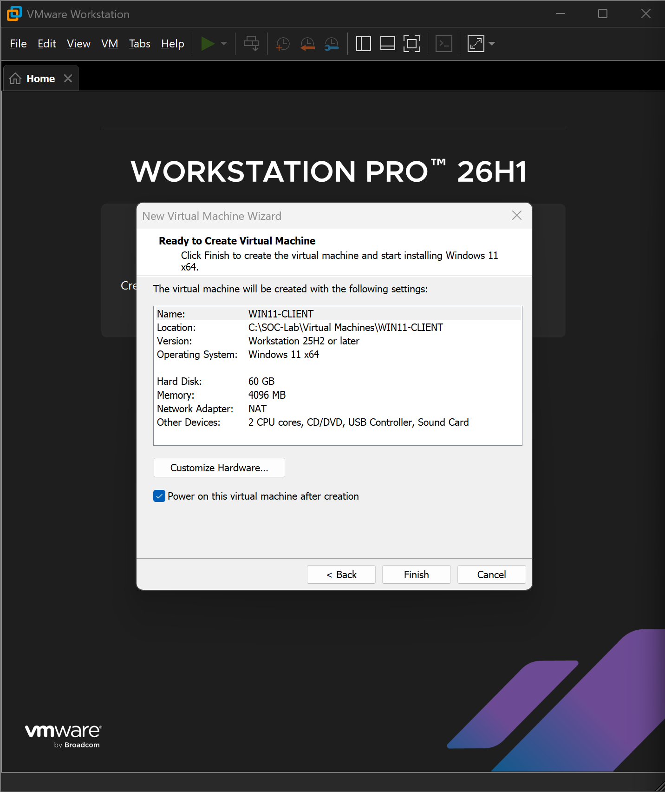
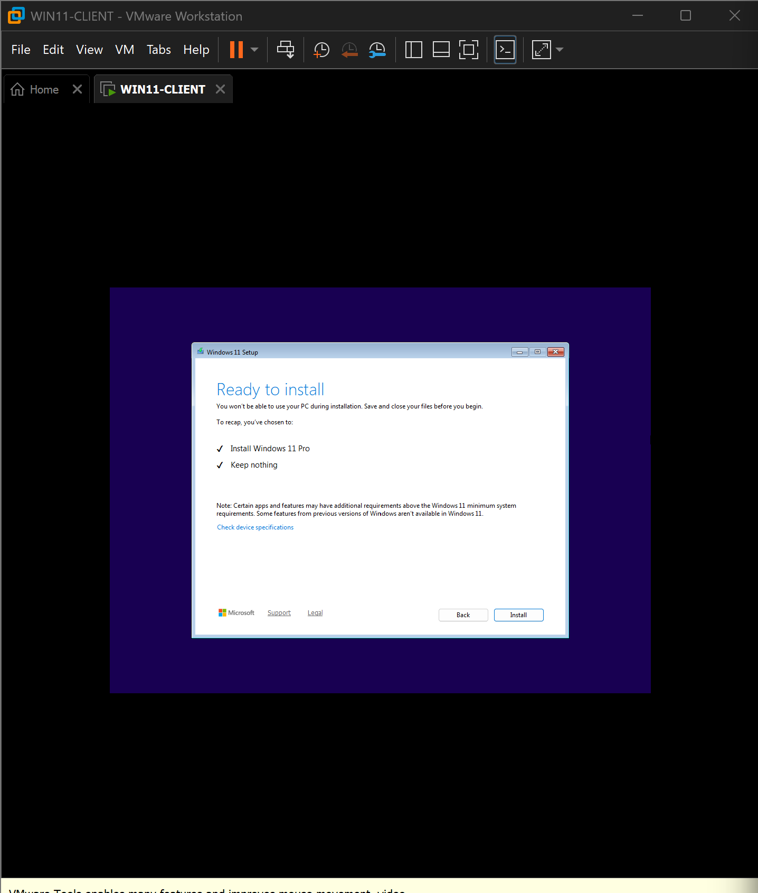
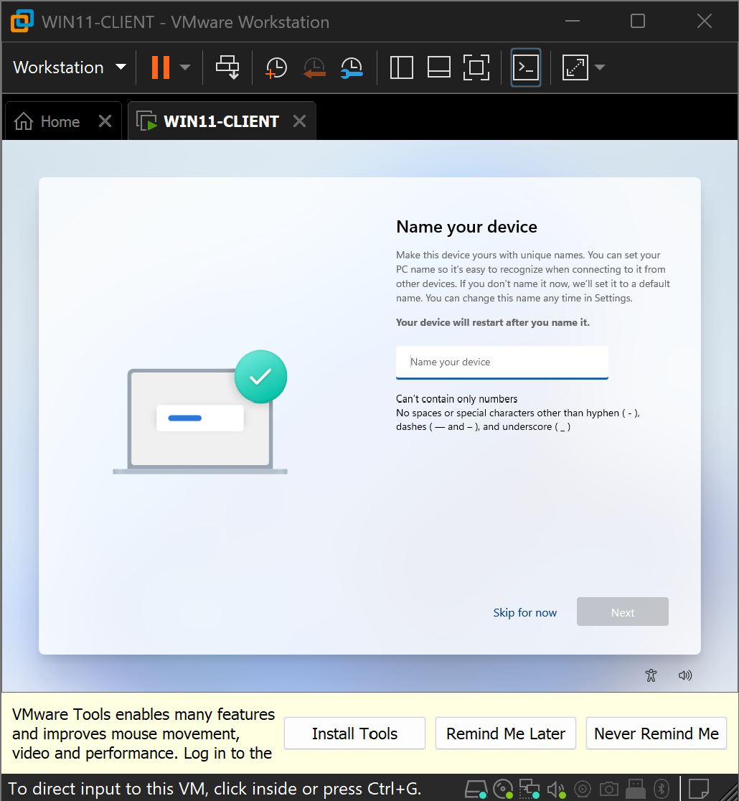
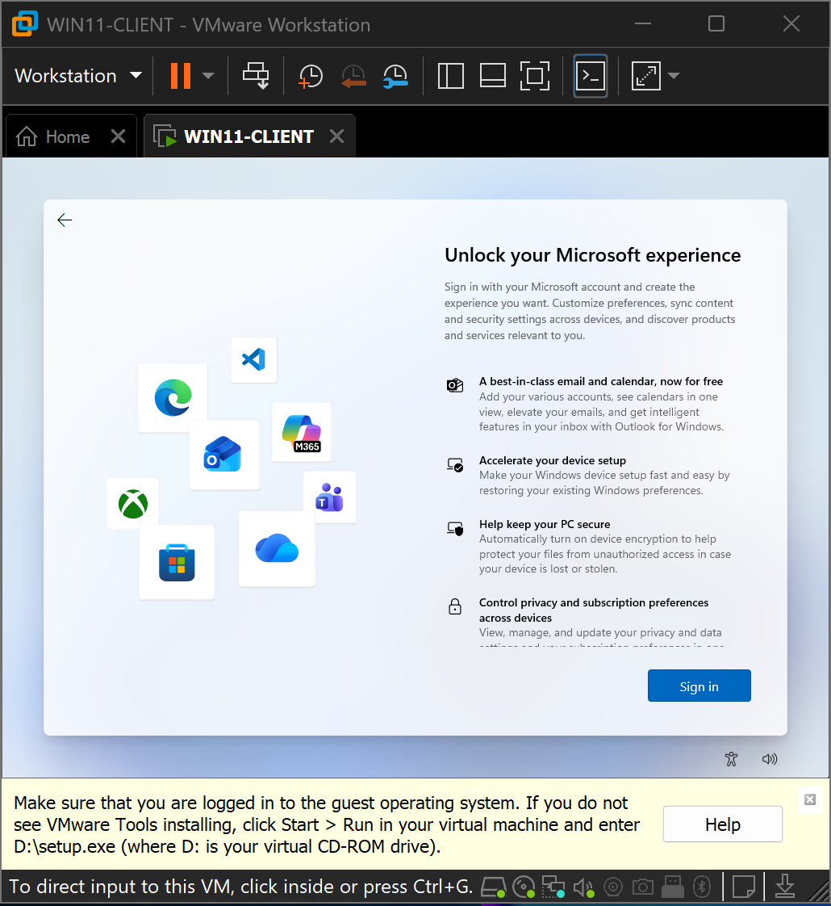
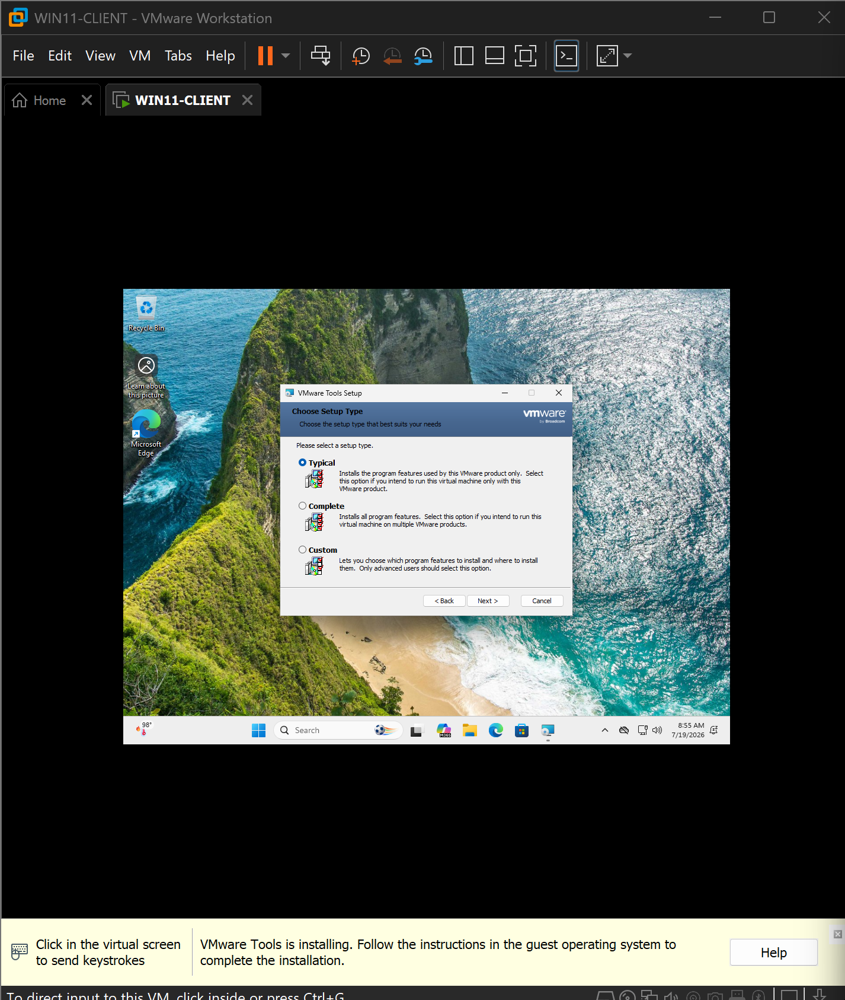
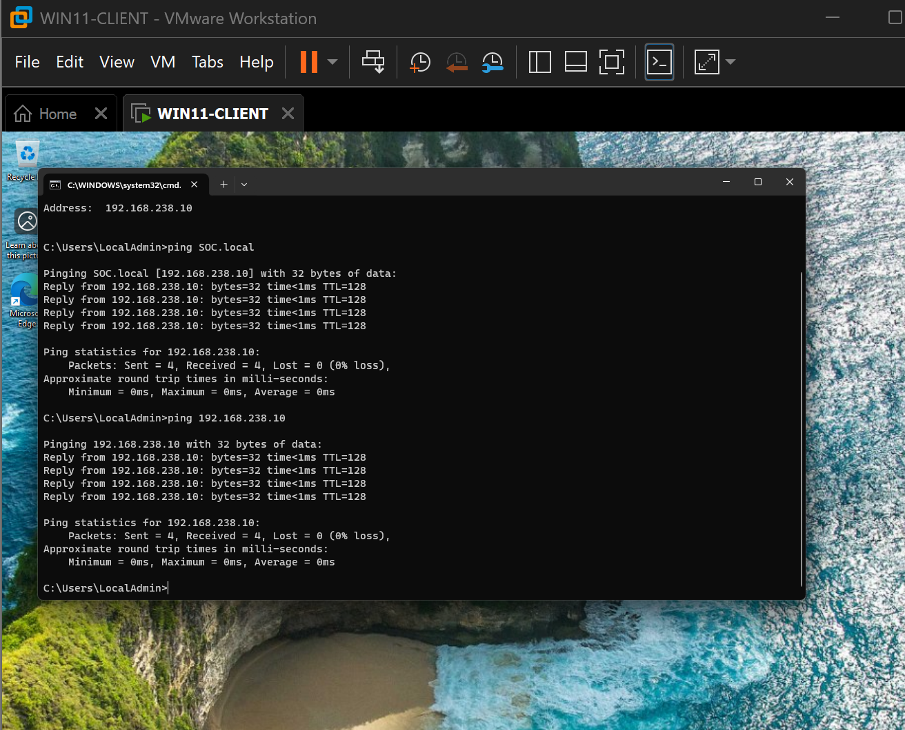
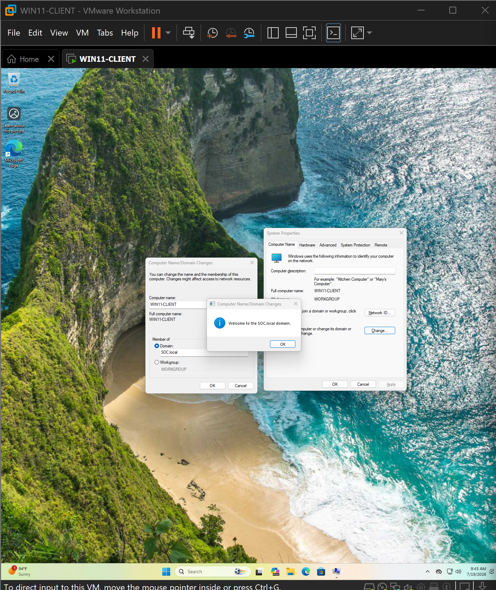
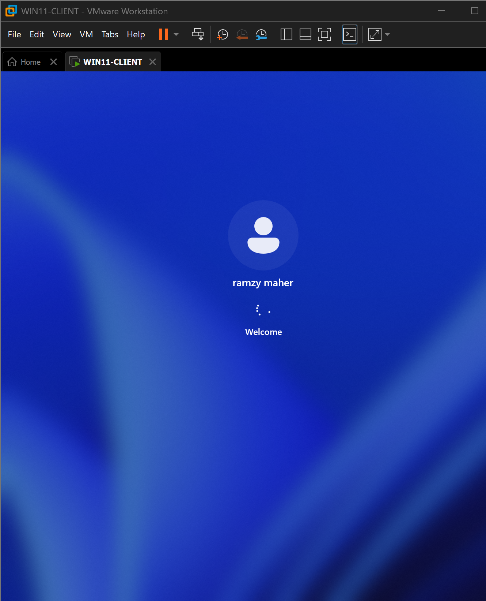
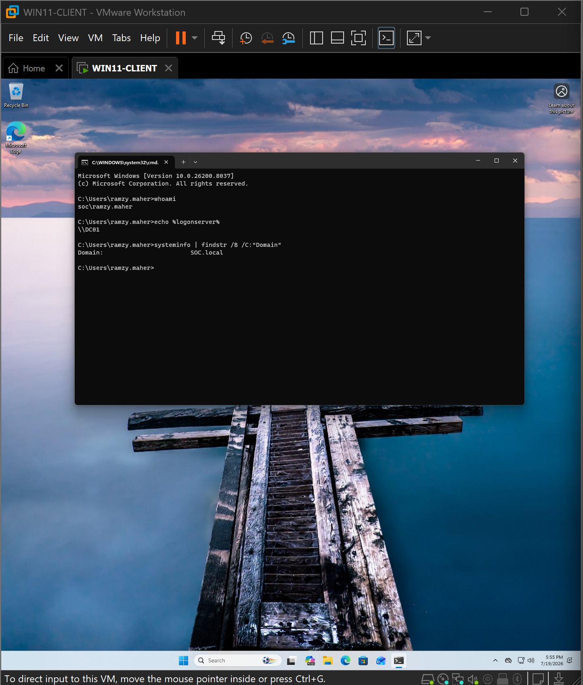
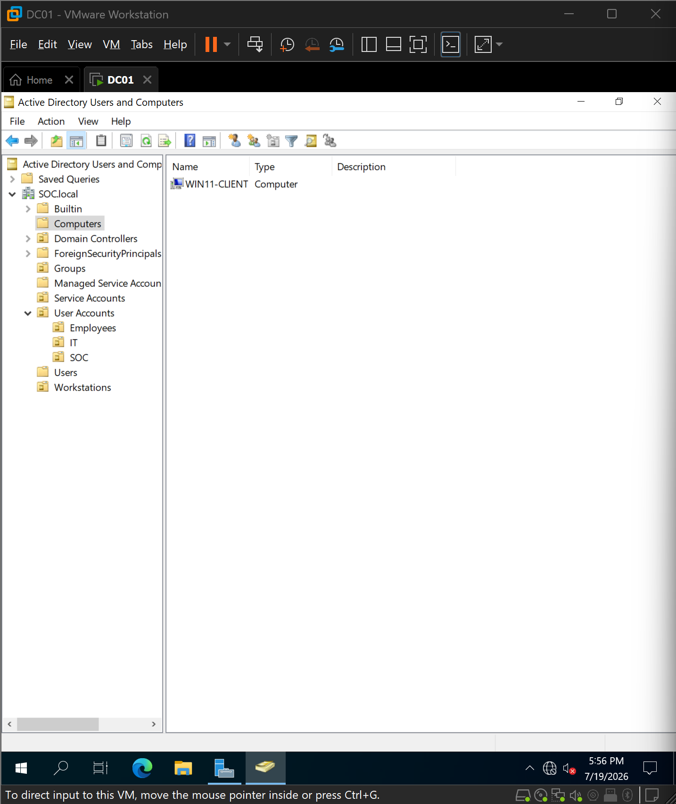

# 07 - Workstation Deployment and Domain Join

## Overview

With the Active Directory infrastructure in place, the next phase of the lab focused on deploying a Windows 11 Enterprise workstation and integrating it into the **SOC.local** Active Directory domain.

The workstation was installed as a separate virtual machine, configured with VMware Tools, validated for network connectivity, joined to the Active Directory domain, and finally organized into the appropriate Organizational Unit (OU). This machine will serve as the primary endpoint for future phases of the lab, including Group Policy deployment, Sysmon installation, attack simulation, and SIEM monitoring.

---

## Objectives

- Deploy a Windows 11 Pro virtual machine.
- Configure a meaningful workstation hostname.
- Complete the Windows Out-of-Box Experience (OOBE).
- Install VMware Tools.
- Configure network connectivity and DNS resolution.
- Join the workstation to the **SOC.local** domain.
- Verify domain authentication.
- Organize the workstation object within Active Directory.

---

## Virtual Machine Configuration

A dedicated Windows 11 virtual machine was created using VMware Workstation.

The virtual hardware was configured with sufficient resources to support future security tooling while remaining lightweight for a home lab environment.

### Configuration

- Operating System: Windows 11 Pro
- Hostname: **WIN11-CLIENT**
- Hypervisor: VMware Workstation
- Network Adapter: NAT (temporarily changed during installation)
- VMware Tools: Installed after operating system deployment

---

## Windows 11 Installation

Windows 11 Pro was installed using the standard installation wizard. During setup, the workstation hostname was configured as **WIN11-CLIENT**, following the lab naming convention established during the planning phase.

Using a consistent naming convention simplifies administration, inventory management, and event correlation within enterprise environments.

---

## Offline Setup Workaround

Recent Windows 11 releases require an Internet connection and a Microsoft account during the Out-of-Box Experience (OOBE).

Because this workstation was intended to operate as a domain-managed enterprise endpoint rather than a personal device, the network adapter was temporarily switched from **NAT** to **Host-Only** networking.

Without Internet connectivity, Windows presented the option to continue with an offline setup, allowing a local administrative account to be created. Once installation completed, the network adapter was restored to its original NAT configuration.

This approach closely resembles enterprise deployment workflows where endpoints are provisioned prior to domain enrollment.

---

## VMware Tools Installation

After Windows installation completed, VMware Tools was installed using the default **Typical** installation option.

Installing VMware Tools provides:

- Improved graphics performance
- Time synchronization
- Optimized network drivers
- Clipboard integration
- Enhanced mouse and keyboard support

These features significantly improve usability when managing virtual machines.

---

## Network and DNS Validation

After restoring the virtual machine to the NAT network, connectivity was verified before joining the domain.

The workstation successfully obtained an IPv4 address from the VMware DHCP service.

The preferred DNS server was then configured to use the Domain Controller (**192.168.238.10**) so that Active Directory services could be discovered correctly.

Connectivity tests confirmed:

- IP communication with the Domain Controller
- Successful DNS name resolution for **SOC.local**

These validation steps ensured the workstation met all networking requirements prior to domain enrollment.

---

## Joining the Active Directory Domain

Once DNS resolution was functioning correctly, the workstation was joined to the **SOC.local** Active Directory domain.

A system restart completed the domain join process, after which the workstation authenticated successfully against the Domain Controller.

---

## Domain Authentication Verification

Following the restart, the workstation was accessed using the domain user account created during the Active Directory deployment phase.

Authentication was validated using several command-line checks:

- `whoami`
- `%logonserver%`
- `systeminfo`

The results confirmed:

- Authentication occurred against **DC01**
- The current security context belonged to the **SOC.local** domain
- The workstation had successfully joined the Active Directory environment

---

## Organizing the Workstation Object

By default, newly joined computers are placed inside the built-in **Computers** container.

To maintain the organizational structure established earlier in the project, the workstation object was moved into the dedicated **Workstations** Organizational Unit.

Separating workstation objects into their own OU enables future Group Policy Objects (GPOs) to target client computers without affecting servers or domain controllers.

---

## Lessons Learned

Throughout this deployment, several practical observations were made:

- Modern Windows 11 installations strongly encourage Microsoft account usage during OOBE.
- Temporarily isolating the workstation from the Internet provides a clean method for creating a local administrator account.
- Correct DNS configuration is essential for successful Active Directory domain joins.
- Verifying authentication after joining the domain confirms both DNS functionality and domain trust.
- Organizing computer accounts immediately after deployment simplifies future Group Policy management.

---

## Outcome

At the conclusion of this phase, the Windows 11 workstation was successfully deployed and integrated into the enterprise environment.

The endpoint now:

- Operates as a member of the **SOC.local** domain.
- Authenticates against **DC01**.
- Uses the Domain Controller for DNS resolution.
- Resides within the dedicated **Workstations** Organizational Unit.
- Is fully prepared for Group Policy deployment, Sysmon installation, Wazuh agent installation, and future attack simulation exercises.