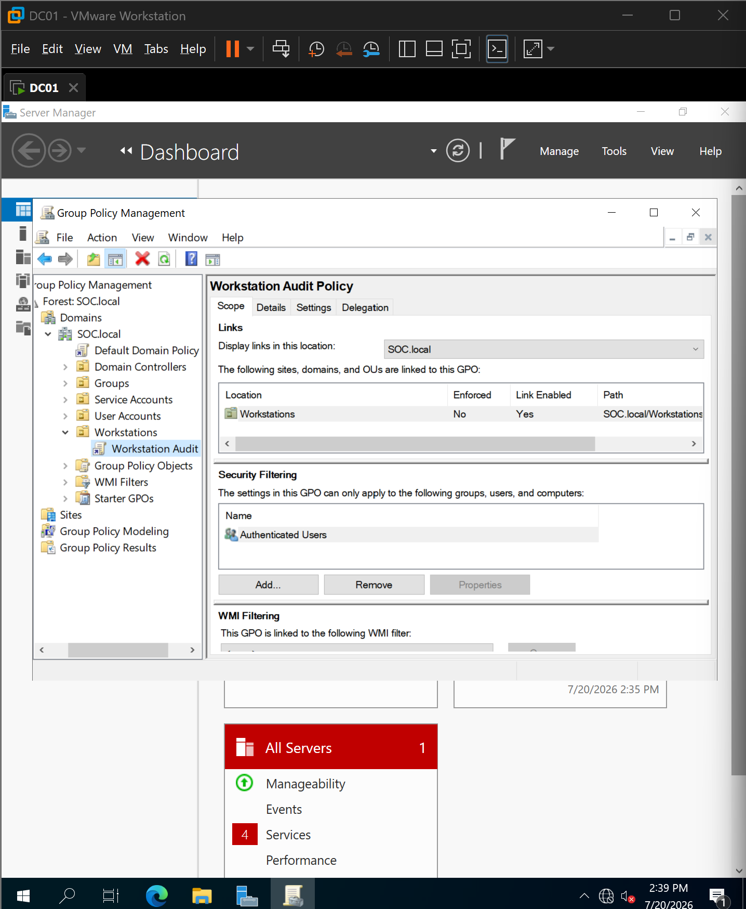
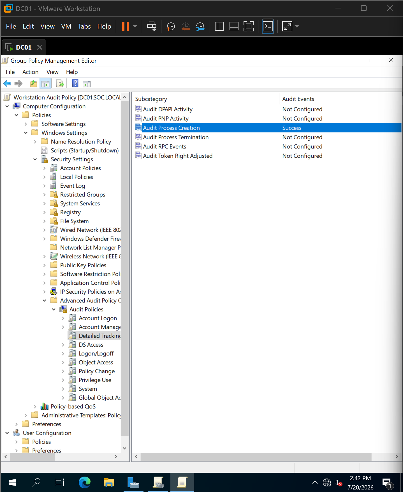
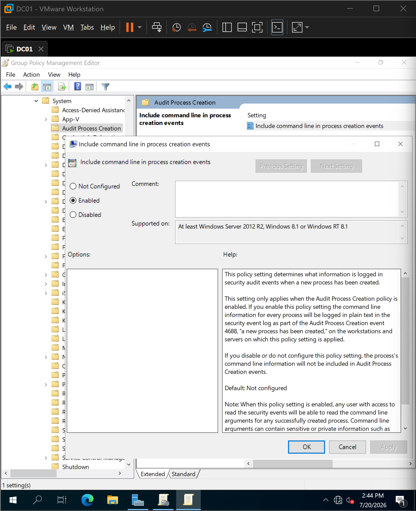
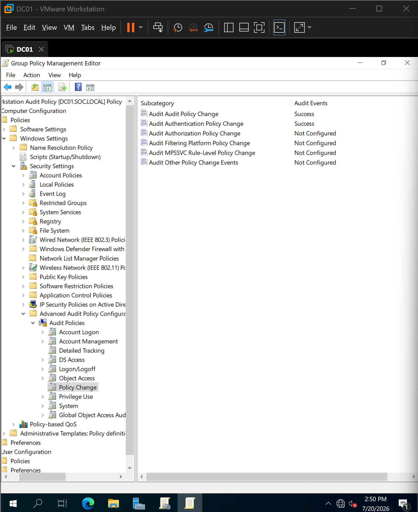
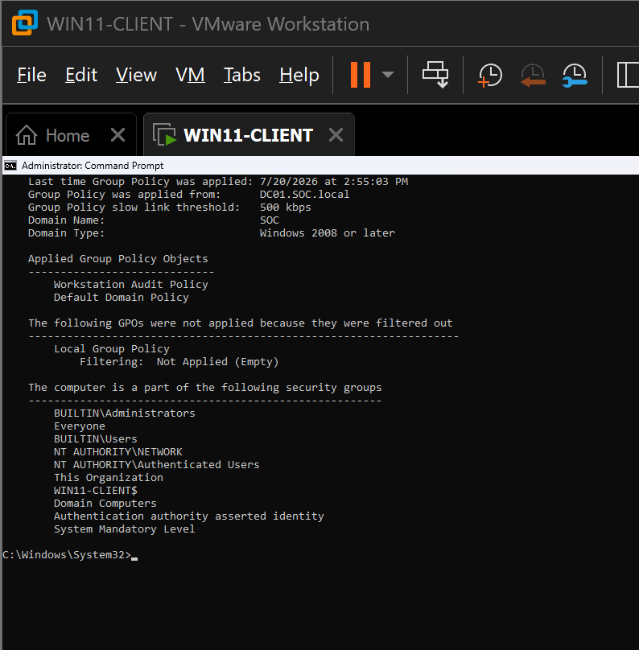
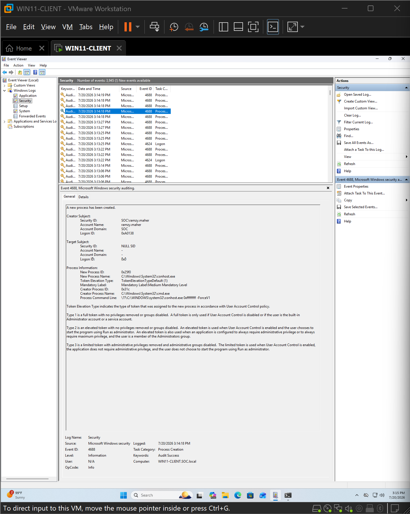

# 08 - Group Policy Configuration

## Overview

Following the deployment of the Windows Server domain controller and the successful domain join of the Windows 11 workstation, the next phase focused on establishing a centralized auditing baseline using Active Directory Group Policy.

Rather than configuring individual systems manually, a dedicated Group Policy Object (GPO) was created and linked to the **Workstations** Organizational Unit (OU). This approach ensures that security auditing settings are applied consistently to all managed workstations while maintaining centralized administration.

The primary objective of this policy was to enable the Windows audit events required for endpoint visibility, detection engineering, and future SIEM integration.

---

## Objectives

The objectives of this implementation were to:

- Deploy a dedicated workstation auditing policy through Group Policy.
- Enable Windows Advanced Audit Policy settings relevant to security monitoring.
- Configure command-line logging for process creation events.
- Validate successful Group Policy deployment.
- Verify that Windows Security logs generate the required audit events for future Sysmon and Wazuh integration.

---

## Group Policy Design

A dedicated Group Policy Object named **Workstation Audit Policy** was created and linked to the **Workstations** Organizational Unit.

This design isolates workstation-specific auditing from Domain Controller policies, allowing each system type to maintain its own security baseline while following enterprise Active Directory administration practices.



---

## Audit Policy Configuration

The policy enables Windows Advanced Audit Policy settings required for endpoint telemetry collection.

### Detailed Tracking

| Setting | Configuration |
|----------|---------------|
| Audit Process Creation | Success |

Enabling Process Creation auditing causes Windows Security Event **4688** to be generated whenever a new process is created.

This event provides the foundation for monitoring process execution across managed endpoints.



---

### Process Command-Line Logging

Process creation events become significantly more valuable when command-line arguments are recorded.

The following administrative template policy was enabled:

```
Computer Configuration
└── Policies
    └── Administrative Templates
        └── System
            └── Audit Process Creation
                └── Include command line in process creation events
```

This configuration extends Event ID 4688 by recording the command line associated with every newly created process.

Without this setting, investigators would know **which executable** was launched but not **how it was executed**, reducing the usefulness of process creation events during incident response.



---

### Additional Audit Settings

To improve endpoint visibility, several additional Advanced Audit Policy subcategories were enabled.

| Category | Configuration |
|----------|---------------|
| Audit Logon | Success |
| Audit Logoff | Success |
| Audit User Account Management | Success |
| Audit Security Group Management | Success |
| Audit Audit Policy Change | Success |
| Audit Authentication Policy Change | Success |

These settings provide visibility into authentication activity, account management operations, security group modifications, and changes to the auditing configuration itself.



---

## Policy Deployment Validation

After configuring the Group Policy Object, the Windows 11 workstation refreshed its policies using:

```cmd
gpupdate /force
```

The applied Group Policy Objects were then verified using:

```cmd
gpresult /r
```

Validation confirmed that the workstation successfully received and applied both:

- Default Domain Policy
- Workstation Audit Policy

This confirmed that the policy was correctly linked and processed by the domain-joined workstation.



---

## Audit Event Validation

Following successful policy deployment, Windows Security auditing was validated using Event Viewer.

A new process was executed on the workstation, generating **Security Event ID 4688 (Process Creation)**.

Validation confirmed that the event contained:

- Process Name
- Process Identifier
- Creator Process
- Process Command Line

The presence of the **Process Command Line** field verified that the command-line logging policy was functioning as intended.

This validation confirms that the endpoint is now generating high-value telemetry suitable for security monitoring and future SIEM ingestion.



---

## Lessons Learned

Several important observations were made during this implementation:

- Windows Advanced Audit Policy provides significantly more granular auditing than the legacy audit policy configuration.
- Command-line logging substantially improves the investigative value of Process Creation events.
- Group Policy allows security configurations to be deployed consistently across managed endpoints without requiring manual configuration.
- Verifying policy application with **gpresult** is an essential validation step before relying on generated audit events.

---

## Outcome

A centralized workstation auditing baseline was successfully implemented using Active Directory Group Policy.

The Windows 11 client now generates enriched Windows Security events, including detailed Process Creation telemetry with command-line arguments.

This auditing baseline establishes the foundation for the next phase of the project, where Microsoft Sysmon will be deployed to provide additional endpoint telemetry before forwarding events to the Wazuh SIEM platform.