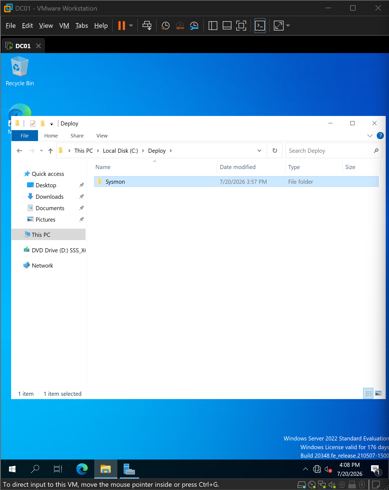
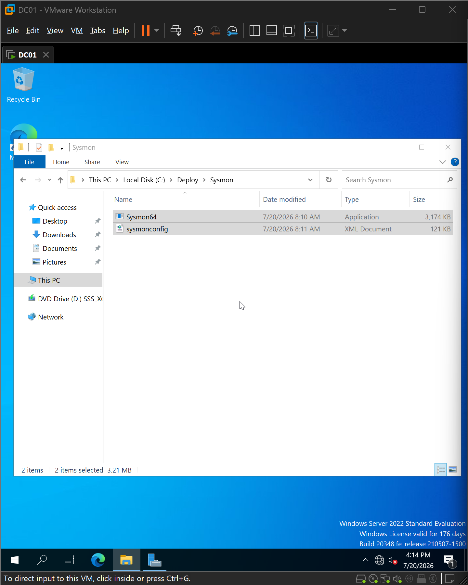
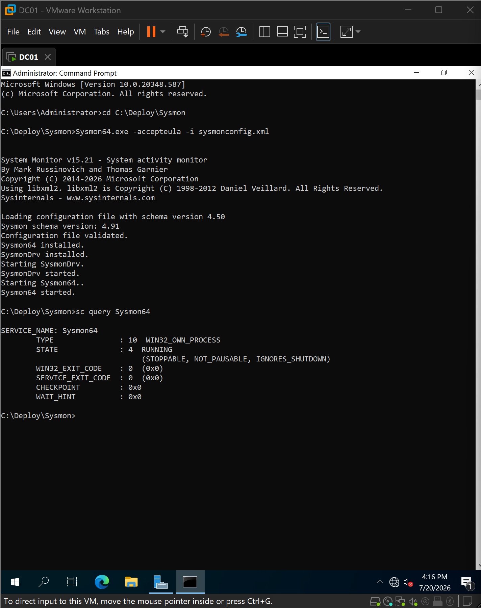
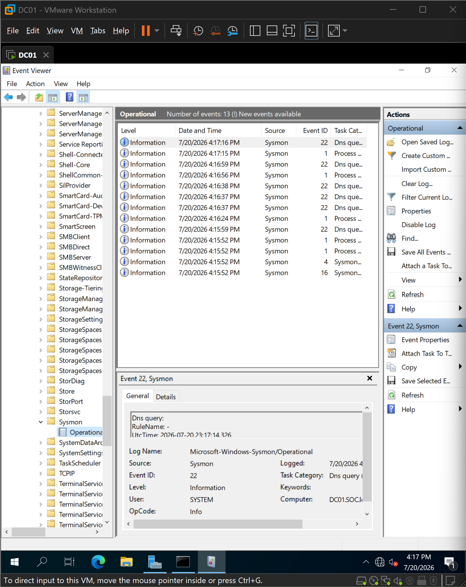
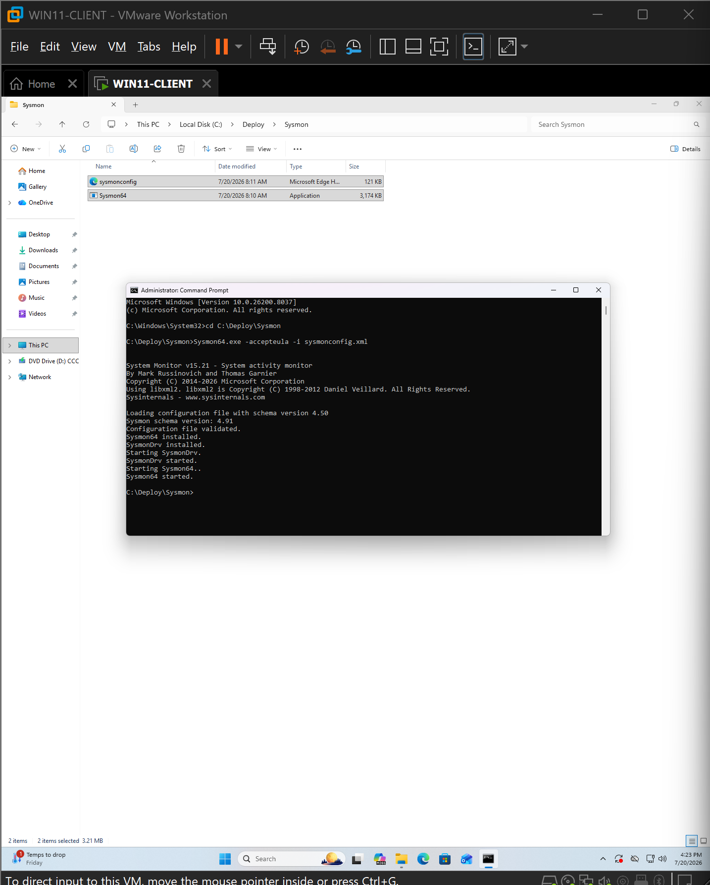
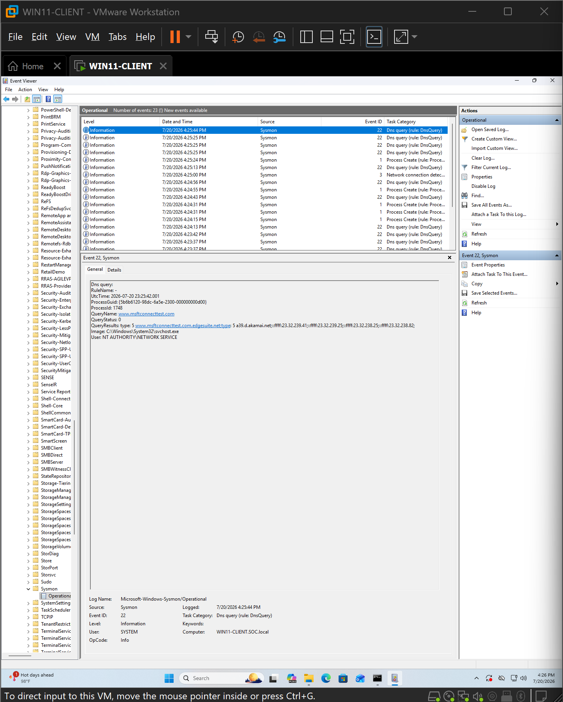
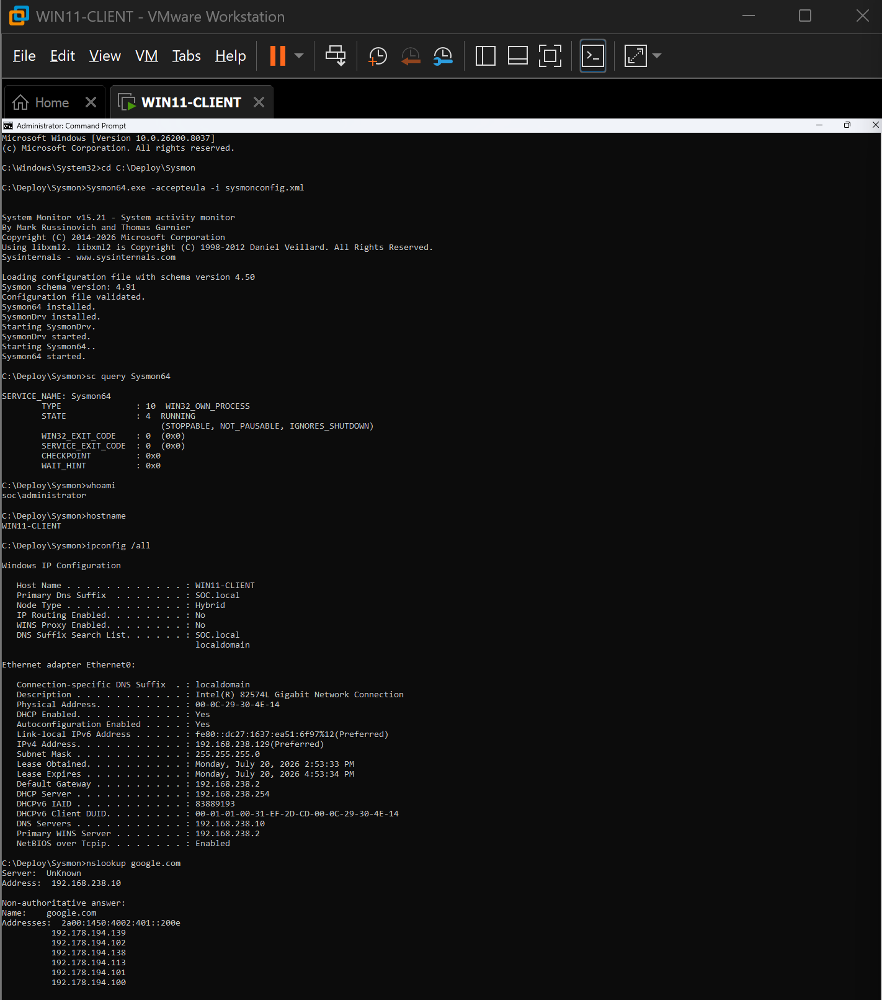
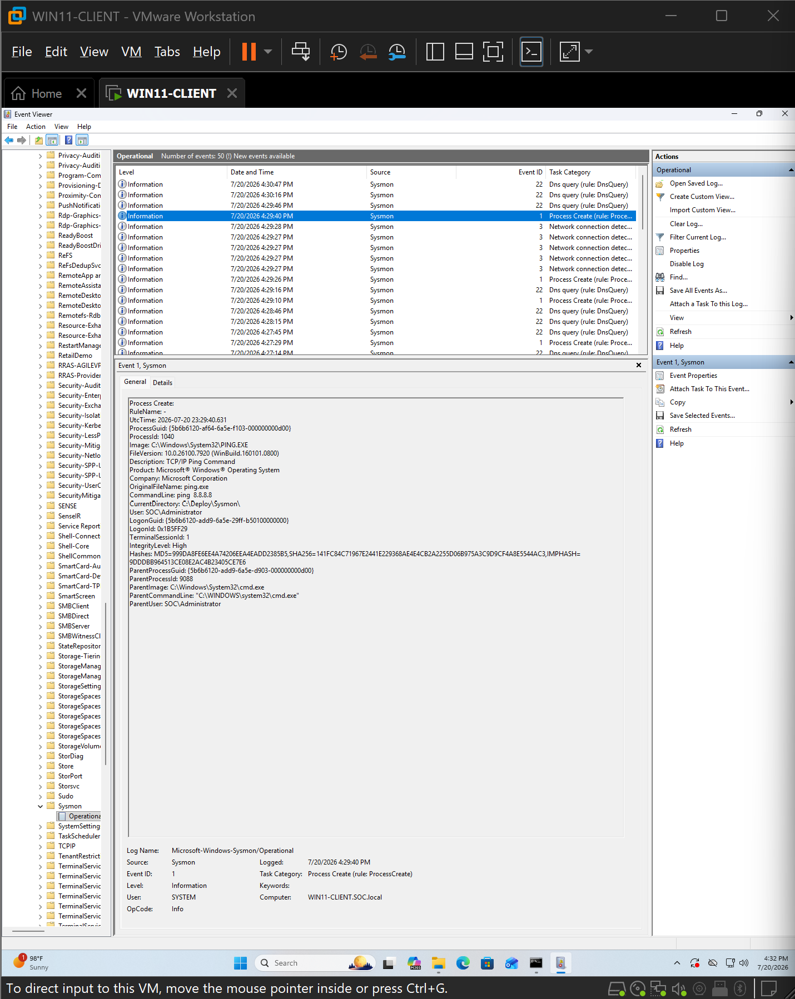
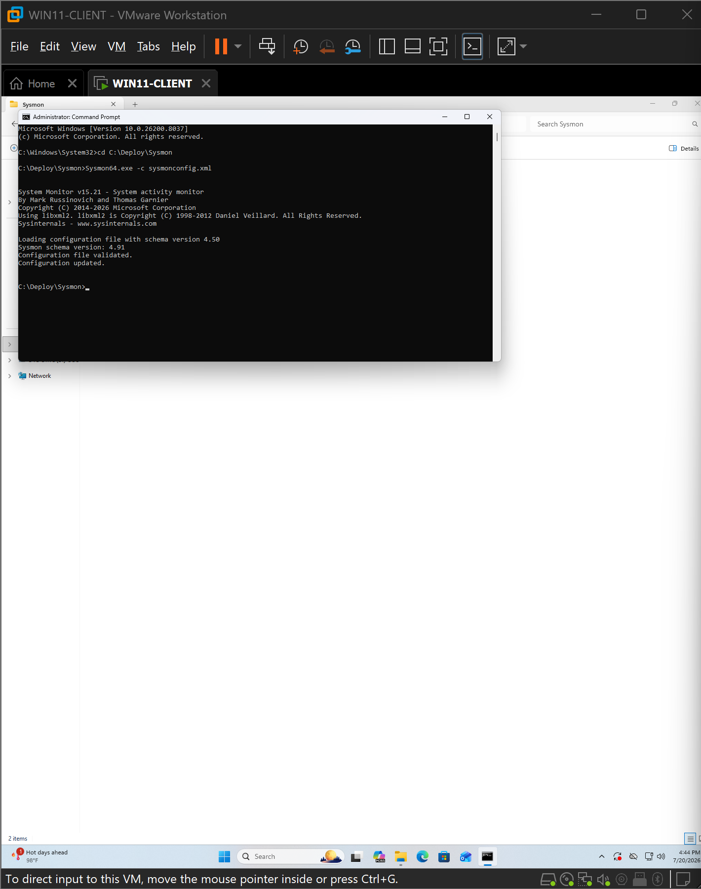
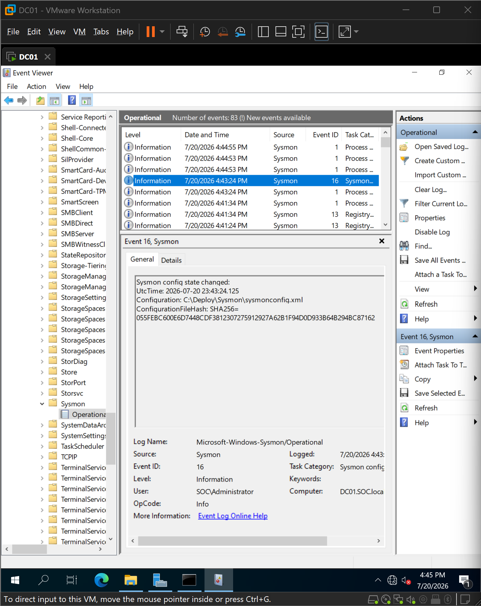

# 09 - Sysmon Deployment

## Overview

Following the implementation of Windows auditing through Group Policy, Sysmon (System Monitor) was deployed to provide detailed endpoint telemetry for the SIEM environment. Unlike native Windows Security logs, Sysmon records rich process, network, registry, file, and DNS activity that greatly improves detection capabilities.

The deployment was performed on both the Domain Controller (DC01) and the Windows 11 client to ensure consistent telemetry across the lab environment.

---

## Objectives

- Deploy Sysmon on all Windows systems.
- Use a community-maintained configuration to reduce unnecessary logging.
- Validate successful installation and service operation.
- Verify that Sysmon generates endpoint telemetry.
- Confirm configuration updates can be applied without reinstalling the service.

---

## Environment

| Component | Value |
|-----------|-------|
| Domain Controller | DC01 |
| Client Workstation | WIN11-CLIENT |
| Operating Systems | Windows Server 2022 / Windows 11 Pro |
| Sysmon Version | 15.21 |
| Configuration | SwiftOnSecurity Sysmon Configuration |

---

## Preparing the Deployment Files

The official Sysmon package was downloaded from Microsoft Sysinternals, while the Sysmon configuration was obtained from the SwiftOnSecurity GitHub repository.

A dedicated deployment directory was created on each system to keep the binaries and configuration organized.

```text
C:\Deploy\Sysmon
```



The Sysmon executable and XML configuration file were copied into the deployment directory.



---

## Installing Sysmon

Sysmon was installed from an elevated Command Prompt using the following command:

```cmd
Sysmon64.exe -accepteula -i sysmonconfig.xml
```

The installation automatically:

- Accepted the Sysinternals EULA
- Installed the Sysmon service
- Installed the Sysmon driver
- Loaded the XML configuration
- Started the monitoring service

The service status was verified afterwards.

```cmd
sc query Sysmon64
```

The service reported a **RUNNING** state, confirming a successful installation.



---

## Validating Sysmon Events

After installation, Sysmon immediately began collecting endpoint activity.

Validation was performed using:

```
Event Viewer
    Applications and Services Logs
        Microsoft
            Windows
                Sysmon
                    Operational
```

Initial events included:

- Event ID 1 – Process Creation
- Event ID 22 – DNS Query
- Event ID 4 – Sysmon Service State Changed
- Event ID 16 – Configuration Changed

These events confirmed that Sysmon was functioning correctly on the Domain Controller.



---

## Deploying Sysmon to the Workstation

The same deployment procedure was repeated on the Windows 11 client.

The deployment directory was created and the required files were copied.



Sysmon was installed using the same installation command:

```cmd
Sysmon64.exe -accepteula -i sysmonconfig.xml
```

---

## Verifying Endpoint Telemetry

To generate telemetry, several common administrative commands were executed.

### DNS Query

```cmd
nslookup google.com
```

The generated Sysmon Event ID 22 confirmed successful DNS monitoring.



---

### Process Creation

```cmd
ping 8.8.8.8
```

Sysmon generated Event ID 1 containing detailed process metadata including:

- Executable path
- Command line
- Parent process
- Process GUID
- User context
- Process hashes

This demonstrates why Sysmon provides significantly richer endpoint telemetry than the default Windows Security log.



---

## Updating the Configuration

One of Sysmon's advantages is the ability to reload configuration changes without reinstalling the service.

The configuration was updated using:

```cmd
Sysmon64.exe -c sysmonconfig.xml
```

The update completed successfully on the Windows 11 client.



The same procedure was repeated on the Domain Controller.



After the update, Sysmon generated **Event ID 16**, confirming that the new configuration had been successfully applied.



---

## Validation Summary

The deployment was considered successful after verifying:

- ✓ Sysmon service installed successfully
- ✓ Sysmon service running
- ✓ Configuration file loaded successfully
- ✓ Process Creation events generated
- ✓ DNS Query events generated
- ✓ Configuration updates applied successfully
- ✓ Event ID 16 generated after configuration update
- ✓ Endpoint telemetry available on both Windows systems

---

## Lessons Learned

- Native Windows Security logs provide only limited visibility into endpoint activity.
- Sysmon significantly enhances detection by capturing detailed process, network, registry, and DNS events.
- Using a curated configuration reduces unnecessary logging while preserving valuable security telemetry.
- Configuration changes can be applied dynamically without reinstalling the service, simplifying future tuning.

---

## Outcome

Sysmon was successfully deployed and validated on both Windows systems within the lab. The environment now produces high-fidelity endpoint telemetry that will be forwarded to the SIEM platform in the next phase of the project.

This deployment establishes the primary endpoint visibility layer required for attack detection, threat hunting, and security monitoring throughout the remainder of the SIEM Monitoring Home Lab.