# 12 - Attack Simulation

## Overview

This phase validates the effectiveness of the monitoring infrastructure by executing adversary techniques from the MITRE ATT&CK framework and observing how endpoint security controls and the SIEM respond.

To provide a comprehensive evaluation, the attack simulation phase is divided into two stages:

- **Phase A – Microsoft Defender Enabled:** Validate prevention capabilities while confirming that security telemetry is successfully forwarded to Wazuh.
- **Phase B – Microsoft Defender Disabled:** Execute the same techniques without endpoint prevention to observe the complete attack chain and compare telemetry visibility.

This methodology demonstrates both preventive security controls and detection engineering capabilities.

---

# Attack Matrix

| Technique | ATT&CK ID | Phase A | Phase B |
|------------|-----------|:------:|:------:|
| PowerShell Fileless Script Execution | T1059.001 (Test 10) | ✅ | ⏳ |
| EncodedCommand Parameter Variations | T1059.001 (Test 15) | ✅ | ⏳ |
| Registry Modification | T1112 | ✅ | ⏳ |
| Scheduled Task | T1053.005 | ✅ | ⏳ |
| Registry Run Keys | T1547.001 | ✅ | ⏳ |

---

# Phase A – Microsoft Defender Enabled

---

# Technique 1 – PowerShell Fileless Script Execution

## MITRE ATT&CK

| Field | Value |
|-------|-------|
| Technique | Command and Scripting Interpreter: PowerShell |
| ATT&CK ID | T1059.001 |
| Atomic Test | Test #10 |
| Atomic Test Name | PowerShell Fileless Script Execution |

---

## Objective

Validate that a malicious PowerShell payload is detected by Microsoft Defender and that the generated endpoint telemetry is successfully forwarded to Wazuh.

---

## Attack Execution

The Atomic Red Team PowerShell test was executed from the Windows 11 client.

<p align="center">
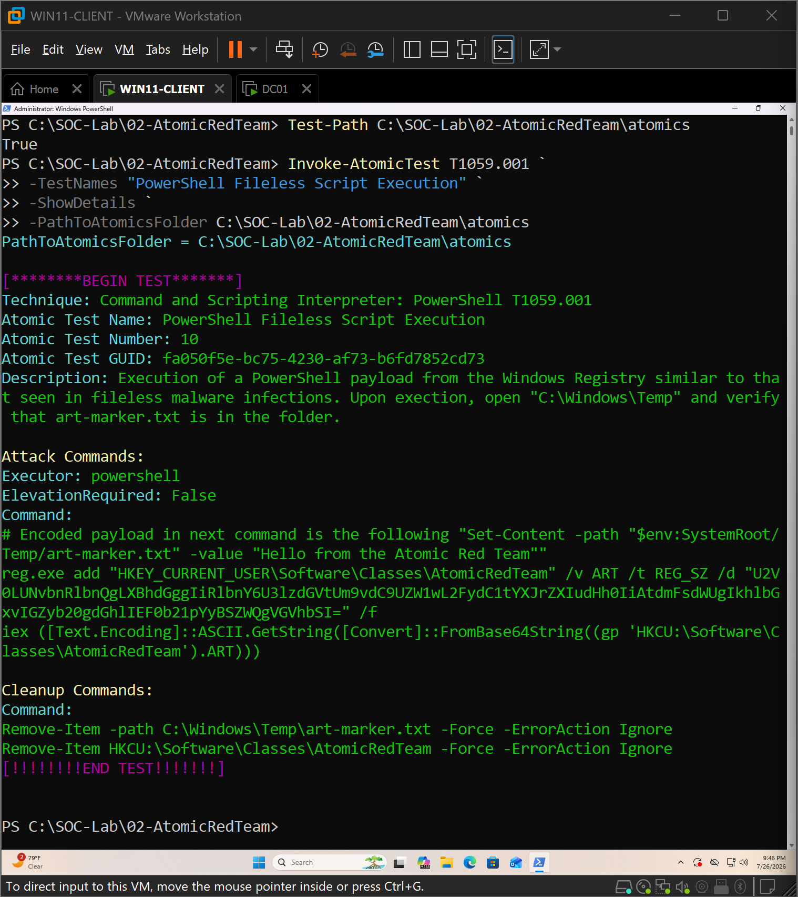
</p>

The test executes an encoded PowerShell payload that stores its content in the Windows Registry before executing it directly from memory, simulating fileless malware behavior.

The attack was then executed.

<p align="center">
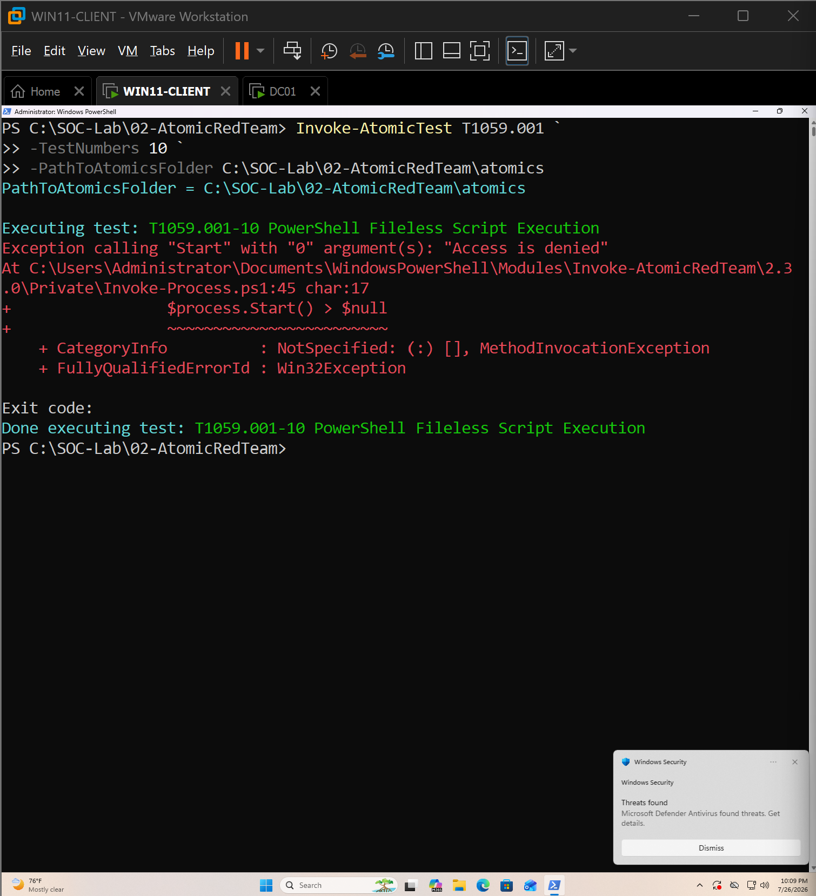
</p>

Immediately after execution, Microsoft Defender intercepted the payload and prevented it from running successfully.

---

## Endpoint Response

Microsoft Defender Real-Time Protection detected the malicious PowerShell payload.

<p align="center">
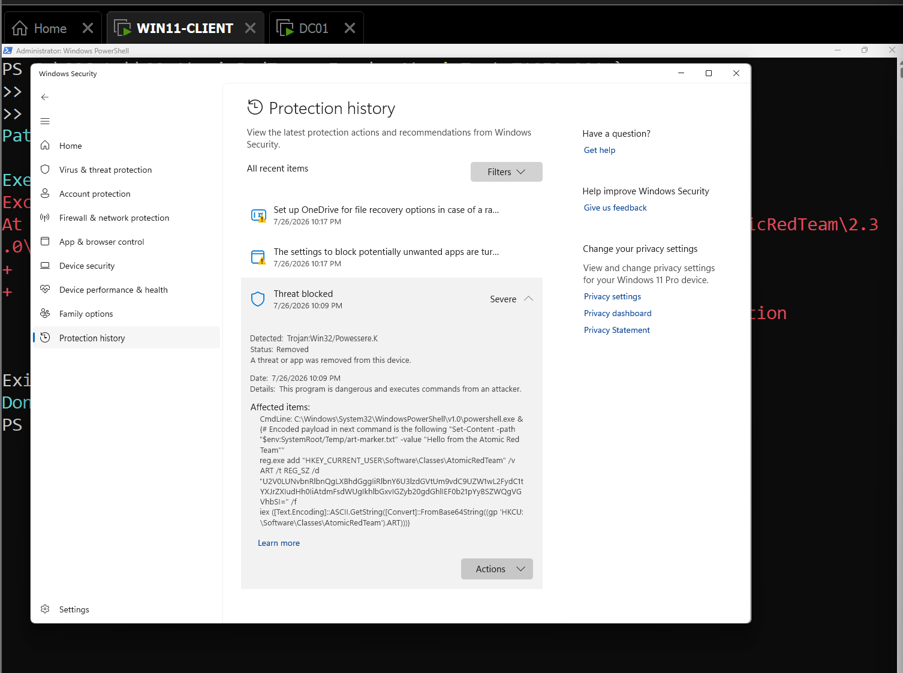
</p>

### Detection Summary

| Field | Value |
|-------|-------|
| Detection | Trojan:Win32/Powessere.K |
| Severity | Severe |
| Action | Removed |
| Protection | Microsoft Defender Real-Time Protection |

---

## Windows Event Logs

The detection generated a Windows Defender Operational event.

<p align="center">
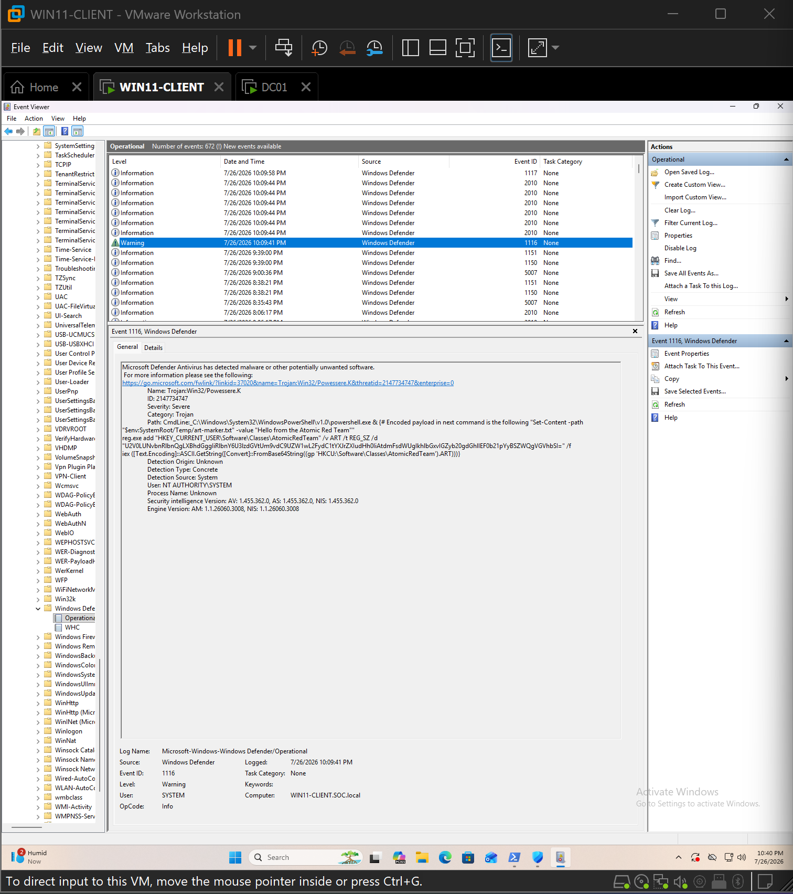
</p>

### Event Details

| Field | Value |
|-------|-------|
| Log | Microsoft-Windows-Windows Defender/Operational |
| Event ID | 1116 |
| Detection Origin | System |
| Event Type | Malware Detection |

The event records the detected threat together with the encoded PowerShell command responsible for the detection.

---

# Detection Pipeline Validation

Although Microsoft Defender successfully generated Event ID 1116 locally, the alert was initially missing from Wazuh.

Searching for Defender-related events returned no results.

<p align="center">
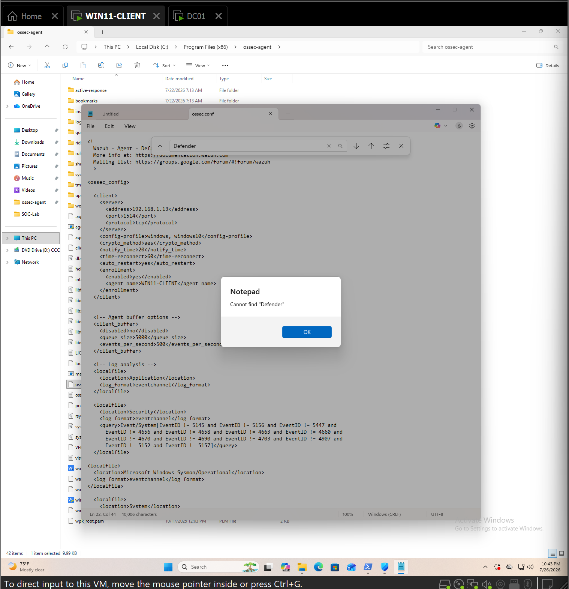
</p>

---

## Root Cause Analysis

The Wazuh agent configuration was inspected.

It was determined that the Windows Defender Operational event channel had not been configured for collection.

The following log source was added to **ossec.conf**.

<p align="center">

</p>

```xml
<localfile>
    <location>Microsoft-Windows-Windows Defender/Operational</location>
    <log_format>eventchannel</log_format>
</localfile>
```

After updating the configuration, the Wazuh agent was restarted.

---

## Validation

A new search confirmed that Microsoft Defender alerts were now successfully ingested by Wazuh.

Note: The Windows 11 client and the Wazuh server were operating with different system times during testing. Consequently, event timestamps differ between the endpoint and SIEM while still referring to the same execution.

<p align="center">
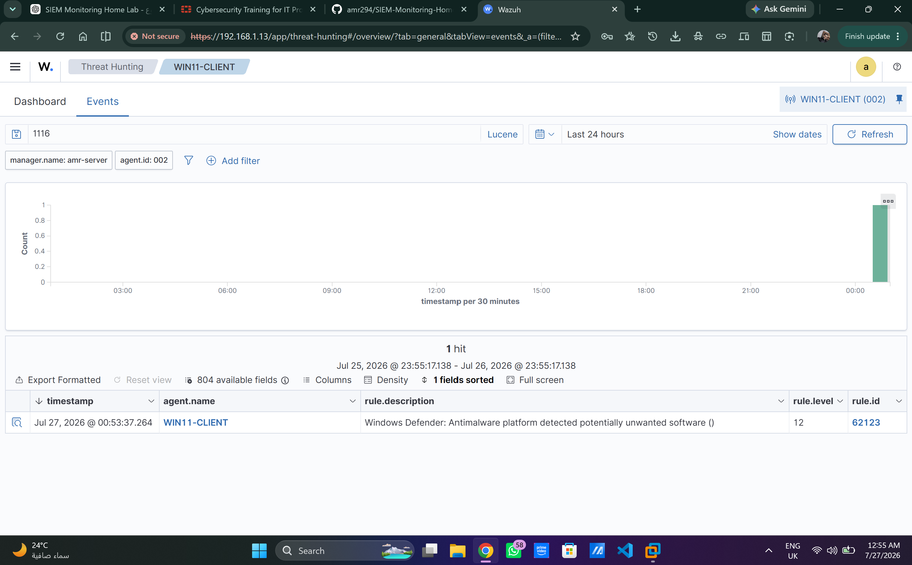
</p>

The SIEM successfully received and indexed the endpoint telemetry.

---

## Results

| Validation | Status |
|------------|:------:|
| Atomic test executed | ✅ |
| Defender detected the attack | ✅ |
| Event ID 1116 generated | ✅ |
| Endpoint telemetry produced | ✅ |
| Wazuh ingested the telemetry | ✅ |
| Detection pipeline validated | ✅ |

---

## Lessons Learned

- Endpoint prevention does not prevent telemetry generation.
- Windows Defender Operational logs provide valuable detection data for the SIEM.
- Wazuh requires explicit configuration to ingest Windows Defender Operational events.
- Validating the complete telemetry pipeline is as important as executing the attack itself.

---

# Technique 2 – PowerShell EncodedCommand Parameter Variations

## MITRE ATT&CK

| Field | Value |
|-------|-------|
| Technique | Command and Scripting Interpreter: PowerShell |
| ATT&CK ID | T1059.001 |
| Atomic Test | Test #15 |
| Atomic Test Name | ATHPowerShellCommandLineParameter - EncodedCommand parameter variations |

---

## Objective

Validate that PowerShell executed using encoded command-line parameter variations is successfully captured by Sysmon and forwarded to Wazuh, while observing the behavior of Microsoft Defender during execution.

---

## Attack Execution

The Atomic Red Team test information was reviewed before execution to verify the technique, command syntax, and execution requirements.

<p align="center">
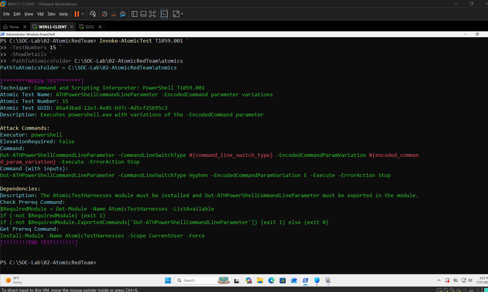
</p>

Unlike the previous PowerShell test, this Atomic test executes PowerShell using variations of the **-EncodedCommand** parameter to emulate adversarial command-line obfuscation techniques frequently observed during post-exploitation activities.

The Atomic test was then executed successfully.

<p align="center">
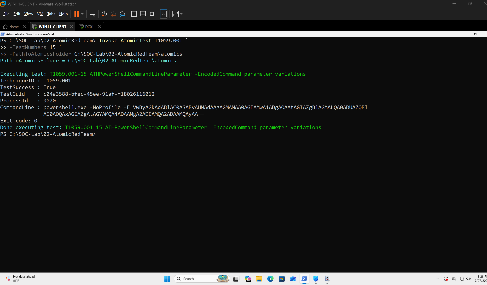
</p>

### Execution Summary

| Field | Value |
|-------|-------|
| Test Result | Success |
| Exit Code | 0 |
| Technique | T1059.001 |
| Executor | PowerShell |
| Behavior | Encoded PowerShell command execution |

The Atomic Red Team framework completed the simulation successfully, confirming that the encoded PowerShell command executed without errors.

---

## Endpoint Response

During this execution, Microsoft Defender did **not** prevent the encoded PowerShell command from executing.

However, Windows Defender Protection History still contained detections generated by a previously executed Atomic Red Team technique.

<p align="center">
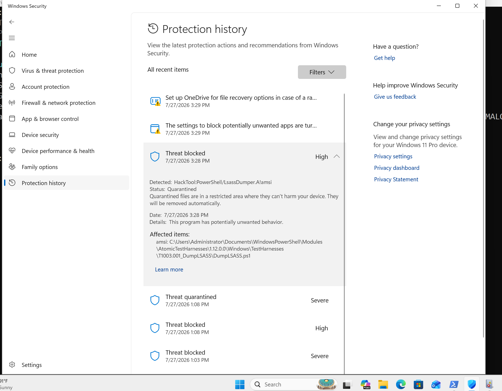
</p>

The detection shown above corresponds to an earlier **LSASS Dump** Atomic test and is included only to demonstrate that endpoint protection remained active throughout the testing session. It is **not** a detection generated by Test #15.

---

## Windows Event Logs

The Windows Defender Operational log also contains the corresponding Event ID 1116 generated by the earlier LSASS detection.

<p align="center">
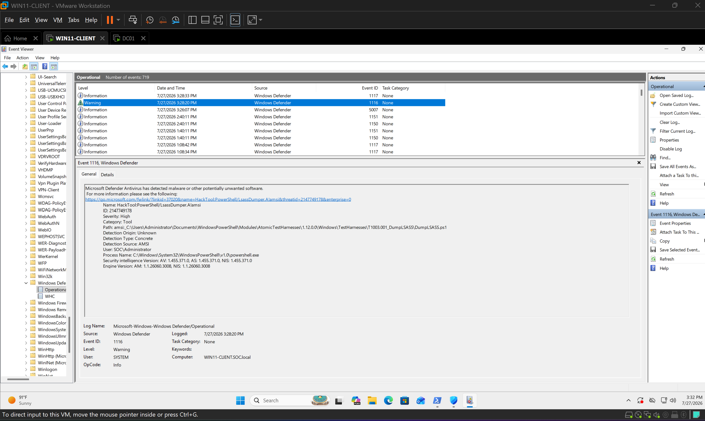
</p>

This event validates that Microsoft Defender Operational logging remained functional while the current Atomic test executed successfully.

---

## Wazuh Detection

Although Microsoft Defender did not block this Atomic test, endpoint telemetry generated by Sysmon was successfully forwarded to Wazuh.

Threat Hunting displayed multiple events associated with the execution.

<p align="center">
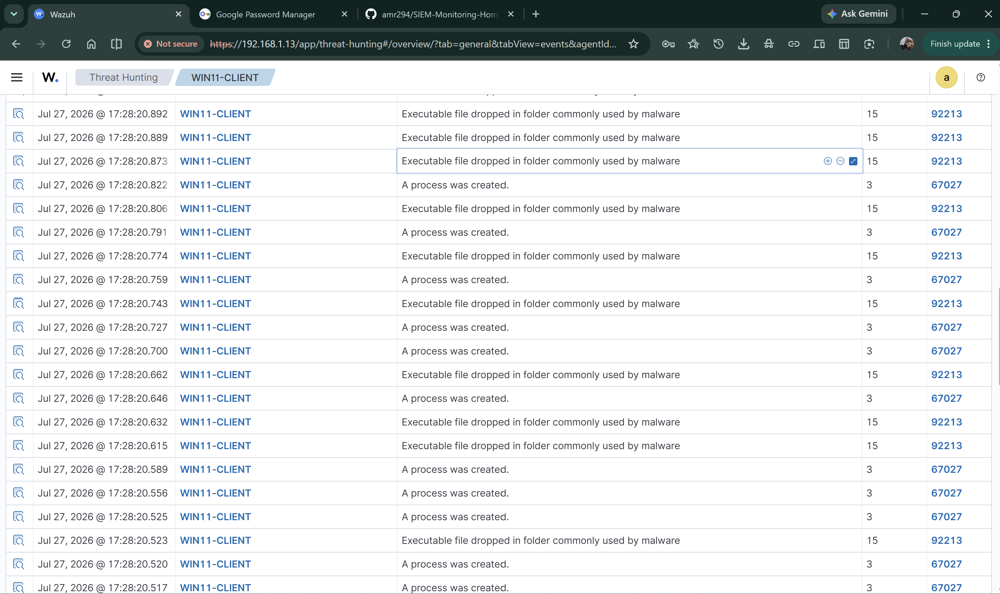
</p>

The SIEM recorded multiple security events including process creation telemetry and additional behavioral detections generated during the encoded PowerShell execution.

---

## Sysmon Telemetry Validation

Inspection of the Sysmon Process Create event confirms that the executed process contained the encoded PowerShell command generated by Atomic Red Team.

<p align="center">
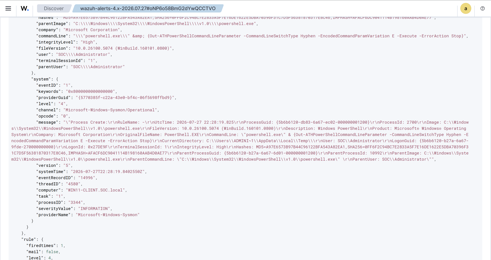
</p>

### Telemetry Summary

| Field | Value |
|-------|-------|
| Event Source | Sysmon |
| Event ID | 1 |
| Event Type | Process Create |
| Technique | T1059.001 |
| Process | powershell.exe |
| Command Line | Encoded PowerShell command |
| Forwarded to Wazuh | ✅ |

The captured telemetry includes the full PowerShell command line together with the execution context, providing sufficient evidence for threat hunting and detection engineering.

---

## Results

| Validation | Status |
|------------|:------:|
| Atomic test executed | ✅ |
| PowerShell executed successfully | ✅ |
| Sysmon Process Create generated | ✅ |
| Endpoint telemetry produced | ✅ |
| Wazuh received the telemetry | ✅ |
| Detection pipeline validated | ✅ |

---

## Lessons Learned

- Encoded PowerShell execution can complete successfully without being blocked by Microsoft Defender.
- Sysmon provides detailed process creation telemetry, including encoded PowerShell command lines.
- Wazuh successfully ingested the generated endpoint telemetry for investigation and threat hunting.
- Successful attack execution is valuable for validating visibility across the entire detection pipeline.

---

# Technique 3 – Registry Modification

## MITRE ATT&CK

| Field | Value |
|-------|-------|
| Technique | Modify Registry |
| ATT&CK ID | T1112 |
| Atomic Test | Test #40 |
| Atomic Test Name | NetWire RAT Registry Key Creation |

---

## Objective

Validate that registry modifications associated with malware persistence are successfully recorded by Sysmon and ingested by Wazuh for detection and investigation.

---

## Attack Execution

Atomic Red Team Test #40 was executed from the Windows 11 client.

<p align="center">
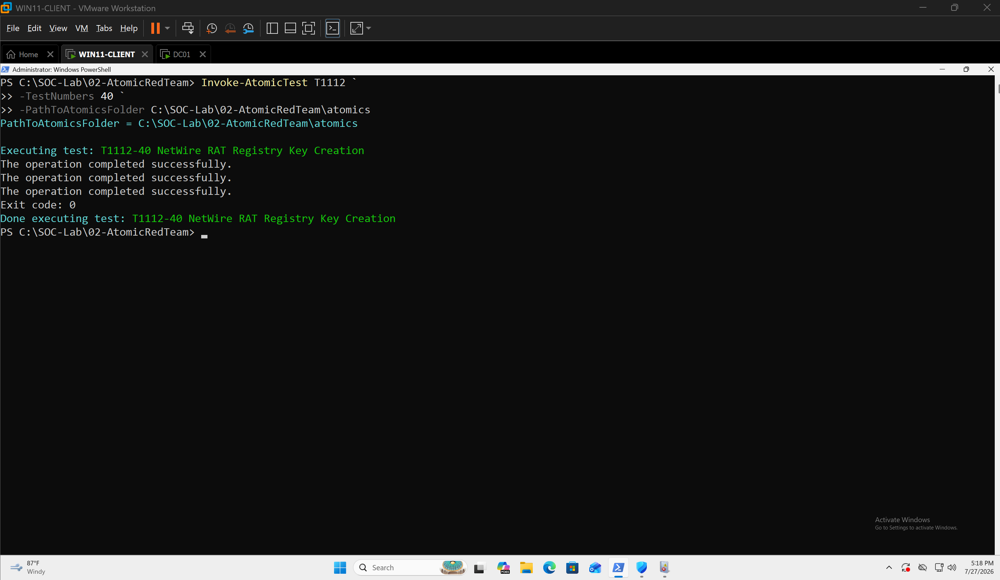
</p>

The Atomic test completed successfully and created registry entries that emulate configuration and persistence artifacts commonly associated with the NetWire Remote Access Trojan (RAT).

### Execution Summary

| Field | Value |
|-------|-------|
| Test Result | Success |
| Exit Code | 0 |
| Technique | T1112 |
| Behavior | Registry Modification |

---

## Registry Artifact Validation

Following execution, the Windows Registry was inspected to verify that the persistence entry had been created.

The following **Run Key** was added under the current user's registry hive.

<p align="center">
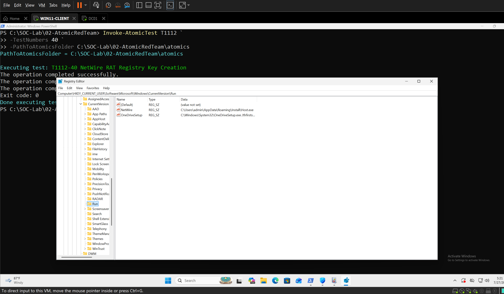
</p>

The registry value references a simulated NetWire executable located within the user's AppData directory, representing a persistence mechanism that executes automatically during user logon.

The Atomic test also created an additional registry key containing configuration values commonly observed with the NetWire malware family.

<p align="center">
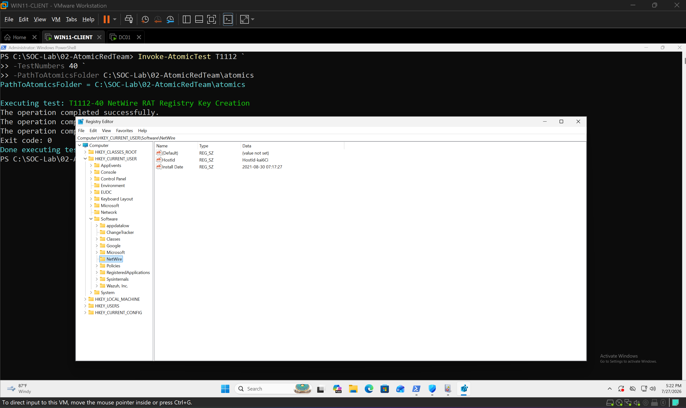
</p>

These registry artifacts confirm that the Atomic test successfully modified the Windows Registry as intended.

---

## Wazuh Detection

After execution, Wazuh Threat Hunting displayed multiple registry-related detections generated from the endpoint.

> **Note:** The Windows 11 client and the Wazuh server were operating with different system times during testing. Consequently, timestamps differ between the endpoint and SIEM while still representing the same attack execution.

<p align="center">
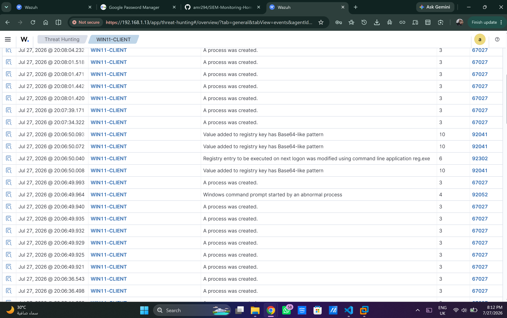
</p>

Among the generated alerts, Wazuh detected the registry modification using Sysmon Event ID 13 and raised Rule **92302**.

Interestingly, although the executed Atomic test belongs to **MITRE ATT&CK T1112 (Modify Registry)**, Wazuh mapped the activity to **T1547.001 (Registry Run Keys / Startup Folder)** because the modified registry location represents a persistence mechanism executed during user logon.

This demonstrates behavior-based detection rather than simply identifying the executed Atomic technique.

---

## Sysmon Telemetry Validation

Inspecting the generated Sysmon event confirms the registry modification performed by **reg.exe**.

<p align="center">
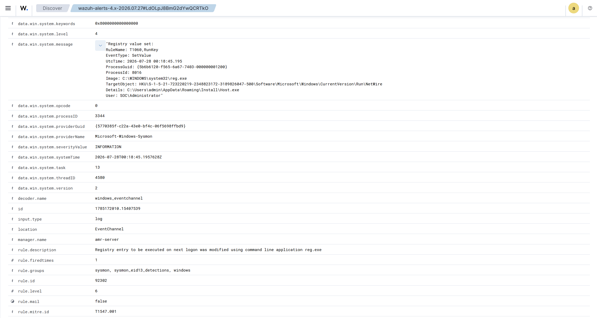
</p>

### Telemetry Summary

| Field | Value |
|-------|-------|
| Event Source | Sysmon |
| Event ID | 13 |
| Event Type | Registry Value Set |
| Process | reg.exe |
| Registry Path | HKCU\Software\Microsoft\Windows\CurrentVersion\Run\NetWire |
| Detection Rule | 92302 |
| MITRE Mapping | T1547.001 |
| Forwarded to Wazuh | ✅ |

The event contains the modified registry path, the value written to the Run Key, and the responsible process, providing complete forensic context for investigation.

---

## Results

| Validation | Status |
|------------|:------:|
| Atomic test executed | ✅ |
| Registry modified | ✅ |
| Persistence artifact created | ✅ |
| Sysmon Event ID 13 generated | ✅ |
| Wazuh detected the activity | ✅ |
| Detection pipeline validated | ✅ |

---

## Lessons Learned

- Registry modifications generate valuable telemetry through Sysmon Event ID 13.
- Registry Run Keys are a common persistence mechanism leveraged by malware.
- Wazuh correlates registry activity based on behavioral context rather than solely on the originating Atomic technique.
- Combining Sysmon with Wazuh provides detailed visibility into Windows persistence mechanisms.

---

# Technique 4 – Scheduled Task

## MITRE ATT&CK

| Field | Value |
|-------|-------|
| Technique | Scheduled Task/Job: Scheduled Task |
| ATT&CK ID | T1053.005 |
| Atomic Test | Test #7 |
| Atomic Test Name | Scheduled Task Executing Base64 Encoded Commands From Registry |

---

## Objective

Validate that the creation of a malicious scheduled task is successfully recorded by Sysmon and detected by Wazuh while demonstrating how multiple telemetry sources correlate a persistence technique.

---

## Attack Execution

The Atomic Red Team test details were reviewed prior to execution.

<p align="center">
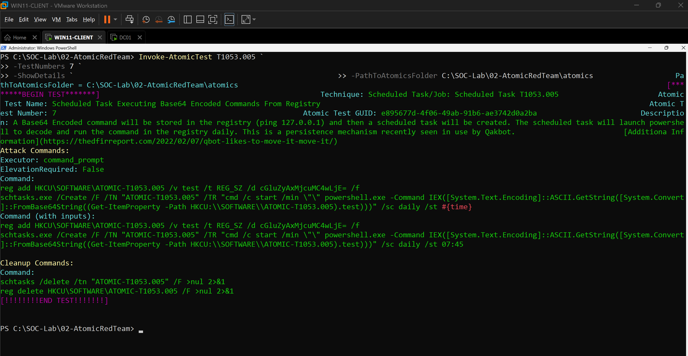
</p>

This Atomic test simulates a persistence technique commonly associated with malware families such as **Qakbot** by storing a Base64-encoded PowerShell command inside the Windows Registry and creating a scheduled task that retrieves and executes the encoded payload.

The Atomic test was then executed successfully.

<p align="center">
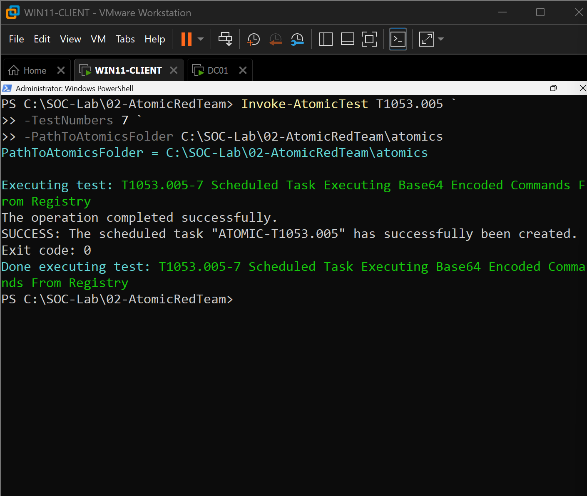
</p>

### Execution Summary

| Field | Value |
|-------|-------|
| Test Result | Success |
| Exit Code | 0 |
| Technique | T1053.005 |
| Behavior | Scheduled Task Creation |

The Atomic Red Team framework successfully created the scheduled task without errors.

---

## Persistence Artifact Validation

Following execution, Windows Task Scheduler was inspected to verify that the persistence mechanism had been created successfully.

<p align="center">
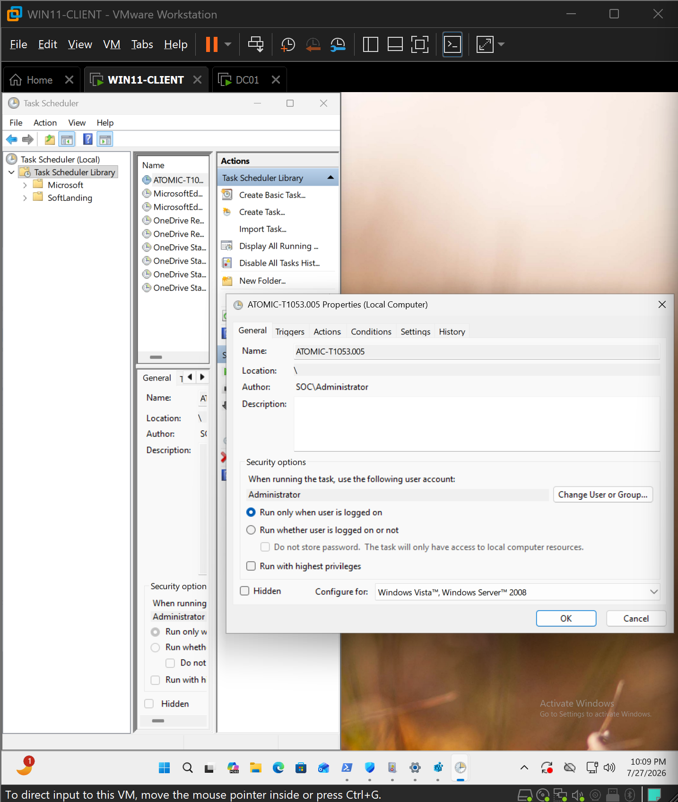
</p>

The scheduled task **ATOMIC-T1053.005** was successfully created under the **Task Scheduler Library** and configured to execute a PowerShell command that retrieves an encoded payload stored in the Windows Registry.

This confirms that the persistence artifact was successfully established on the endpoint.

---

## Wazuh Detection

After execution, Wazuh Threat Hunting displayed multiple alerts generated from the attack.

> **Note:** The Windows 11 client and the Wazuh server were operating with different system times during testing. Consequently, timestamps differ between the endpoint and SIEM while still representing the same attack execution.

<p align="center">
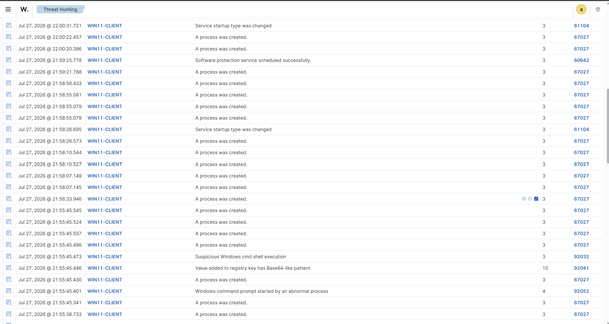
</p>

Instead of generating a single alert, Wazuh correlated multiple behaviors associated with the scheduled task creation, including:

- Process Creation
- Registry modification
- Base64-encoded registry value detection
- Suspicious Windows command shell execution
- Abnormal command prompt execution

This demonstrates how a single persistence technique can produce multiple detection opportunities across different telemetry sources.

---

## Sysmon Telemetry Validation

Inspection of the generated Sysmon Process Create event confirms the complete command responsible for creating both the registry value and the scheduled task.

<p align="center">
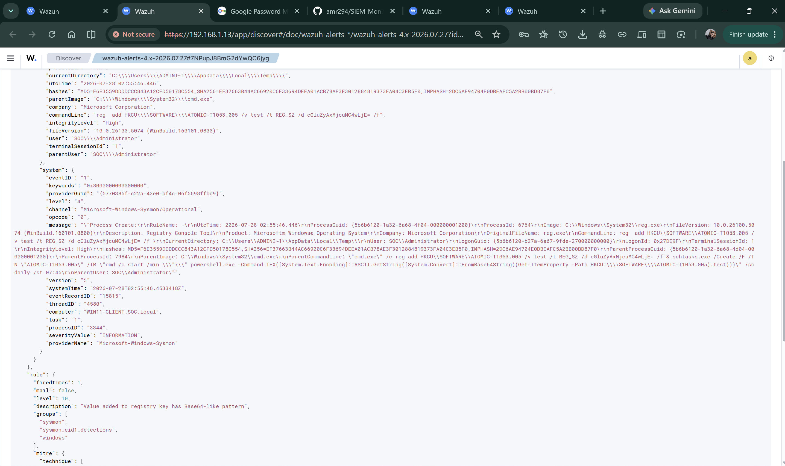
</p>

### Telemetry Summary

| Field | Value |
|-------|-------|
| Event Source | Sysmon |
| Event ID | 1 |
| Event Type | Process Create |
| Process | reg.exe |
| Child Activity | schtasks.exe |
| Technique | T1053.005 |
| Forwarded to Wazuh | ✅ |

The captured command line clearly shows the creation of the **ATOMIC-T1053.005** scheduled task together with the registry value used to store the encoded PowerShell payload, providing complete forensic context for investigation.

---

## Results

| Validation | Status |
|------------|:------:|
| Atomic test executed | ✅ |
| Scheduled task created | ✅ |
| Persistence artifact validated | ✅ |
| Sysmon telemetry generated | ✅ |
| Wazuh detected the activity | ✅ |
| Detection pipeline validated | ✅ |

---

## Lessons Learned

- Scheduled Tasks remain one of the most common Windows persistence mechanisms leveraged by adversaries.
- A single persistence technique can generate multiple correlated detections across Sysmon and Wazuh.
- Capturing complete command-line telemetry significantly improves forensic investigation and threat hunting.
- Correlating registry modifications, scheduled task creation, and process execution provides stronger detection coverage than relying on individual events alone.

---

# Technique 5 – Registry Run Keys / Startup Folder

## MITRE ATT&CK

| Field | Value |
|-------|-------|
| Technique | Boot or Logon Autostart Execution: Registry Run Keys / Startup Folder |
| ATT&CK ID | T1547.001 |
| Atomic Test | Test #1 |
| Atomic Test Name | Reg Key Run |

---

## Objective

Validate that a persistence mechanism implemented through Windows Registry Run Keys is successfully recorded by Sysmon and detected by Wazuh while demonstrating visibility into registry-based persistence techniques.

---

## Attack Execution

The Atomic Red Team test was executed from the Windows 11 client.

<p align="center">
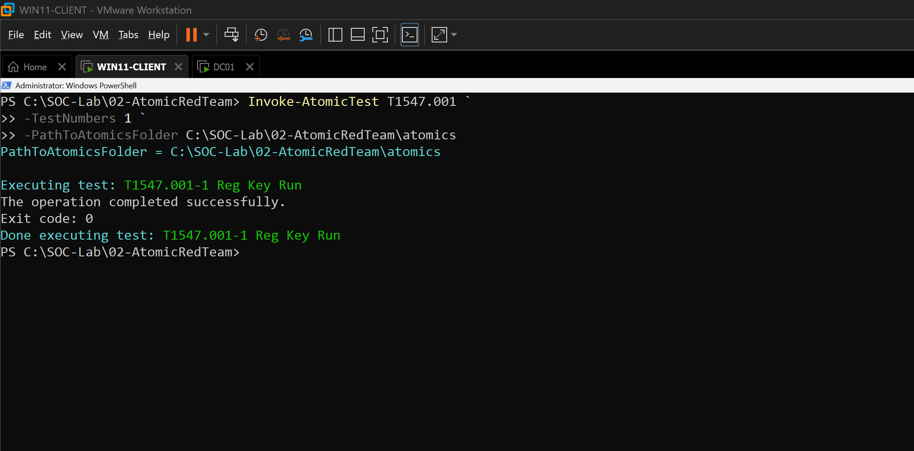
</p>

The Atomic test simulates a common persistence technique by creating a new value under the Windows **Run** registry key. Any executable referenced by this registry value will automatically execute when the user logs on.

### Execution Summary

| Field | Value |
|-------|-------|
| Test Result | Success |
| Exit Code | 0 |
| Technique | T1547.001 |
| Behavior | Registry Run Key Persistence |

The Atomic Red Team framework completed the simulation successfully and created the persistence artifact without errors.

---

## Persistence Artifact Validation

Following execution, the Run key was inspected using PowerShell to verify that the registry value had been created successfully.

<p align="center">
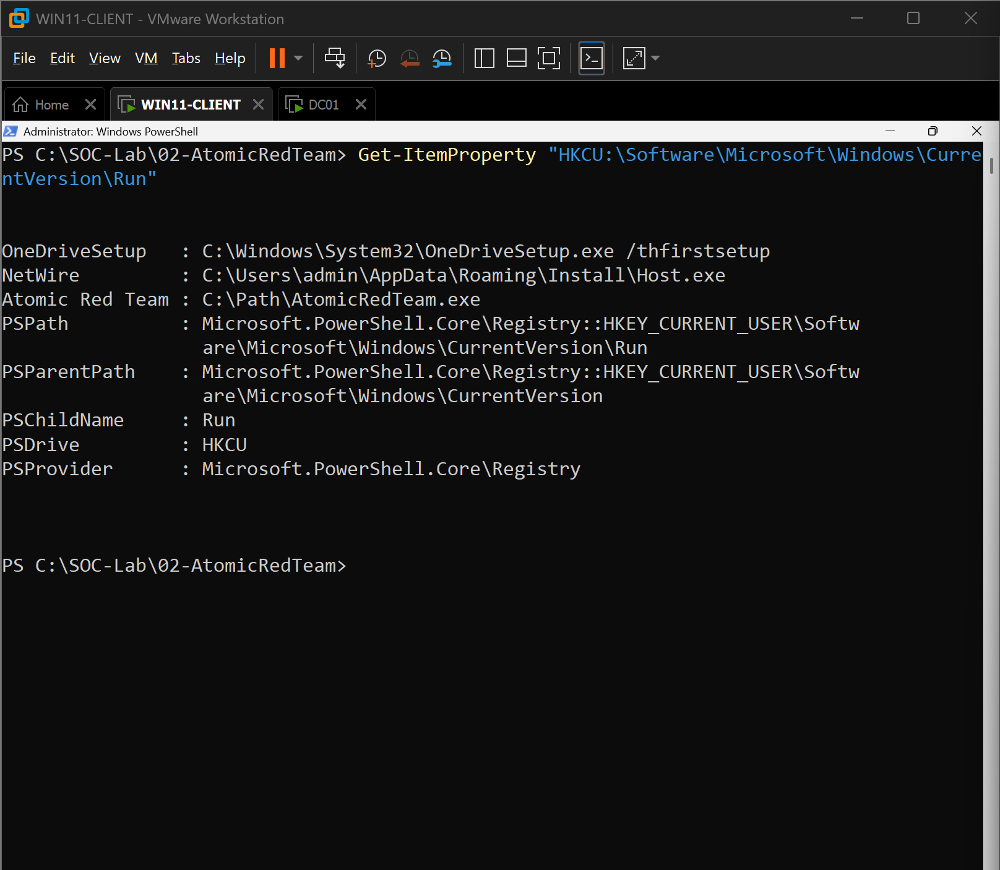
</p>

The output confirms that a new registry value named **Atomic Red Team** was added beneath the current user's **Run** registry key.

This persistence mechanism causes the referenced executable to launch automatically whenever the user logs on, making Registry Run Keys one of the most common Windows persistence techniques used by malware.

---

## Wazuh Detection

After execution, Wazuh Threat Hunting displayed multiple alerts generated from the registry modification.

> **Note:** The Windows 11 client and the Wazuh server were operating with different system times during testing. Consequently, timestamps differ between the endpoint and SIEM while still representing the same attack execution.

<p align="center">
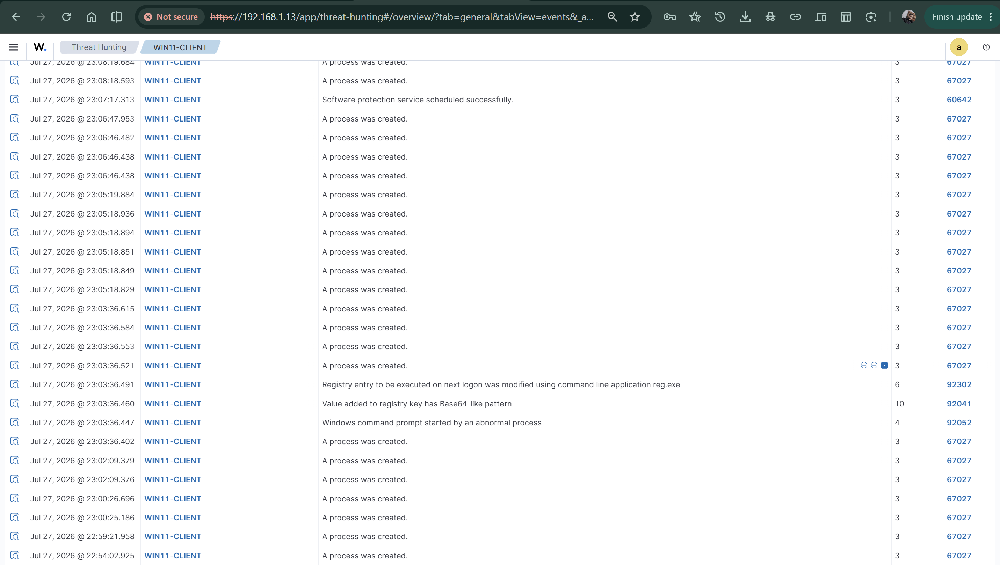
</p>

Among the generated detections, Wazuh identified:

- Registry Run Key modification
- Base64-like registry value detection
- Suspicious process creation
- Command-line execution telemetry

These correlated alerts demonstrate that a single persistence technique can generate multiple independent detection opportunities.

---

## Sysmon Telemetry Validation

Inspection of the generated Sysmon event confirms the command responsible for creating the Registry Run Key.

<p align="center">
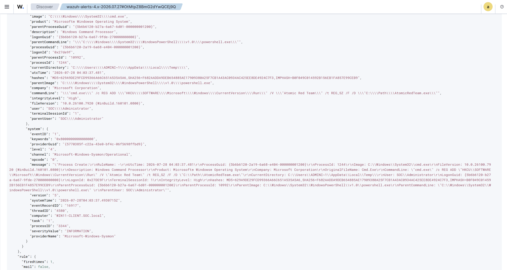
</p>

### Telemetry Summary

| Field | Value |
|-------|-------|
| Event Source | Sysmon |
| Event ID | 1 |
| Event Type | Process Create |
| Process | reg.exe |
| Registry Path | HKCU\Software\Microsoft\Windows\CurrentVersion\Run |
| Technique | T1547.001 |
| Forwarded to Wazuh | ✅ |

The Sysmon telemetry captures the complete command line executed by **reg.exe**, including the registry path, value name, and data written to the Run key, providing complete forensic context for investigation.

---

## Results

| Validation | Status |
|------------|:------:|
| Atomic test executed | ✅ |
| Registry Run Key created | ✅ |
| Persistence artifact validated | ✅ |
| Sysmon telemetry generated | ✅ |
| Wazuh detected the activity | ✅ |
| Detection pipeline validated | ✅ |

---

## Lessons Learned

- Registry Run Keys remain one of the most widely abused Windows persistence mechanisms.
- Sysmon provides detailed visibility into registry modification commands executed by adversaries.
- Wazuh successfully correlates registry persistence activity with additional behavioral detections generated during execution.
- Combining Sysmon process telemetry with Wazuh correlation rules provides comprehensive visibility into Windows persistence techniques.

---

# Phase A Summary

Phase A successfully validated that the SIEM monitoring infrastructure can observe attacker activity while Microsoft Defender remains enabled. Five Atomic Red Team techniques covering execution and persistence tactics were executed from the Windows 11 endpoint and their resulting telemetry was collected by Sysmon and forwarded to Wazuh.

Although Microsoft Defender prevented some malicious actions, endpoint telemetry continued to be generated and successfully ingested by the SIEM, demonstrating that prevention and detection operate together rather than replacing one another.

Across the executed techniques, Wazuh successfully correlated process creation, registry modifications, scheduled task creation, encoded PowerShell execution, and registry-based persistence, providing multiple opportunities for investigation and threat hunting.

## Phase A Validation Summary

| Technique | ATT&CK ID | Status |
|-----------|-----------|:------:|
| PowerShell Fileless Script Execution | T1059.001 Test 10 | ✅ |
| Encoded PowerShell Parameters | T1059.001 Test 15 | ✅ |
| Registry Modification | T1112 Test 40 | ✅ |
| Scheduled Task Persistence | T1053.005 Test 7 | ✅ |
| Registry Run Keys | T1547.001 Test 1 | ✅ |

All planned attack simulations for Phase A completed successfully, validating the complete telemetry pipeline from endpoint execution through Sysmon event generation to centralized detection within Wazuh.