# 12 - Attack Simulation

## Overview

This phase validates the effectiveness of the monitoring infrastructure by executing adversary techniques from the MITRE ATT&CK framework and observing how endpoint security controls and the SIEM respond.

To provide a comprehensive evaluation, the attack simulation phase is divided into two stages:

- **Phase A – Microsoft Defender Enabled:** Validate prevention capabilities while confirming that security telemetry is successfully forwarded to Wazuh.
- **Phase B – Microsoft Defender Disabled:** Execute the same techniques without endpoint prevention to observe the complete attack chain and compare telemetry visibility.

This methodology demonstrates both preventive security controls and detection engineering capabilities.

---

# Attack Matrix

| Technique | ATT&CK ID | Phase A | Phase B |
|------------|-----------|:------:|:------:|
| PowerShell Fileless Script Execution | T1059.001 (Test 10) | ✅ | ✅ |
| EncodedCommand Parameter Variations | T1059.001 (Test 15) | ✅ | ✅ |
| Registry Modification | T1112 | ✅ | ✅ |
| Scheduled Task | T1053.005 | ✅ | ✅ |
| Registry Run Keys | T1547.001 | ✅ | ✅ |

---

# Phase A – Microsoft Defender Enabled

---

# Technique 1 – PowerShell Fileless Script Execution

## MITRE ATT&CK

| Field | Value |
|-------|-------|
| Technique | Command and Scripting Interpreter: PowerShell |
| ATT&CK ID | T1059.001 |
| Atomic Test | Test #10 |
| Atomic Test Name | PowerShell Fileless Script Execution |

---

## Objective

Validate that a malicious PowerShell payload is detected by Microsoft Defender and that the generated endpoint telemetry is successfully forwarded to Wazuh.

---

## Attack Execution

The Atomic Red Team PowerShell test was executed from the Windows 11 client.

<p align="center">

</p>

The test executes an encoded PowerShell payload that stores its content in the Windows Registry before executing it directly from memory, simulating fileless malware behavior.

The attack was then executed.

<p align="center">

</p>

Immediately after execution, Microsoft Defender intercepted the payload and prevented it from running successfully.

---

## Endpoint Response

Microsoft Defender Real-Time Protection detected the malicious PowerShell payload.

<p align="center">

</p>

### Detection Summary

| Field | Value |
|-------|-------|
| Detection | Trojan:Win32/Powessere.K |
| Severity | Severe |
| Action | Removed |
| Protection | Microsoft Defender Real-Time Protection |

---

## Windows Event Logs

The detection generated a Windows Defender Operational event.

<p align="center">

</p>

### Event Details

| Field | Value |
|-------|-------|
| Log | Microsoft-Windows-Windows Defender/Operational |
| Event ID | 1116 |
| Detection Origin | System |
| Event Type | Malware Detection |

The event records the detected threat together with the encoded PowerShell command responsible for the detection.

---

# Detection Pipeline Validation

Although Microsoft Defender successfully generated Event ID 1116 locally, the alert was initially missing from Wazuh.

Searching for Defender-related events returned no results.

<p align="center">

</p>

---

## Root Cause Analysis

The Wazuh agent configuration was inspected.

It was determined that the Windows Defender Operational event channel had not been configured for collection.

The following log source was added to **ossec.conf**.

<p align="center">

</p>

```xml
<localfile>
    <location>Microsoft-Windows-Windows Defender/Operational</location>
    <log_format>eventchannel</log_format>
</localfile>
```

After updating the configuration, the Wazuh agent was restarted.

---

## Validation

A new search confirmed that Microsoft Defender alerts were now successfully ingested by Wazuh.

Note: The Windows 11 client and the Wazuh server were operating with different system times during testing. Consequently, event timestamps differ between the endpoint and SIEM while still referring to the same execution.

<p align="center">

</p>

The SIEM successfully received and indexed the endpoint telemetry.

---

## Results

| Validation | Status |
|------------|:------:|
| Atomic test executed | ✅ |
| Defender detected the attack | ✅ |
| Event ID 1116 generated | ✅ |
| Endpoint telemetry produced | ✅ |
| Wazuh ingested the telemetry | ✅ |
| Detection pipeline validated | ✅ |

---

## Lessons Learned

- Endpoint prevention does not prevent telemetry generation.
- Windows Defender Operational logs provide valuable detection data for the SIEM.
- Wazuh requires explicit configuration to ingest Windows Defender Operational events.
- Validating the complete telemetry pipeline is as important as executing the attack itself.

---

# Technique 2 – PowerShell EncodedCommand Parameter Variations

## MITRE ATT&CK

| Field | Value |
|-------|-------|
| Technique | Command and Scripting Interpreter: PowerShell |
| ATT&CK ID | T1059.001 |
| Atomic Test | Test #15 |
| Atomic Test Name | ATHPowerShellCommandLineParameter - EncodedCommand parameter variations |

---

## Objective

Validate that PowerShell executed using encoded command-line parameter variations is successfully captured by Sysmon and forwarded to Wazuh, while observing the behavior of Microsoft Defender during execution.

---

## Attack Execution

The Atomic Red Team test information was reviewed before execution to verify the technique, command syntax, and execution requirements.

<p align="center">

</p>

Unlike the previous PowerShell test, this Atomic test executes PowerShell using variations of the **-EncodedCommand** parameter to emulate adversarial command-line obfuscation techniques frequently observed during post-exploitation activities.

The Atomic test was then executed successfully.

<p align="center">

</p>

### Execution Summary

| Field | Value |
|-------|-------|
| Test Result | Success |
| Exit Code | 0 |
| Technique | T1059.001 |
| Executor | PowerShell |
| Behavior | Encoded PowerShell command execution |

The Atomic Red Team framework completed the simulation successfully, confirming that the encoded PowerShell command executed without errors.

---
## Endpoint Response

Unlike Technique 1, Microsoft Defender did not block this Atomic test. The encoded PowerShell command executed successfully and generated endpoint telemetry that was collected by Sysmon and forwarded to Wazuh for analysis.

Because no Defender detection was generated during this execution, validation focused on the resulting Sysmon telemetry and Wazuh detections.

---

## Wazuh Detection

Although Microsoft Defender did not block this Atomic test, endpoint telemetry generated by Sysmon was successfully forwarded to Wazuh.

Threat Hunting displayed multiple events associated with the execution.

<p align="center">

</p>

The SIEM recorded multiple security events including process creation telemetry and additional behavioral detections generated during the encoded PowerShell execution.

---

## Sysmon Telemetry Validation

Inspection of the Sysmon Process Create event confirms that the executed process contained the encoded PowerShell command generated by Atomic Red Team.

<p align="center">

</p>

### Telemetry Summary

| Field | Value |
|-------|-------|
| Event Source | Sysmon |
| Event ID | 1 |
| Event Type | Process Create |
| Technique | T1059.001 |
| Process | powershell.exe |
| Command Line | Encoded PowerShell command |
| Forwarded to Wazuh | ✅ |

The captured telemetry includes the full PowerShell command line together with the execution context, providing sufficient evidence for threat hunting and detection engineering.

---

## Results

| Validation | Status |
|------------|:------:|
| Atomic test executed | ✅ |
| PowerShell executed successfully | ✅ |
| Sysmon Process Create generated | ✅ |
| Endpoint telemetry produced | ✅ |
| Wazuh received the telemetry | ✅ |
| Detection pipeline validated | ✅ |

---

## Lessons Learned

- Encoded PowerShell execution can complete successfully without being blocked by Microsoft Defender.
- Sysmon provides detailed process creation telemetry, including encoded PowerShell command lines.
- Wazuh successfully ingested the generated endpoint telemetry for investigation and threat hunting.
- Successful attack execution is valuable for validating visibility across the entire detection pipeline.

---

# Technique 3 – Registry Modification

## MITRE ATT&CK

| Field | Value |
|-------|-------|
| Technique | Modify Registry |
| ATT&CK ID | T1112 |
| Atomic Test | Test #40 |
| Atomic Test Name | NetWire RAT Registry Key Creation |

---

## Objective

Validate that registry modifications associated with malware persistence are successfully recorded by Sysmon and ingested by Wazuh for detection and investigation.

---

## Attack Execution

Atomic Red Team Test #40 was executed from the Windows 11 client.

<p align="center">

</p>

The Atomic test completed successfully and created registry entries that emulate configuration and persistence artifacts commonly associated with the NetWire Remote Access Trojan (RAT).

### Execution Summary

| Field | Value |
|-------|-------|
| Test Result | Success |
| Exit Code | 0 |
| Technique | T1112 |
| Behavior | Registry Modification |

---

## Registry Artifact Validation

Following execution, the Windows Registry was inspected to verify that the persistence entry had been created.

The following **Run Key** was added under the current user's registry hive.

<p align="center">

</p>

The registry value references a simulated NetWire executable located within the user's AppData directory, representing a persistence mechanism that executes automatically during user logon.

The Atomic test also created an additional registry key containing configuration values commonly observed with the NetWire malware family.

<p align="center">

</p>

These registry artifacts confirm that the Atomic test successfully modified the Windows Registry as intended.

---

## Wazuh Detection

After execution, Wazuh Threat Hunting displayed multiple registry-related detections generated from the endpoint.

> **Note:** The Windows 11 client and the Wazuh server were operating with different system times during testing. Consequently, timestamps differ between the endpoint and SIEM while still representing the same attack execution.

<p align="center">

</p>

Among the generated alerts, Wazuh detected the registry modification using Sysmon Event ID 13 and raised Rule **92302**.

Interestingly, although the executed Atomic test belongs to **MITRE ATT&CK T1112 (Modify Registry)**, Wazuh mapped the activity to **T1547.001 (Registry Run Keys / Startup Folder)** because the modified registry location represents a persistence mechanism executed during user logon.

This demonstrates behavior-based detection rather than simply identifying the executed Atomic technique.

---

## Sysmon Telemetry Validation

Inspecting the generated Sysmon event confirms the registry modification performed by **reg.exe**.

<p align="center">

</p>

### Telemetry Summary

| Field | Value |
|-------|-------|
| Event Source | Sysmon |
| Event ID | 13 |
| Event Type | Registry Value Set |
| Process | reg.exe |
| Registry Path | HKCU\Software\Microsoft\Windows\CurrentVersion\Run\NetWire |
| Detection Rule | 92302 |
| MITRE Mapping | T1547.001 |
| Forwarded to Wazuh | ✅ |

The event contains the modified registry path, the value written to the Run Key, and the responsible process, providing complete forensic context for investigation.

---

## Results

| Validation | Status |
|------------|:------:|
| Atomic test executed | ✅ |
| Registry modified | ✅ |
| Persistence artifact created | ✅ |
| Sysmon Event ID 13 generated | ✅ |
| Wazuh detected the activity | ✅ |
| Detection pipeline validated | ✅ |

---

## Lessons Learned

- Registry modifications generate valuable telemetry through Sysmon Event ID 13.
- Registry Run Keys are a common persistence mechanism leveraged by malware.
- Wazuh correlates registry activity based on behavioral context rather than solely on the originating Atomic technique.
- Combining Sysmon with Wazuh provides detailed visibility into Windows persistence mechanisms.

---

# Technique 4 – Scheduled Task

## MITRE ATT&CK

| Field | Value |
|-------|-------|
| Technique | Scheduled Task/Job: Scheduled Task |
| ATT&CK ID | T1053.005 |
| Atomic Test | Test #7 |
| Atomic Test Name | Scheduled Task Executing Base64 Encoded Commands From Registry |

---

## Objective

Validate that the creation of a malicious scheduled task is successfully recorded by Sysmon and detected by Wazuh while demonstrating how multiple telemetry sources correlate a persistence technique.

---

## Attack Execution

The Atomic Red Team test details were reviewed prior to execution.

<p align="center">

</p>

This Atomic test simulates a persistence technique commonly associated with malware families such as **Qakbot** by storing a Base64-encoded PowerShell command inside the Windows Registry and creating a scheduled task that retrieves and executes the encoded payload.

The Atomic test was then executed successfully.

<p align="center">

</p>

### Execution Summary

| Field | Value |
|-------|-------|
| Test Result | Success |
| Exit Code | 0 |
| Technique | T1053.005 |
| Behavior | Scheduled Task Creation |

The Atomic Red Team framework successfully created the scheduled task without errors.

---

## Persistence Artifact Validation

Following execution, Windows Task Scheduler was inspected to verify that the persistence mechanism had been created successfully.

<p align="center">

</p>

The scheduled task **ATOMIC-T1053.005** was successfully created under the **Task Scheduler Library** and configured to execute a PowerShell command that retrieves an encoded payload stored in the Windows Registry.

This confirms that the persistence artifact was successfully established on the endpoint.

---

## Wazuh Detection

After execution, Wazuh Threat Hunting displayed multiple alerts generated from the attack.

> **Note:** The Windows 11 client and the Wazuh server were operating with different system times during testing. Consequently, timestamps differ between the endpoint and SIEM while still representing the same attack execution.

<p align="center">

</p>

Instead of generating a single alert, Wazuh correlated multiple behaviors associated with the scheduled task creation, including:

- Process Creation
- Registry modification
- Base64-encoded registry value detection
- Suspicious Windows command shell execution
- Abnormal command prompt execution

This demonstrates how a single persistence technique can produce multiple detection opportunities across different telemetry sources.

---

## Sysmon Telemetry Validation

Inspection of the generated Sysmon Process Create event confirms the complete command responsible for creating both the registry value and the scheduled task.

<p align="center">

</p>

### Telemetry Summary

| Field | Value |
|-------|-------|
| Event Source | Sysmon |
| Event ID | 1 |
| Event Type | Process Create |
| Process | reg.exe |
| Child Activity | schtasks.exe |
| Technique | T1053.005 |
| Forwarded to Wazuh | ✅ |

The captured command line clearly shows the creation of the **ATOMIC-T1053.005** scheduled task together with the registry value used to store the encoded PowerShell payload, providing complete forensic context for investigation.

---

## Results

| Validation | Status |
|------------|:------:|
| Atomic test executed | ✅ |
| Scheduled task created | ✅ |
| Persistence artifact validated | ✅ |
| Sysmon telemetry generated | ✅ |
| Wazuh detected the activity | ✅ |
| Detection pipeline validated | ✅ |

---

## Lessons Learned

- Scheduled Tasks remain one of the most common Windows persistence mechanisms leveraged by adversaries.
- A single persistence technique can generate multiple correlated detections across Sysmon and Wazuh.
- Capturing complete command-line telemetry significantly improves forensic investigation and threat hunting.
- Correlating registry modifications, scheduled task creation, and process execution provides stronger detection coverage than relying on individual events alone.

---

# Technique 5 – Registry Run Keys / Startup Folder

## MITRE ATT&CK

| Field | Value |
|-------|-------|
| Technique | Boot or Logon Autostart Execution: Registry Run Keys / Startup Folder |
| ATT&CK ID | T1547.001 |
| Atomic Test | Test #1 |
| Atomic Test Name | Reg Key Run |

---

## Objective

Validate that a persistence mechanism implemented through Windows Registry Run Keys is successfully recorded by Sysmon and detected by Wazuh while demonstrating visibility into registry-based persistence techniques.

---

## Attack Execution

The Atomic Red Team test was executed from the Windows 11 client.

<p align="center">

</p>

The Atomic test simulates a common persistence technique by creating a new value under the Windows **Run** registry key. Any executable referenced by this registry value will automatically execute when the user logs on.

### Execution Summary

| Field | Value |
|-------|-------|
| Test Result | Success |
| Exit Code | 0 |
| Technique | T1547.001 |
| Behavior | Registry Run Key Persistence |

The Atomic Red Team framework completed the simulation successfully and created the persistence artifact without errors.

---

## Persistence Artifact Validation

Following execution, the Run key was inspected using PowerShell to verify that the registry value had been created successfully.

<p align="center">

</p>

The output confirms that a new registry value named **Atomic Red Team** was added beneath the current user's **Run** registry key.

This persistence mechanism causes the referenced executable to launch automatically whenever the user logs on, making Registry Run Keys one of the most common Windows persistence techniques used by malware.

---

## Wazuh Detection

After execution, Wazuh Threat Hunting displayed multiple alerts generated from the registry modification.

> **Note:** The Windows 11 client and the Wazuh server were operating with different system times during testing. Consequently, timestamps differ between the endpoint and SIEM while still representing the same attack execution.

<p align="center">

</p>

Among the generated detections, Wazuh identified:

- Registry Run Key modification
- Base64-like registry value detection
- Suspicious process creation
- Command-line execution telemetry

These correlated alerts demonstrate that a single persistence technique can generate multiple independent detection opportunities.

---

## Sysmon Telemetry Validation

Inspection of the generated Sysmon event confirms the command responsible for creating the Registry Run Key.

<p align="center">

</p>

### Telemetry Summary

| Field | Value |
|-------|-------|
| Event Source | Sysmon |
| Event ID | 1 |
| Event Type | Process Create |
| Process | reg.exe |
| Registry Path | HKCU\Software\Microsoft\Windows\CurrentVersion\Run |
| Technique | T1547.001 |
| Forwarded to Wazuh | ✅ |

The Sysmon telemetry captures the complete command line executed by **reg.exe**, including the registry path, value name, and data written to the Run key, providing complete forensic context for investigation.

---

## Results

| Validation | Status |
|------------|:------:|
| Atomic test executed | ✅ |
| Registry Run Key created | ✅ |
| Persistence artifact validated | ✅ |
| Sysmon telemetry generated | ✅ |
| Wazuh detected the activity | ✅ |
| Detection pipeline validated | ✅ |

---

## Lessons Learned

- Registry Run Keys remain one of the most widely abused Windows persistence mechanisms.
- Sysmon provides detailed visibility into registry modification commands executed by adversaries.
- Wazuh successfully correlates registry persistence activity with additional behavioral detections generated during execution.
- Combining Sysmon process telemetry with Wazuh correlation rules provides comprehensive visibility into Windows persistence techniques.

---

# Phase A Summary

Phase A successfully validated that the SIEM monitoring infrastructure can observe attacker activity while Microsoft Defender remains enabled. Five Atomic Red Team techniques covering execution and persistence tactics were executed from the Windows 11 endpoint and their resulting telemetry was collected by Sysmon and forwarded to Wazuh.

Although Microsoft Defender prevented some malicious actions, endpoint telemetry continued to be generated and successfully ingested by the SIEM, demonstrating that prevention and detection operate together rather than replacing one another.

Across the executed techniques, Wazuh successfully correlated process creation, registry modifications, scheduled task creation, encoded PowerShell execution, and registry-based persistence, providing multiple opportunities for investigation and threat hunting.

## Phase A Validation Summary

| Technique | ATT&CK ID | Status |
|-----------|-----------|:------:|
| PowerShell Fileless Script Execution | T1059.001 Test 10 | ✅ |
| Encoded PowerShell Parameters | T1059.001 Test 15 | ✅ |
| Registry Modification | T1112 Test 40 | ✅ |
| Scheduled Task Persistence | T1053.005 Test 7 | ✅ |
| Registry Run Keys | T1547.001 Test 1 | ✅ |

All planned attack simulations for Phase A completed successfully, validating the complete telemetry pipeline from endpoint execution through Sysmon event generation to centralized detection within Wazuh.

---

# Phase B – Microsoft Defender Disabled

## Overview

Following the successful validation of Microsoft Defender's prevention capabilities during Phase A, Microsoft Defender Real-Time Protection was disabled to observe the complete execution of the attack chain without endpoint intervention.

Unlike Phase A, where malicious activity was either prevented or partially interrupted, this phase focuses on validating detection and visibility after successful attack execution. The objective is to determine whether Sysmon and Wazuh continue to provide comprehensive telemetry even when preventive controls are absent.

By comparing both phases, the effectiveness of the monitoring infrastructure can be evaluated independently of endpoint protection, demonstrating the distinction between attack prevention and attack detection.

---

# Technique 1 – PowerShell Fileless Script Execution

## MITRE ATT&CK

| Field | Value |
|-------|-------|
| Technique | Command and Scripting Interpreter: PowerShell |
| ATT&CK ID | T1059.001 |
| Atomic Test | Test #10 |
| Atomic Test Name | PowerShell Fileless Script Execution |

---

## Objective

Validate that the complete PowerShell fileless attack executes successfully after Microsoft Defender is disabled while confirming that Sysmon and Wazuh maintain complete visibility throughout the attack lifecycle.

---

## Attack Execution

With Microsoft Defender disabled, the Atomic Red Team PowerShell Fileless Script Execution test was executed from the Windows 11 client.

<p align="center">
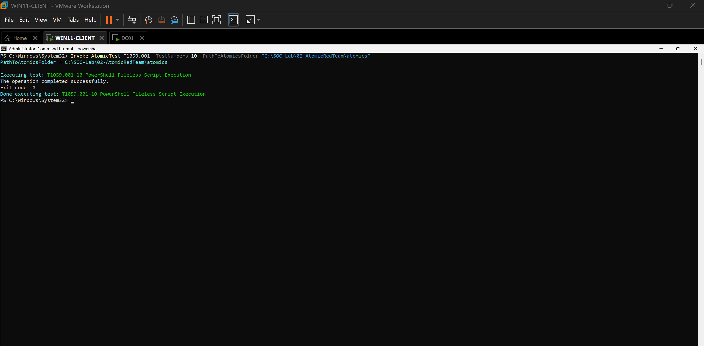
</p>

Unlike Phase A, the Atomic test completed successfully without being blocked by Microsoft Defender.

### Execution Summary

| Field | Value |
|-------|-------|
| Test Result | Success |
| Exit Code | 0 |
| Technique | T1059.001 |
| Executor | PowerShell |
| Behavior | Fileless PowerShell Execution |

The encoded PowerShell payload executed successfully, allowing the remaining stages of the attack chain to complete.

---

## Registry Artifact Validation

Following execution, the Windows Registry was inspected to confirm that the payload successfully created its registry artifact.

<p align="center">
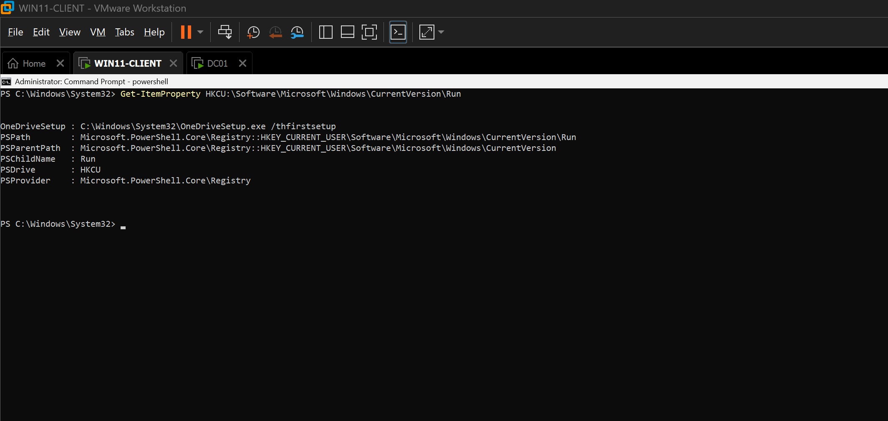
</p>

Although the simulated payload did not create a traditional Run Key persistence entry, additional inspection identified the registry location created by the Atomic test.

<p align="center">
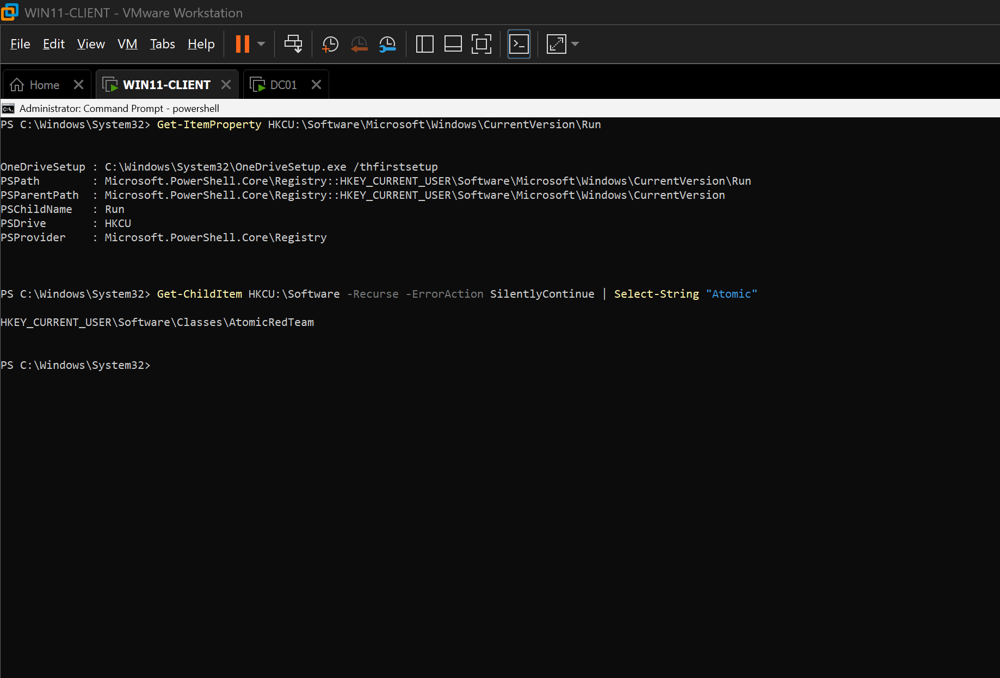
</p>

The registry artifact located under **HKCU\Software\Classes\AtomicRedTeam** confirms that the encoded PowerShell payload successfully stored its data within the registry before executing it directly from memory, accurately simulating fileless malware behavior.

---

## Sysmon Telemetry Validation

Because Microsoft Defender no longer interrupted execution, Sysmon recorded multiple stages of the attack.

### File Creation

The first observable artifact was the temporary PowerShell script created during execution.

<p align="center">
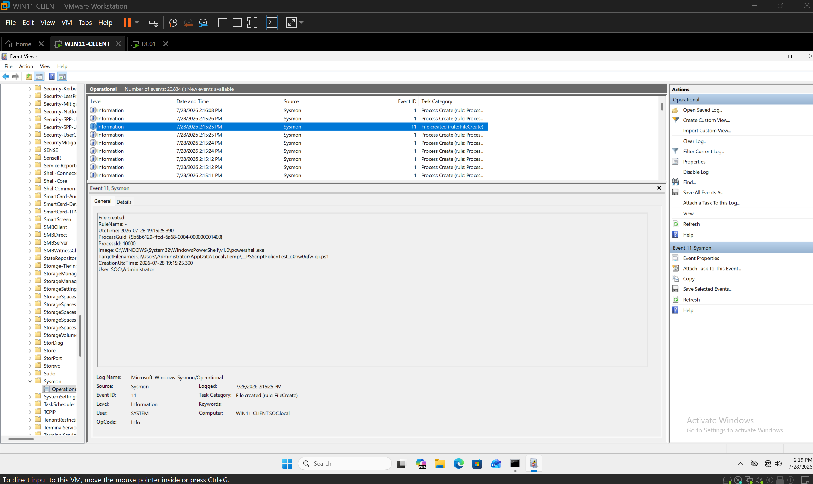
</p>

Sysmon Event ID 11 confirms that PowerShell generated a temporary script inside the user's temporary directory.

---

### PowerShell Process Execution

Sysmon Process Create telemetry captured the complete encoded PowerShell command executed by Atomic Red Team.

<p align="center">
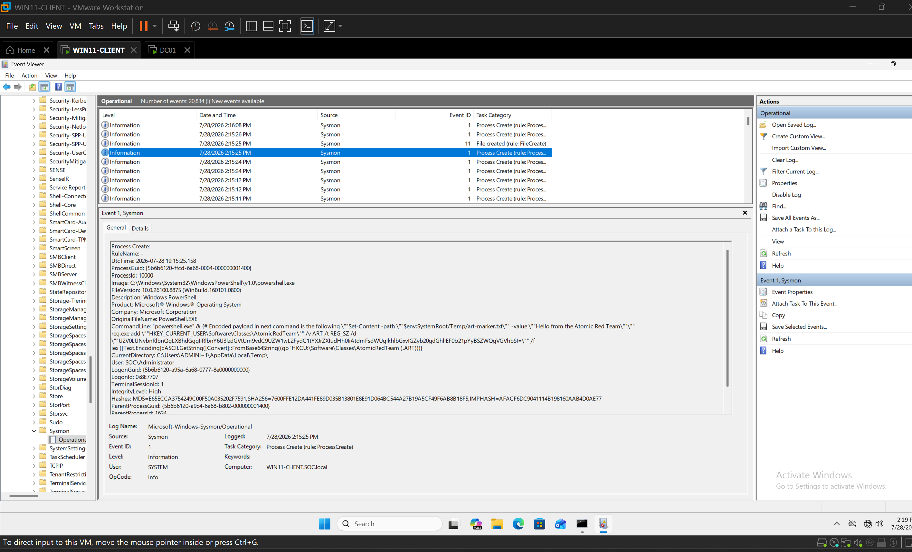
</p>

The captured command line includes the Base64-encoded payload, registry modification commands, and the subsequent in-memory execution of the decoded PowerShell content.

---

### Child Process Creation

During execution, the payload launched additional Windows utilities as child processes.

PowerShell executed **whoami.exe**.

<p align="center">
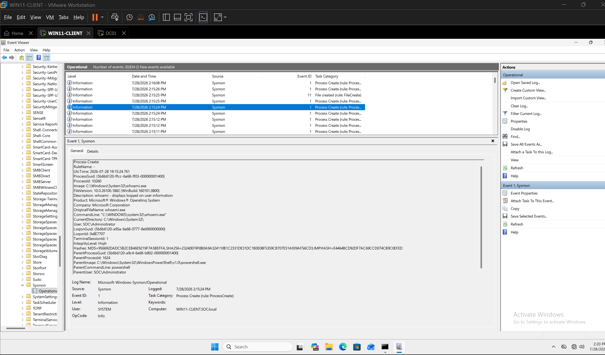
</p>

PowerShell also executed **hostname.exe**.

<p align="center">
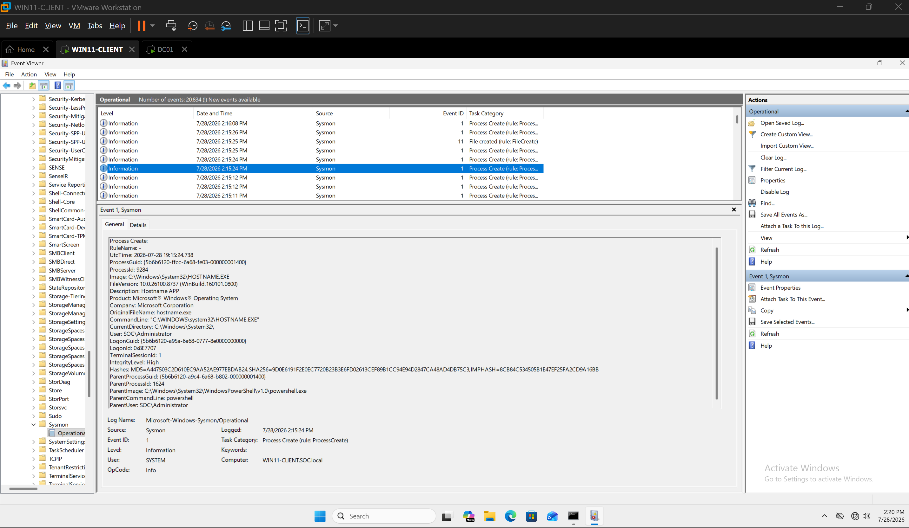
</p>

Together, these Sysmon events provide a complete forensic timeline of the attack, from initial PowerShell execution through the creation of child processes initiated by the decoded payload.

### Telemetry Summary

| Field | Value |
|-------|-------|
| Event Source | Sysmon |
| Event IDs | 1, 11 |
| Primary Process | powershell.exe |
| Child Processes | whoami.exe, hostname.exe |
| Registry Artifact | HKCU\Software\Classes\AtomicRedTeam |
| Forwarded to Wazuh | ✅ |

---

## Wazuh Detection

Following successful execution, Wazuh Threat Hunting displayed multiple correlated detections generated from the endpoint.

> **Note:** The Windows 11 client and the Wazuh server were operating with different system times during testing. Consequently, timestamps differ between the endpoint and SIEM while still representing the same attack execution.

### Threat Hunting Overview

<p align="center">
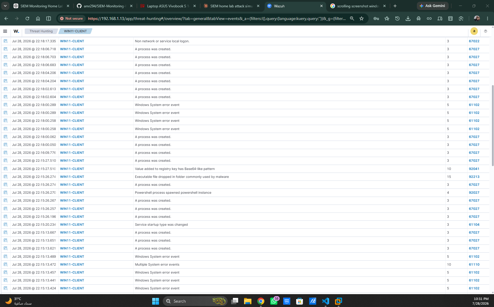
</p>

Unlike Phase A, where Microsoft Defender terminated execution early, Phase B produced significantly richer telemetry because the entire attack chain completed successfully.

---

### Registry-Based Process Execution

Wazuh successfully captured the registry modification performed by **reg.exe**, including the complete encoded command responsible for creating the Atomic Red Team registry artifact.

<p align="center">
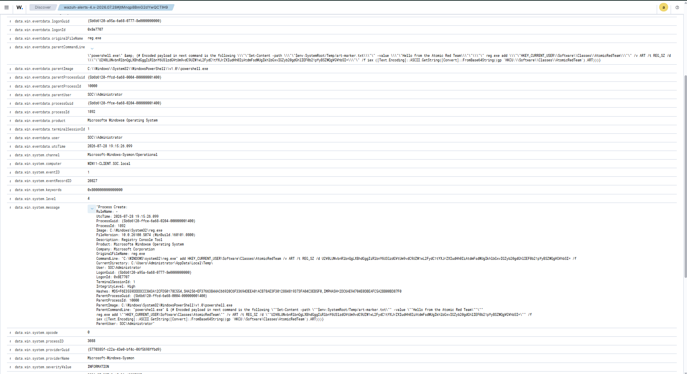
</p>

---

### Temporary Script Detection

Sysmon File Create telemetry generated a Wazuh alert after PowerShell created a temporary script inside the user's temporary directory.

<p align="center">
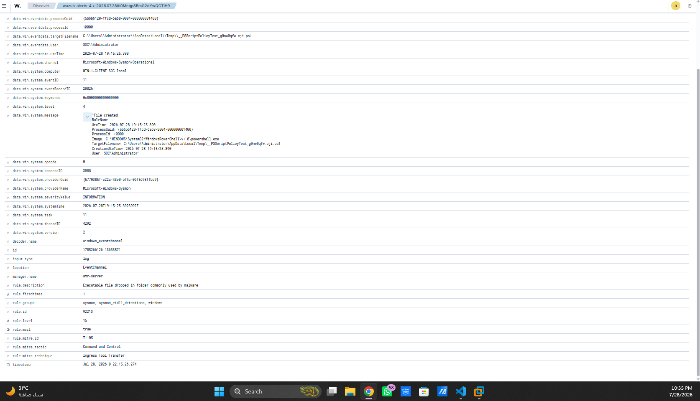
</p>

The detection was mapped to **MITRE ATT&CK T1105 (Ingress Tool Transfer)** because executable content was created within a directory commonly abused by malware.

---

### Encoded PowerShell Detection

The PowerShell Process Create event was also ingested by Wazuh, preserving the complete encoded command line generated by Atomic Red Team.

<p align="center">
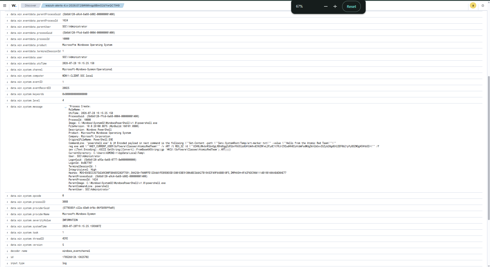
</p>

The collected telemetry provides investigators with full command-line visibility, parent-child process relationships, registry activity, and execution context necessary for forensic analysis.

---

## Results

| Validation | Status |
|------------|:------:|
| Atomic test executed | ✅ |
| Fileless payload executed | ✅ |
| Registry artifact created | ✅ |
| Sysmon Process Create captured | ✅ |
| Sysmon File Create captured | ✅ |
| Child processes recorded | ✅ |
| Wazuh correlated attack events | ✅ |
| Complete attack chain observed | ✅ |

---

## Lessons Learned

- Disabling Microsoft Defender allowed the entire attack chain to execute successfully, generating substantially richer telemetry.
- Sysmon continued recording detailed endpoint activity independently of Microsoft Defender's protection state.
- Wazuh successfully correlated multiple events, including PowerShell execution, registry modification, temporary file creation, and child process execution.
- Comparing both phases demonstrates the distinction between preventive security controls and detection engineering, highlighting the importance of endpoint telemetry even when attacks are not prevented.

---

# Technique 2 – PowerShell EncodedCommand Parameter Variations

## MITRE ATT&CK

| Field | Value |
|-------|-------|
| Technique | Command and Scripting Interpreter: PowerShell |
| ATT&CK ID | T1059.001 |
| Atomic Test | Test #15 |
| Atomic Test Name | ATHPowerShellCommandLineParameter – EncodedCommand parameter variations |

---

## Objective

Validate that PowerShell execution using encoded command-line parameter variations completes successfully after Microsoft Defender is disabled while demonstrating end-to-end visibility through Sysmon and Wazuh.

---

## Attack Execution

With Microsoft Defender Real-Time Protection disabled, Atomic Red Team Test #15 was executed from the Windows 11 endpoint.

<p align="center">
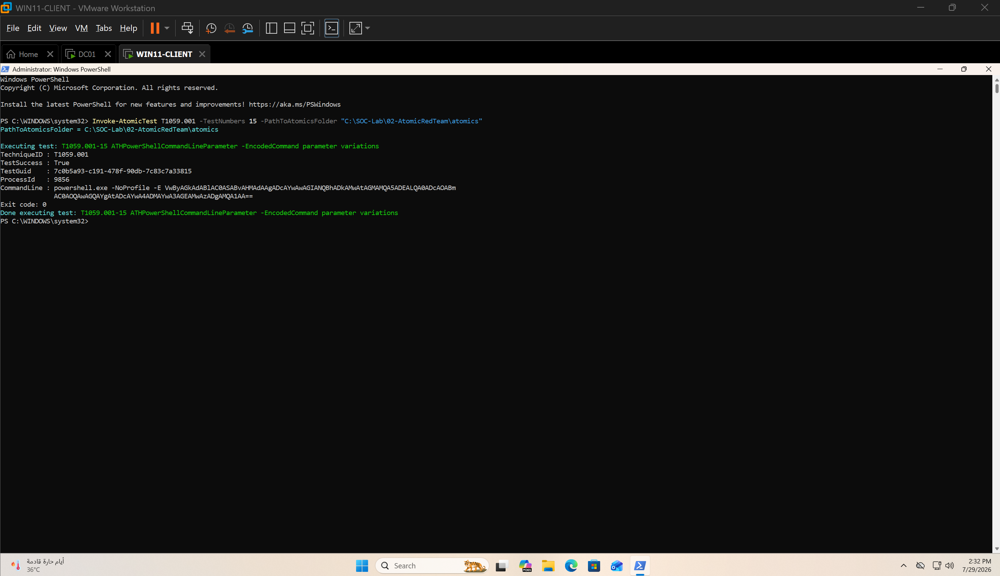
</p>

Unlike Phase A, the encoded PowerShell command completed successfully without endpoint intervention, allowing the remaining attack activity to execute.

### Execution Summary

| Field | Value |
|-------|-------|
| Test Result | Success |
| Exit Code | 0 |
| Technique | T1059.001 |
| Executor | PowerShell |
| Behavior | Encoded PowerShell Command Execution |

The successful execution produced endpoint telemetry that was collected by Sysmon and forwarded to Wazuh for investigation.

---

## Sysmon Telemetry Validation

After successful execution, Sysmon recorded multiple stages of the attack.

### PowerShell Process Execution

Sysmon Event ID 1 captured the complete PowerShell process together with the encoded command-line arguments used during execution.

<p align="center">
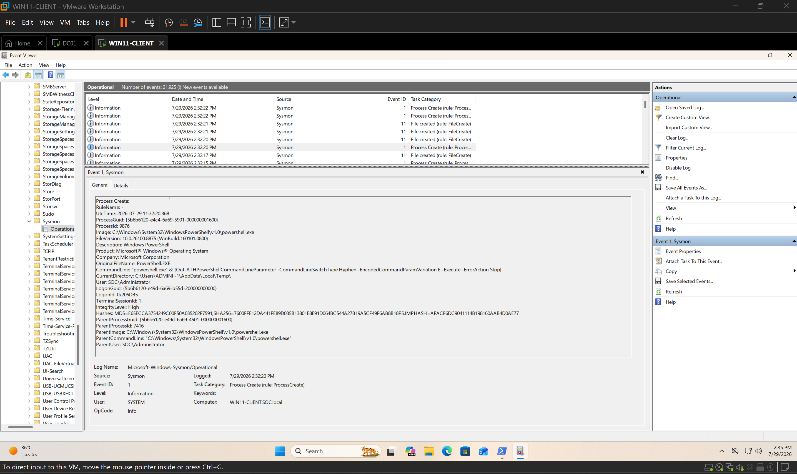
</p>

The telemetry includes the full command line, parent process information, execution context, integrity level, hashes, and user account.

---

### Temporary PowerShell Script Creation

Sysmon Event ID 11 recorded the temporary PowerShell script generated during execution.

<p align="center">
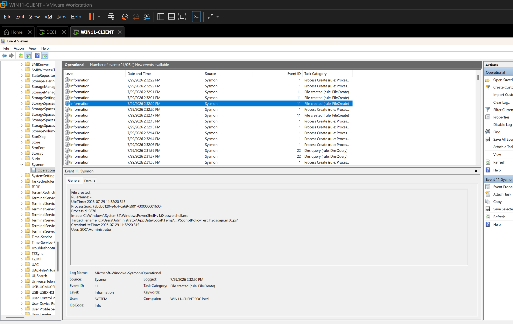
</p>

The temporary **__PSScriptPolicyTest** file demonstrates PowerShell's execution workflow and provides an additional forensic artifact generated during the attack.

---

### Child Process Execution

The decoded PowerShell payload subsequently launched **whoami.exe**, which was captured by Sysmon Process Create telemetry.

<p align="center">
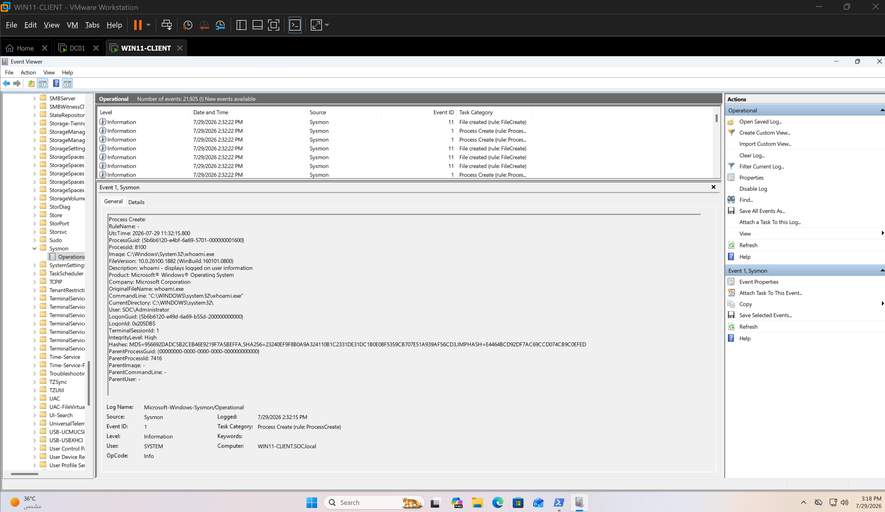
</p>

This confirms that the encoded PowerShell command progressed beyond initial execution and successfully spawned additional child processes.

### Telemetry Summary

| Field | Value |
|-------|-------|
| Event Source | Sysmon |
| Event IDs | 1, 11 |
| Primary Process | powershell.exe |
| Child Process | whoami.exe |
| Temporary Artifact | __PSScriptPolicyTest |
| Forwarded to Wazuh | ✅ |

---

## Wazuh Detection Analysis

Following execution, Wazuh Threat Hunting displayed multiple correlated detections generated from the endpoint.

> **Note:** The Windows 11 client and the Wazuh server were operating with different system times during testing. Consequently, timestamps differ between the endpoint and SIEM while still representing the same attack execution.

### Threat Hunting Overview

<p align="center">
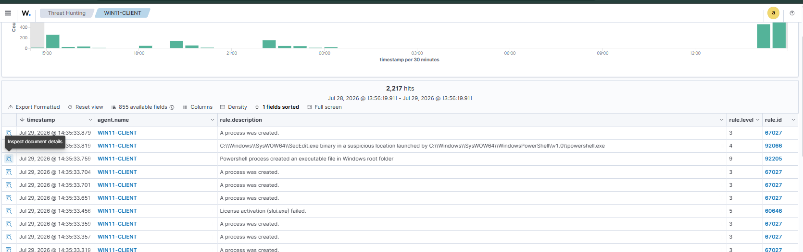
</p>

The encoded PowerShell execution generated multiple behavioral detections rather than a single isolated alert.

---

### Discovery Activity

Among the correlated events, Wazuh identified discovery-related activity generated during execution.

<p align="center">
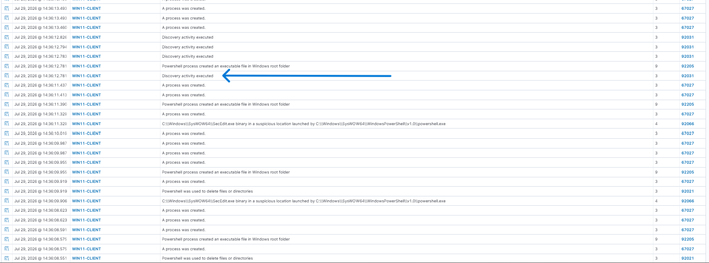
</p>

The executed payload triggered discovery behavior, demonstrating that successful PowerShell execution can produce telemetry spanning multiple ATT&CK tactics beyond simple command execution.

---

### PowerShell-Created Executable Detection

Wazuh also generated a behavioral alert indicating that PowerShell created executable content within a commonly abused Windows directory.

<p align="center">
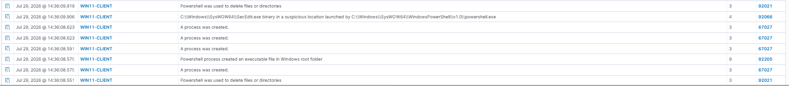
</p>

This detection was generated from the Sysmon File Create event and highlights how Wazuh applies behavioral analytics to endpoint telemetry.

---

### SecEdit Process Analysis

Further investigation revealed that the executed PowerShell command launched **SecEdit.exe**, which Wazuh identified as a suspicious process because it originated from PowerShell.

<p align="center">
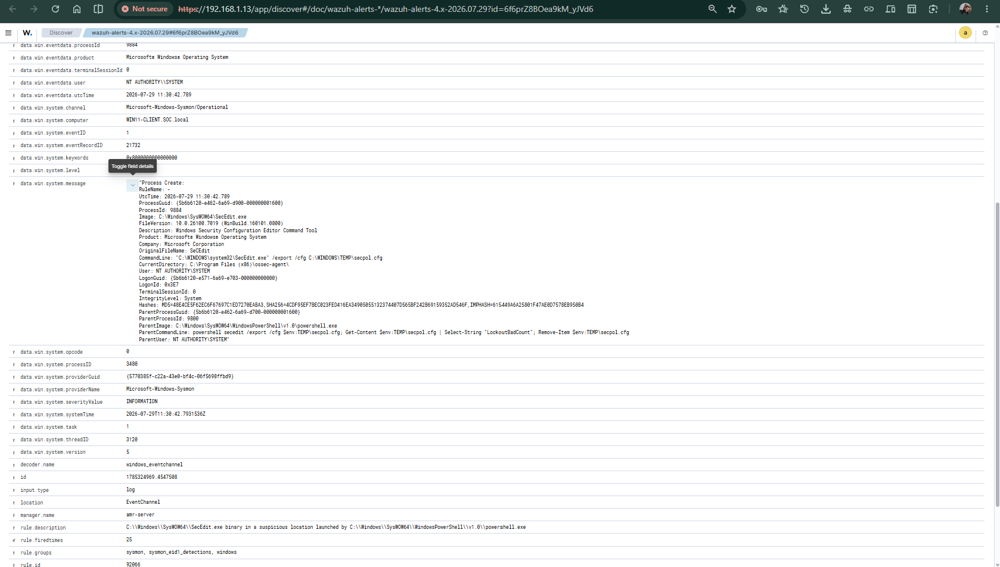
</p>

Inspection of the underlying Sysmon Process Create event shows that **SecEdit.exe** was executed with command-line arguments used to export the local security policy before the temporary files were removed.

This behavior demonstrates how Wazuh preserves the complete execution context, allowing investigators to reconstruct attacker activity from individual endpoint events.

---

## Results

| Validation | Status |
|------------|:------:|
| Atomic test executed | ✅ |
| Encoded PowerShell executed | ✅ |
| Sysmon Process Create captured | ✅ |
| Sysmon File Create captured | ✅ |
| Child process recorded | ✅ |
| Wazuh correlated attack events | ✅ |
| Discovery activity detected | ✅ |
| Complete attack chain observed | ✅ |

---

## Lessons Learned

- Successful encoded PowerShell execution demonstrates that Sysmon and Wazuh maintain consistent visibility regardless of Microsoft Defender's protection state.
- Sysmon captures both the initial PowerShell execution and the subsequent processes spawned by the decoded payload.
- Wazuh correlates multiple behavioral detections from a single encoded PowerShell execution, including process creation, temporary file creation, discovery activity, and security policy inspection.
- Behavioral analytics provide valuable investigative context even when the executed command is heavily obfuscated.

---

# Technique 3 – Registry Modification

## MITRE ATT&CK

| Field | Value |
|-------|-------|
| Technique | Modify Registry |
| ATT&CK ID | T1112 |
| Atomic Test | Test #40 |
| Atomic Test Name | NetWire RAT Registry Key Creation |

---

## Objective

Validate that registry-based persistence artifacts are successfully created after Microsoft Defender is disabled while confirming that Sysmon captures the resulting registry modifications and Wazuh correlates the associated persistence behavior for investigation.

---

## Attack Execution

With Microsoft Defender Real-Time Protection disabled, Atomic Red Team Test #40 was executed from the Windows 11 endpoint.

<p align="center">
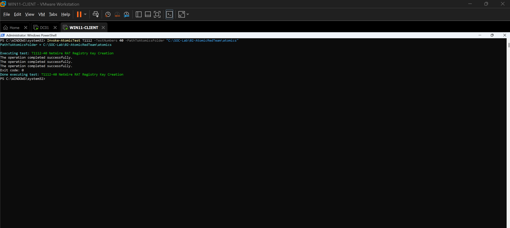
</p>

Unlike Phase A, the Atomic test completed successfully without endpoint intervention, allowing the simulated persistence artifacts to be written to the Windows Registry.

### Execution Summary

| Field | Value |
|-------|-------|
| Test Result | Success |
| Exit Code | 0 |
| Technique | T1112 |
| Behavior | Registry Modification |
| Simulated Threat | NetWire RAT |

The successful execution established registry artifacts commonly associated with Windows persistence techniques and generated endpoint telemetry for investigation.

---

## Registry Artifact Validation

After execution, the Windows Registry was inspected to verify that the expected persistence artifacts had been successfully created.

### Registry Run Key

<p align="center">
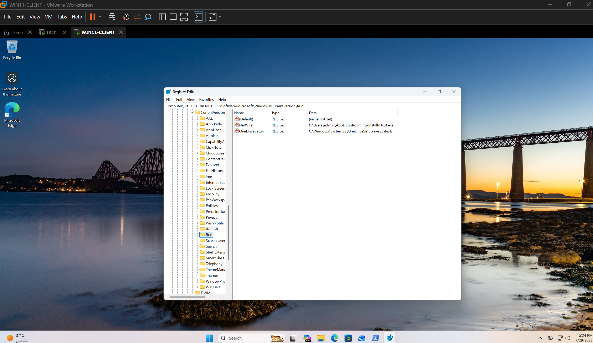
</p>

The Atomic test created a new **NetWire** value beneath the current user's **Run** registry key.

The registry value references a simulated executable stored within the user's **AppData** directory, representing a persistence mechanism that automatically executes during user logon.

---

### NetWire Registry Configuration

<p align="center">
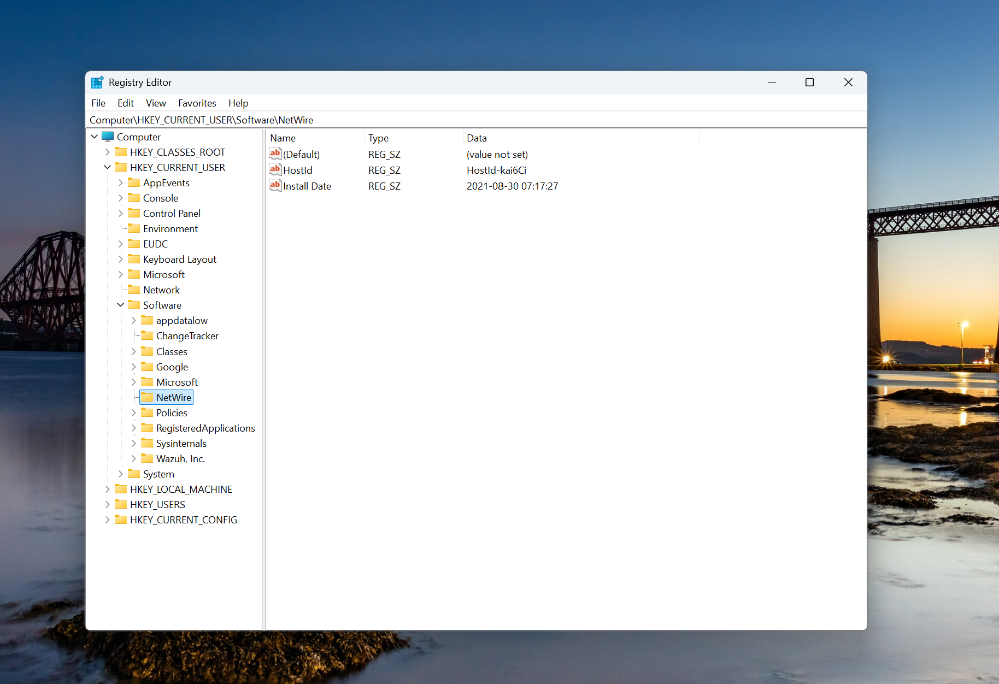
</p>

Additional configuration values were created beneath **HKCU\Software\NetWire**, including simulated malware configuration data such as **HostId** and **Install Date**.

Together, these registry artifacts demonstrate that the Atomic test successfully established both persistence and supporting malware configuration within the Windows Registry.

---

## Sysmon Telemetry Validation

Successful execution generated multiple Sysmon events documenting the registry modifications.

### Registry Value Modification

Sysmon Event ID 13 recorded the modification of the Windows Run Key responsible for persistence.

<p align="center">
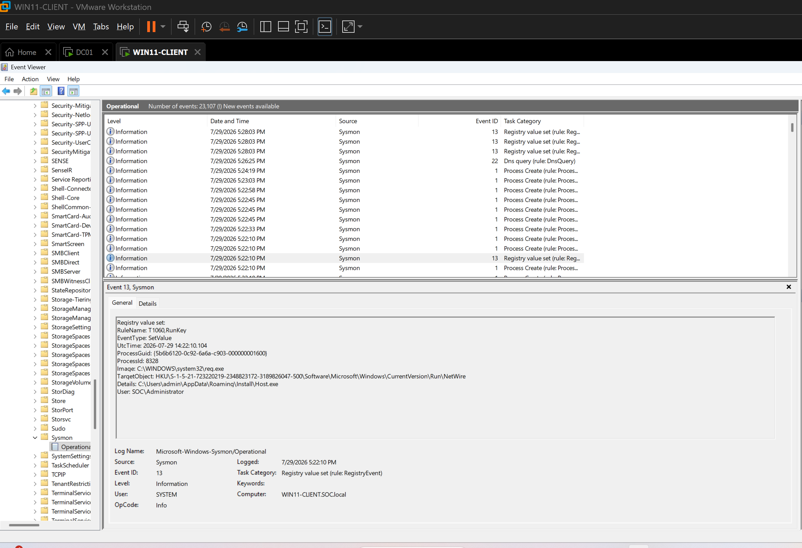
</p>

The event captures the modified registry path, the value written by the attack, the executing process, and the associated user account, providing investigators with complete forensic context surrounding the persistence mechanism.

---

### Registry Process Creation

Sysmon Process Create telemetry recorded the execution of **reg.exe** responsible for performing the registry modifications.

<p align="center">
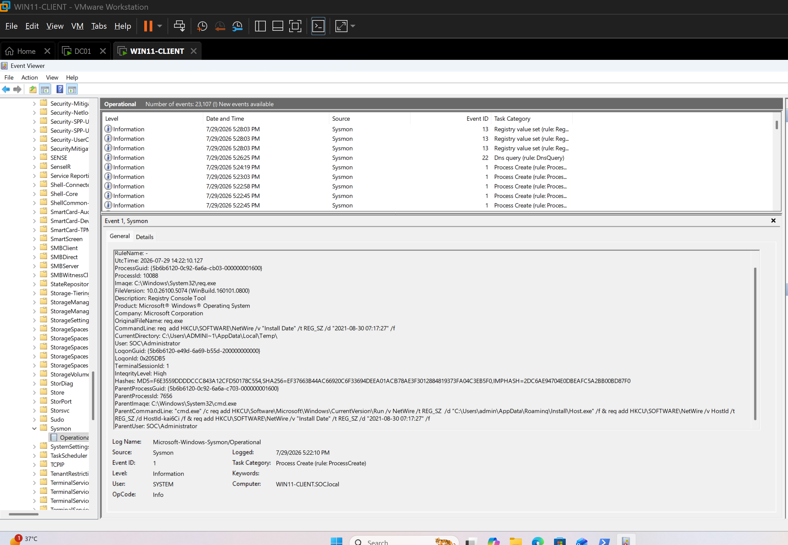
</p>

The captured command line includes the complete sequence of registry operations performed during the Atomic test, including creation of the **Run** key persistence entry together with the additional **NetWire** configuration values.

### Telemetry Summary

| Field | Value |
|-------|-------|
| Event Source | Sysmon |
| Event IDs | 1, 13 |
| Primary Process | reg.exe |
| Registry Artifact | HKCU\Software\Microsoft\Windows\CurrentVersion\Run\NetWire |
| Additional Artifact | HKCU\Software\NetWire |
| Forwarded to Wazuh | ✅ |

---

## Wazuh Detection Analysis

Following execution, Wazuh Threat Hunting displayed multiple correlated detections generated from the endpoint.

> **Note:** The Windows 11 client and the Wazuh server were operating with different system times during testing. Consequently, timestamps differ between the endpoint and SIEM while still representing the same attack execution.

### Threat Hunting Overview

<p align="center">
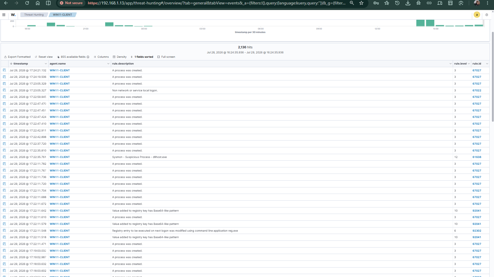
</p>

Rather than producing a single alert, Wazuh correlated multiple events generated throughout the registry modification, including process creation telemetry, registry persistence activity, and behavioral detections associated with the modified registry location.

---

### Registry Persistence Analysis

<p align="center">
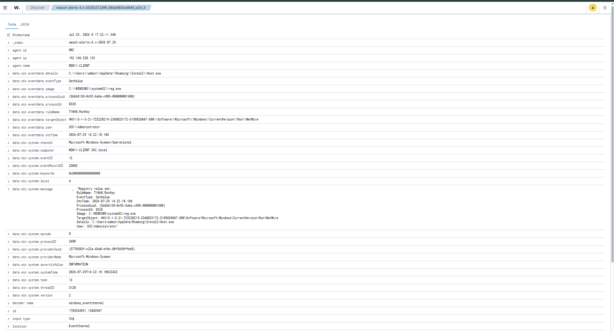
</p>

Inspection of the correlated Sysmon Event ID 13 reveals that **reg.exe** modified the Windows **Run** registry key to establish persistence using the simulated NetWire executable.

Although the executed Atomic test is categorized as **MITRE ATT&CK T1112 (Modify Registry)**, the resulting behavior represents **Registry Run Keys / Startup Folder (T1547.001)** because the modified registry location is executed automatically during user logon.

This demonstrates that Wazuh classifies activity according to the security impact of the behavior rather than simply identifying the originating Atomic test.

---

## Results

| Validation | Status |
|------------|:------:|
| Atomic test executed | ✅ |
| Registry persistence created | ✅ |
| Registry artifacts validated | ✅ |
| Sysmon Event ID 13 captured | ✅ |
| Sysmon Process Create captured | ✅ |
| Wazuh correlated registry activity | ✅ |
| Persistence behavior identified | ✅ |
| Complete attack chain observed | ✅ |

---

## Lessons Learned

- Registry modification activity produces consistent telemetry through Sysmon and Wazuh regardless of Microsoft Defender's protection state.
- Sysmon Event ID 13 captures detailed registry modification data, including the affected registry path, written value, and responsible process.
- Registry Run Keys remain one of the most common Windows persistence mechanisms leveraged by adversaries.
- Wazuh correlates registry activity according to the resulting persistence behavior, allowing investigators to reconstruct both the registry modification and its security impact.

---

# Technique 4 – Scheduled Task

## MITRE ATT&CK

| Field | Value |
|-------|-------|
| Technique | Scheduled Task/Job: Scheduled Task |
| ATT&CK ID | T1053.005 |
| Atomic Test | Test #7 |
| Atomic Test Name | Scheduled Task Executing Base64 Encoded Commands From Registry |

---

## Objective

Validate that a scheduled task executing a Base64-encoded PowerShell payload from the Windows Registry successfully executes after Microsoft Defender is disabled while confirming that Sysmon captures the resulting persistence activity and Wazuh correlates the associated behavioral detections.

---

## Attack Execution

With Microsoft Defender Real-Time Protection disabled, Atomic Red Team Test #7 was executed from the Windows 11 endpoint.

<p align="center">
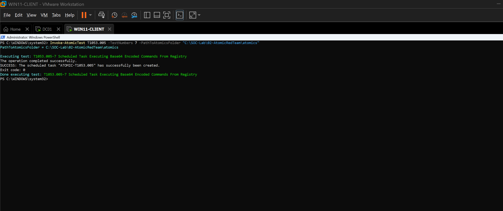
</p>

Unlike Phase A, the Atomic test completed successfully without endpoint intervention, allowing the complete persistence mechanism to be created.

### Execution Summary

| Field | Value |
|-------|-------|
| Test Result | Success |
| Exit Code | 0 |
| Technique | T1053.005 |
| Behavior | Scheduled Task Persistence |

The Atomic Red Team framework successfully created a scheduled task that retrieves a Base64-encoded PowerShell payload from the Windows Registry and executes it using PowerShell.

---

## Persistence Artifact Validation

Following execution, Windows Task Scheduler was inspected to verify that the persistence mechanism had been created successfully.

### Scheduled Task Properties

<p align="center">
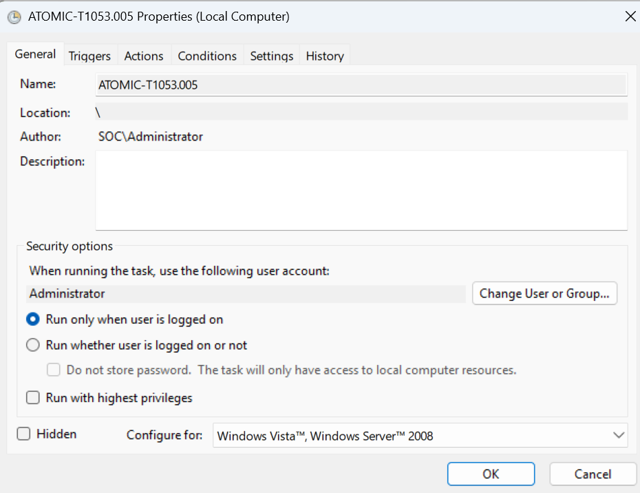
</p>


The scheduled task **ATOMIC-T1053.005** was successfully created and configured to execute under the Administrator account.

---

### Scheduled Trigger

Inspection of the task trigger confirms that the scheduled task is configured to execute automatically every day at **7:45 AM**.

<p align="center">
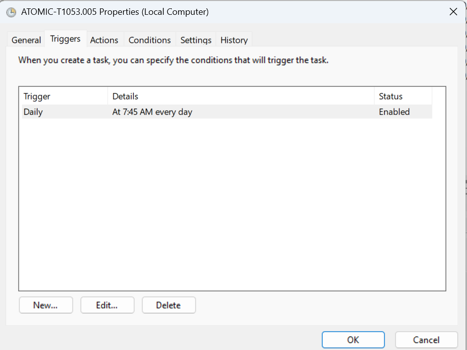
</p>

The configured trigger establishes a persistence mechanism capable of repeatedly executing the malicious payload without additional user interaction.

---

### Scheduled Action

The Actions tab reveals the command executed by the scheduled task.

<p align="center">
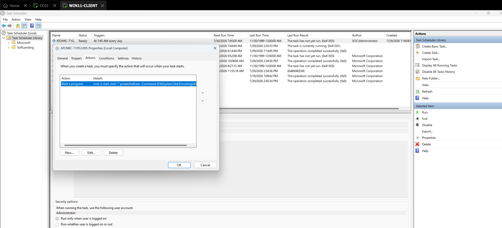
</p>

The scheduled task launches **PowerShell** using a command that retrieves a Base64-encoded value stored within the Windows Registry, decodes the content, and executes it directly from memory.

This behavior closely resembles persistence techniques commonly used by malware families that conceal malicious payloads within registry values to reduce their on-disk footprint.

---

### Registry Payload Validation

The Windows Registry was inspected to verify that the encoded payload referenced by the scheduled task had been created successfully.

<p align="center">
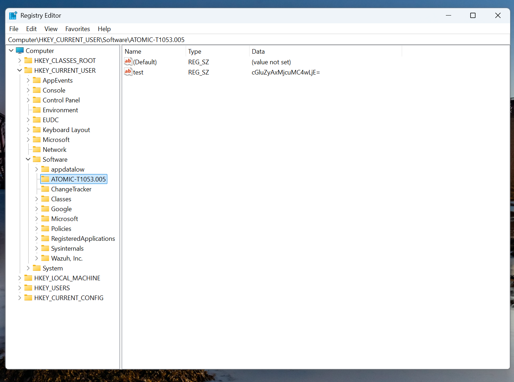
</p>

The registry key **HKCU\Software\ATOMIC-T1053.005** contains the Base64-encoded PowerShell payload that is retrieved and executed by the scheduled task.

Together, the scheduled task configuration and registry artifact confirm that the complete persistence mechanism was successfully established on the endpoint.

---

## Sysmon Telemetry Validation

Successful execution generated multiple Sysmon Process Create events documenting each stage of the persistence mechanism.

### Scheduled Task Creation

Sysmon Event ID 1 captured the execution of **schtasks.exe** responsible for creating the persistence task.

<p align="center">
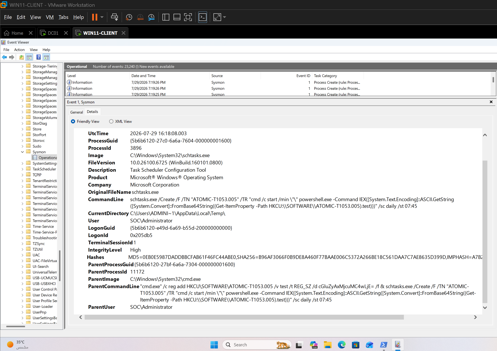
</p>

The captured command line contains the complete scheduled task configuration, including the task name, execution trigger, and the embedded PowerShell command responsible for decoding and executing the registry payload.

---

### Command Processor Execution

Sysmon also captured the parent **cmd.exe** process responsible for creating both the registry value and the scheduled task.

<p align="center">
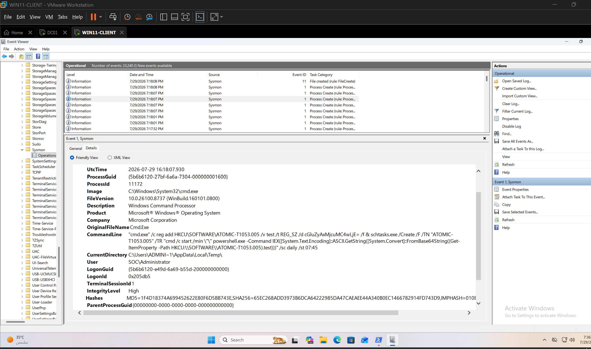
</p>

The command line clearly demonstrates the complete attack chain by combining:

- Registry modification
- Scheduled task creation
- PowerShell execution
- Base64 payload retrieval

within a single command.

### Telemetry Summary

| Field | Value |
|-------|-------|
| Event Source | Sysmon |
| Event ID | 1 |
| Primary Processes | cmd.exe, schtasks.exe |
| Persistence Mechanism | Scheduled Task |
| Registry Artifact | HKCU\Software\ATOMIC-T1053.005 |
| Forwarded to Wazuh | ✅ |

---

## Wazuh Detection Analysis

Following successful execution, Wazuh Threat Hunting displayed multiple correlated detections generated from the endpoint.

> **Note:** The Windows 11 client and the Wazuh server were operating with different system times during testing. Consequently, timestamps differ between the endpoint and SIEM while still representing the same attack execution.

### Threat Hunting Overview

<p align="center">
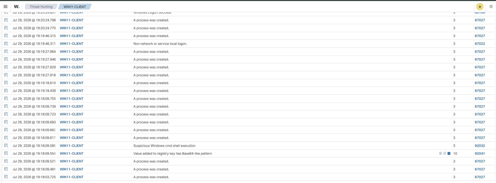
</p>

Rather than producing a single alert, Wazuh correlated several behavioral events generated throughout the persistence workflow.

The investigation revealed alerts associated with process creation, registry modification, scheduled task creation, and command-line activity.

---

### Base64 Registry Detection

Wazuh generated a behavioral detection after identifying a Base64-like value being written to the Windows Registry.

<p align="center">
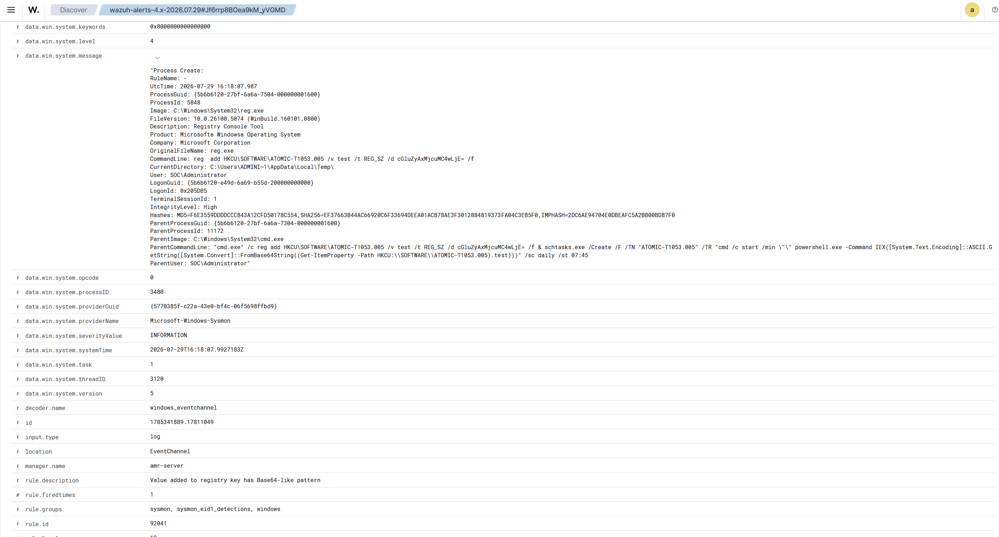
</p>

Inspection of the underlying Sysmon event confirms that **reg.exe** created the registry value containing the encoded PowerShell payload before the scheduled task was registered.

This alert demonstrates Wazuh's ability to identify suspicious registry content rather than simply detecting the registry modification itself.

---

### Suspicious Command Shell Execution

Wazuh also generated a behavioral alert after detecting the execution of a complex command through **cmd.exe**.

<p align="center">
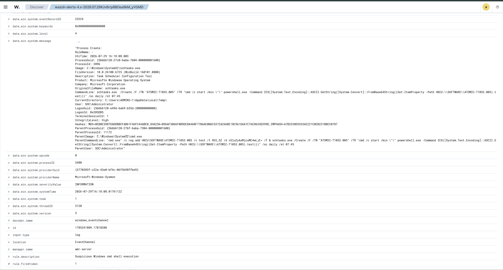
</p>

Inspection of the correlated Sysmon Process Create event shows that the command simultaneously performed multiple operations:

- Creating a registry value
- Registering a scheduled task
- Configuring PowerShell execution
- Retrieving a Base64-encoded payload from the registry

The complete command line preserved by Wazuh enables investigators to reconstruct the entire persistence workflow from a single endpoint event.

---

## Results

| Validation | Status |
|------------|:------:|
| Atomic test executed | ✅ |
| Scheduled task created | ✅ |
| Registry payload created | ✅ |
| Persistence artifacts validated | ✅ |
| Sysmon Process Create captured | ✅ |
| Wazuh correlated attack events | ✅ |
| Base64 registry detection generated | ✅ |
| Complete attack chain observed | ✅ |

---

## Lessons Learned

- Scheduled Tasks remain one of the most common persistence mechanisms leveraged by adversaries.
- Storing encoded payloads within the Windows Registry provides an additional layer of obfuscation while reducing the attacker's on-disk footprint.
- Sysmon captures the complete persistence workflow, including registry modification, scheduled task creation, and command execution.
- Wazuh correlates multiple behavioral detections generated from a single persistence technique, providing investigators with sufficient context to reconstruct the entire attack chain.

---

# Technique 5 – Registry Run Keys / Startup Folder

## MITRE ATT&CK

| Field | Value |
|-------|-------|
| Technique | Boot or Logon Autostart Execution: Registry Run Keys / Startup Folder |
| ATT&CK ID | T1547.001 |
| Atomic Test | Test #1 |
| Atomic Test Name | Reg Key Run |

---

## Objective

Validate that a Windows Registry Run Key persistence mechanism executes successfully after Microsoft Defender is disabled while confirming that Sysmon captures the resulting registry modifications and Wazuh correlates the associated persistence activity.

---

## Attack Execution

With Microsoft Defender Real-Time Protection disabled, Atomic Red Team Test #1 was executed from the Windows 11 endpoint.

<p align="center">
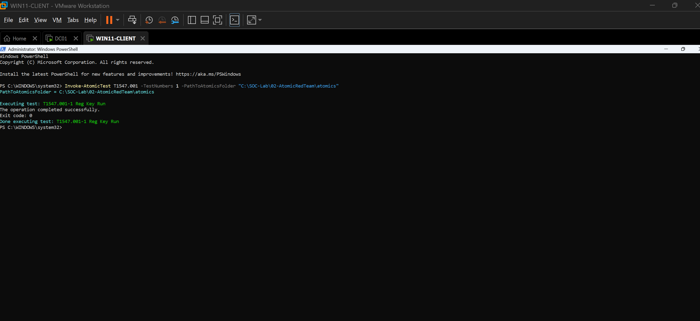
</p>

Unlike Phase A, the Atomic test completed successfully without endpoint intervention, creating a Registry Run Key persistence mechanism.

### Execution Summary

| Field | Value |
|-------|-------|
| Test Result | Success |
| Exit Code | 0 |
| Technique | T1547.001 |
| Behavior | Registry Run Key Persistence |

The Atomic Red Team framework successfully created the Registry Run Key persistence artifact.

---

## Persistence Artifact Validation

Following execution, the Windows Registry was inspected to verify that the expected persistence artifact had been created successfully.

<p align="center">
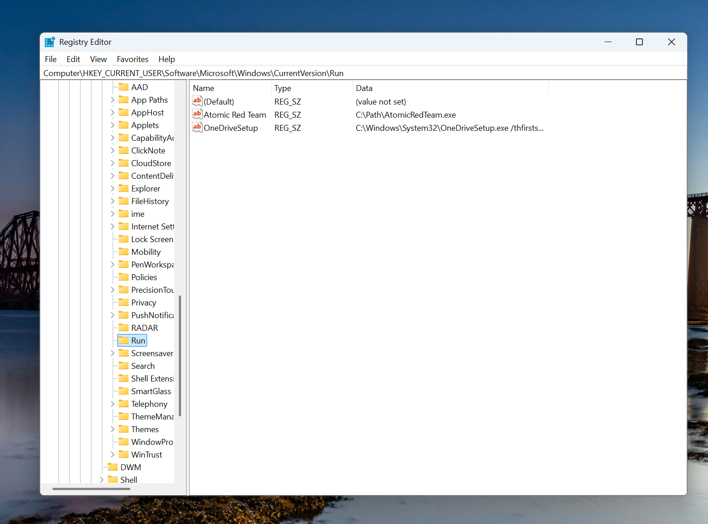
</p>

Inspection of **HKCU\Software\Microsoft\Windows\CurrentVersion\Run** confirms that a new registry value named **Atomic Red Team** was successfully created.

The registry value references the simulated executable **C:\Path\AtomicRedTeam.exe**, demonstrating a Registry Run Key persistence mechanism that automatically executes whenever the user logs on.

---

## Sysmon Telemetry Validation

Successful execution generated multiple Sysmon events documenting the persistence activity.

### Registry Value Modification

Sysmon Event ID **13** recorded the creation of the Registry Run Key.

<p align="center">
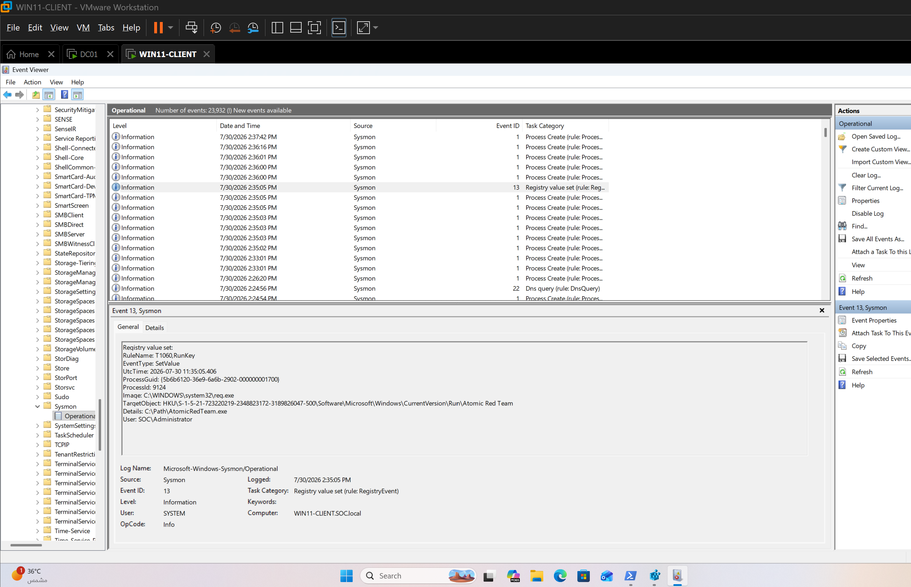
</p>

The event captures the modified registry path, the value written to the Run Key, and the responsible process, providing complete forensic context surrounding the persistence mechanism.

---

### Registry Process Creation

Sysmon Event ID **1** captured the execution of **reg.exe**, which created the Registry Run Key.

<p align="center">
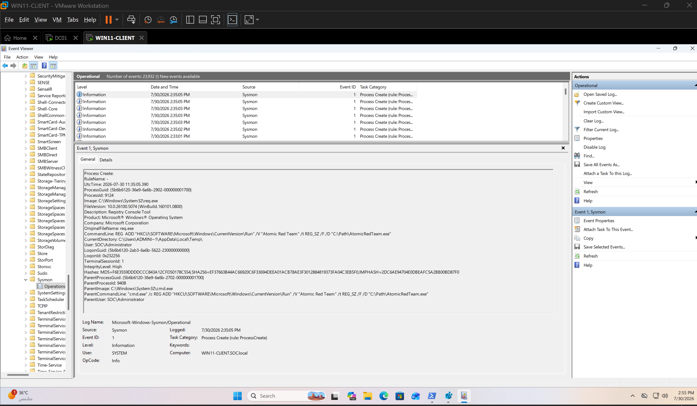
</p>

The captured command line includes the complete registry operation, including the registry path, value name, and data written by the Atomic test.

### Telemetry Summary

| Field | Value |
|-------|-------|
| Event Source | Sysmon |
| Event IDs | 1, 13 |
| Primary Process | reg.exe |
| Parent Process | cmd.exe |
| Persistence Mechanism | Registry Run Key |
| Registry Path | HKCU\Software\Microsoft\Windows\CurrentVersion\Run |
| Forwarded to Wazuh | ✅ |

---

## Wazuh Detection Analysis

Following successful execution, Wazuh Threat Hunting displayed multiple correlated detections generated from the endpoint.

> **Note:** The Windows 11 client and the Wazuh server were operating with different system times during testing. Consequently, timestamps differ between the endpoint and SIEM while still representing the same attack execution.

### Threat Hunting Overview

<p align="center">
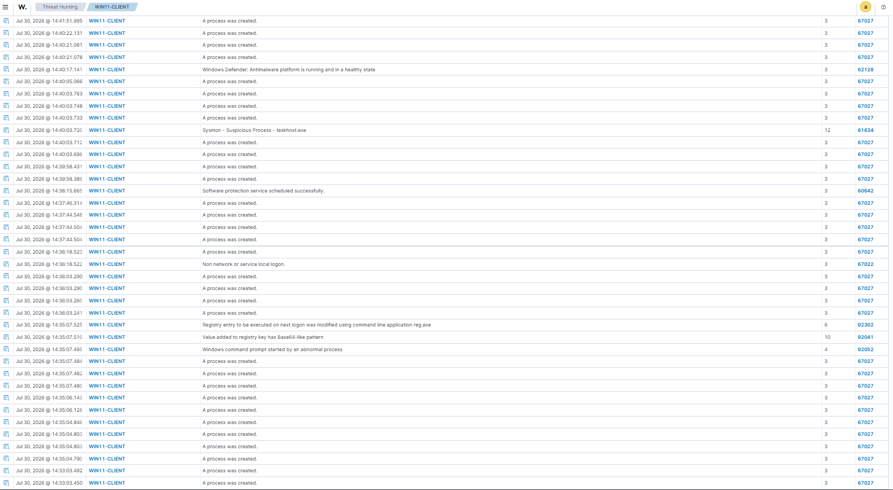
</p>

The attack generated several correlated alerts, including process creation telemetry, Registry Run Key persistence detection, and behavioral analysis of the registry content.

---

### Registry Run Key Persistence Detection

Wazuh generated **Rule 92302**, identifying the registry modification as a Registry Run Key persistence technique.

<p align="center">
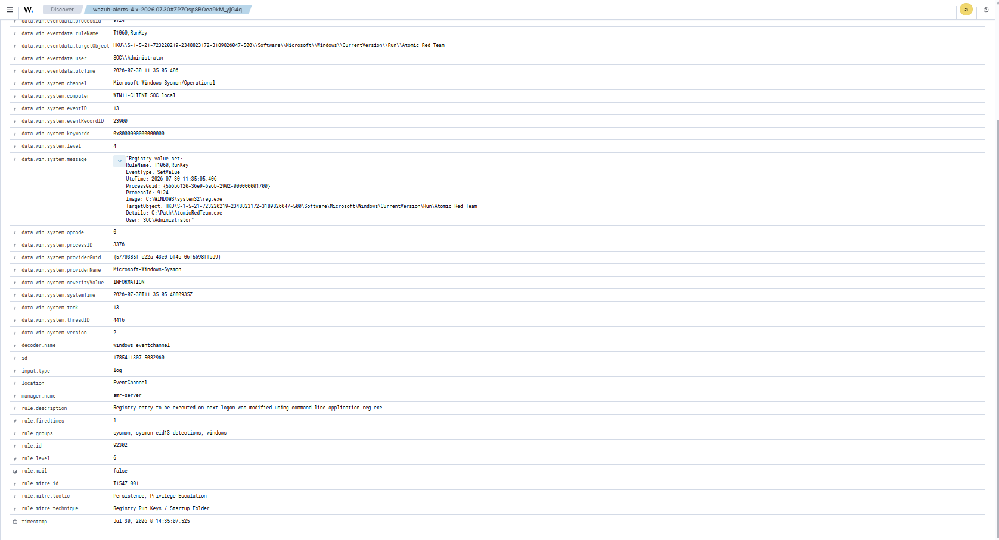
</p>

The alert is mapped to **MITRE ATT&CK T1547.001 (Registry Run Keys / Startup Folder)** and is based on the underlying Sysmon Event ID 13 generated by **reg.exe**.

The event records the modified registry path, the created value, and the executable configured to launch automatically during user logon.

---

### Base64 Registry Detection

Wazuh also generated **Rule 92041**, indicating that the registry value matched a Base64-like pattern.

<p align="center">
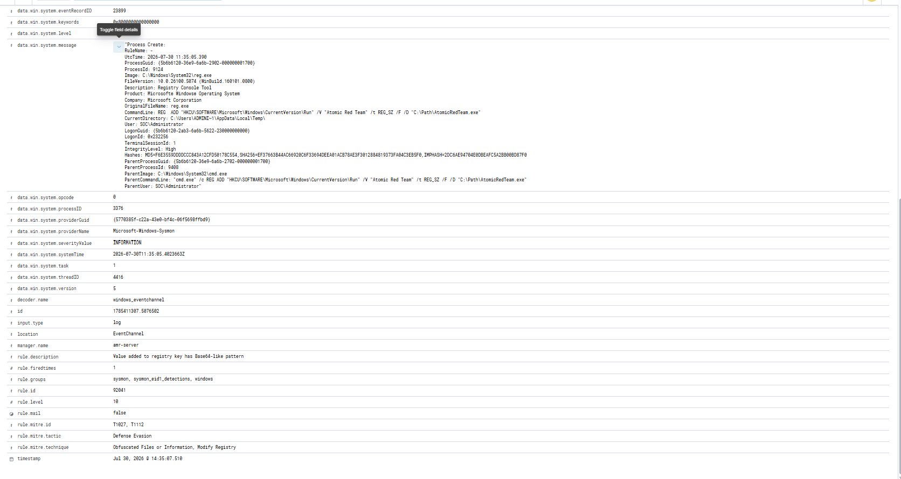
</p>

Although this Atomic test primarily demonstrates Registry Run Key persistence, Wazuh simultaneously applied additional behavioral analysis to the registry value, generating an independent detection based on its content.

This illustrates how multiple detection rules can be triggered from a single registry modification.

---

## Results

| Validation | Status |
|------------|:------:|
| Atomic test executed | ✅ |
| Registry Run Key created | ✅ |
| Persistence artifact validated | ✅ |
| Sysmon Event ID 13 generated | ✅ |
| Sysmon Process Create generated | ✅ |
| Wazuh detected Registry Run Key persistence | ✅ |
| Detection pipeline validated | ✅ |

---

## Lessons Learned

- Registry Run Keys remain one of the most common Windows persistence mechanisms leveraged by adversaries.
- Sysmon provides detailed visibility into both registry modifications and the processes responsible for creating them.
- Wazuh successfully correlates Registry Run Key persistence with additional behavioral detections generated during the same execution.
- Consistent telemetry from Sysmon and Wazuh demonstrates that Windows persistence techniques remain highly visible even when Microsoft Defender is disabled.

---

# Phase B Summary

Phase B validated that Sysmon and Wazuh maintain comprehensive endpoint visibility independently of Microsoft Defender's protection state. By executing the same Atomic Red Team techniques without endpoint prevention, the complete attack chain could be observed and compared against the results obtained during Phase A.

Only **Technique 1 (T1059.001 Test #10)** demonstrated a true prevention-to-detection contrast. Microsoft Defender blocked the attack during Phase A, while disabling Defender in Phase B allowed the complete attack chain to execute, producing additional telemetry including registry artifacts, temporary files, and child process creation.

The remaining techniques executed successfully in both phases. Comparing their results confirmed that Sysmon continued generating detailed endpoint telemetry and Wazuh consistently correlated the resulting events regardless of whether Microsoft Defender was enabled or disabled.

This demonstrates that endpoint prevention and centralized monitoring provide complementary security capabilities. While Microsoft Defender may prevent attack execution, Sysmon and Wazuh continue to provide comprehensive visibility into attacker behavior for investigation and threat hunting.

## Phase B Validation Summary

| Technique | Phase A Outcome | Phase B Outcome | Prevention / Detection Comparison |
|-----------|-----------------|-----------------|-----------------------------------|
| T1059.001 Test 10 | Blocked by Microsoft Defender | Executed Successfully | Additional telemetry observed |
| T1059.001 Test 15 | Executed Successfully | Executed Successfully | Consistent visibility |
| T1112 Test 40 | Executed Successfully | Executed Successfully | Consistent visibility |
| T1053.005 Test 7 | Executed Successfully | Executed Successfully | Consistent visibility |
| T1547.001 Test 1 | Executed Successfully | Executed Successfully | Consistent visibility |

---

# Project Conclusions

This project successfully demonstrated the deployment and validation of a Windows-based security monitoring environment using Sysmon and Wazuh. Multiple adversary techniques covering execution and persistence were simulated using Atomic Red Team to evaluate both endpoint prevention and centralized detection capabilities.

Across both phases, Sysmon consistently generated detailed endpoint telemetry while Wazuh successfully ingested, correlated, and analyzed the resulting events. Comparing Microsoft Defender enabled and disabled scenarios demonstrated that endpoint prevention and security monitoring serve complementary roles: prevention reduces attacker success, while monitoring preserves visibility into attacker behavior regardless of the protection state.

The completed lab validates an end-to-end detection pipeline from attack execution through endpoint logging, centralized collection, behavioral correlation, and analyst investigation, closely reflecting the workflow of a modern Security Operations Center (SOC).