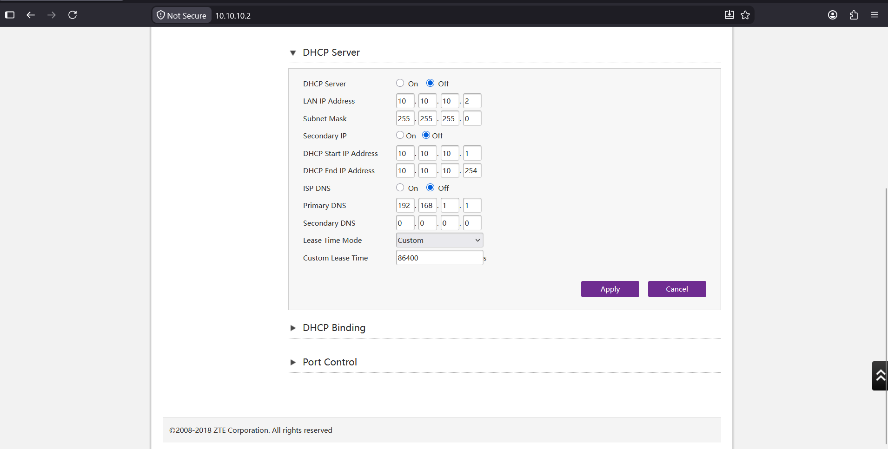
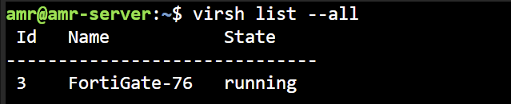
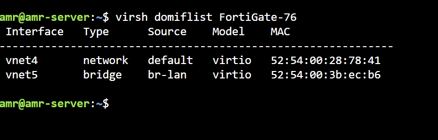
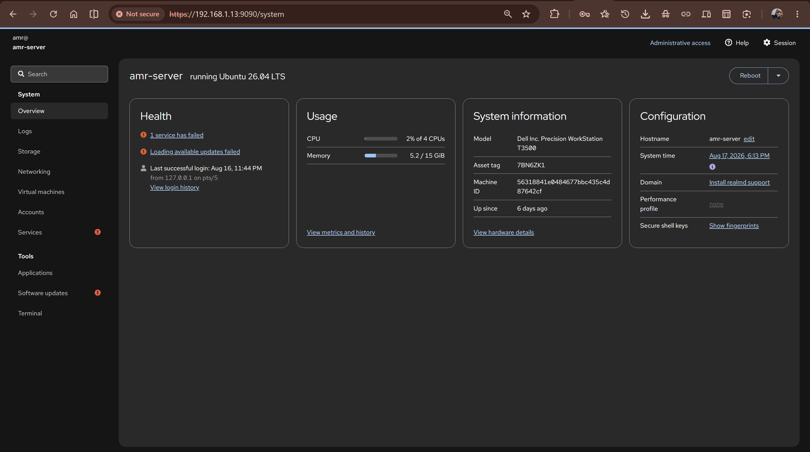
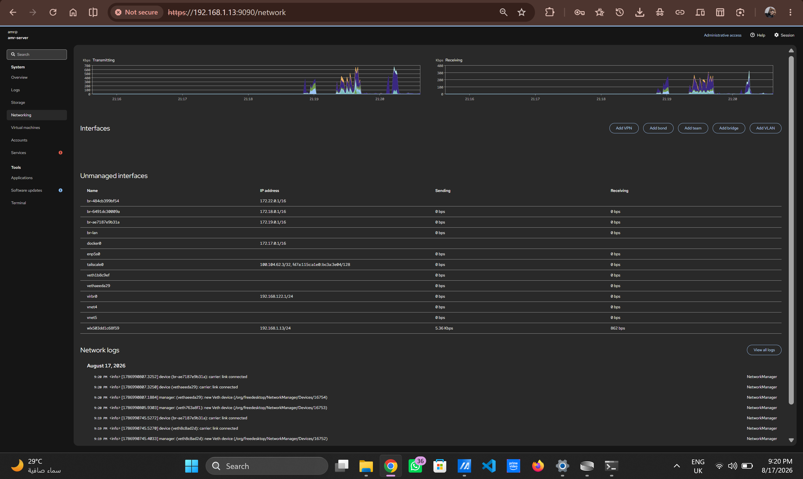

# FortiGate Network Edge

## 1. Objective

Add a dedicated network edge to the SIEM home lab using a virtualized
FortiGate firewall running on the same Ubuntu server that hosts the
existing Wazuh/CasaOS infrastructure.

The objective was to move the lab beyond a detection-only design toward a small enterprise-style security architecture with:

- A dedicated firewall/perimeter.
- A separate lab LAN.
- Routing and DHCP for the dedicated lab network through FortiGate.
- Remote-access VPN capability.
- A design that reuses existing hardware and avoids additional paid infrastructure.

The FortiGate currently provides routing and DHCP for the dedicated `10.10.10.0/24` lab network.

The existing VMware-based Windows infrastructure, including DC01 and the Windows 11 client, remains on its original VMware NAT network at this stage and has intentionally not yet been migrated behind FortiGate. Their integration with the new FortiGate-controlled network will be handled in a later implementation phase.

------------------------------------------------------------------------

## 2. Final Architecture


**Figure 1 --- Final FortiGate network-edge architecture.**

### Traffic path

```text
Home Network
     |
     | Wi-Fi
     v
Ubuntu Server
192.168.1.13
     |
     v
libvirt NAT / virbr0
192.168.122.0/24
     |
     v
FortiGate port1 — WAN
192.168.122.78/24
     |
     v
FortiGate port2 — LAN
10.10.10.1/24
     |
     v
Reused Wi-Fi router
DHCP disabled
Access-layer role
     |
     v
Lab clients
10.10.10.0/24
```

The FortiGate is therefore the routing and DHCP boundary for the
dedicated lab network, while Ubuntu/libvirt provides the upstream
virtualized WAN segment.

------------------------------------------------------------------------

## 3. Design Decisions

### 3.1 Wi-Fi as the Ubuntu uplink

The Ubuntu server uses its existing Wi-Fi connection as the
upstream/management connection instead of requiring a second physical
Ethernet adapter.

This keeps the implementation low-cost and avoids adding dedicated
hardware solely for the lab.

### 3.2 libvirt NAT for the FortiGate WAN

The FortiGate WAN interface is connected to the libvirt `default`
network (`virbr0`) rather than directly bridging the Wi-Fi adapter.

This provides the FortiGate with a private virtual WAN segment:

-   libvirt gateway: `192.168.122.1`
-   FortiGate WAN: `192.168.122.78`
-   Subnet: `192.168.122.0/24`

This arrangement also avoids depending on direct station-mode Wi-Fi
bridging for the VM.

### 3.3 Reused router as access-layer infrastructure

The existing Wi-Fi router on the lab side was repurposed as access-layer infrastructure for the dedicated lab network.

Its previous DHCP and routing/NAT role is no longer used for the lab segment:

- DHCP disabled.
- FortiGate provides DHCP.
- FortiGate provides routing and the default gateway.
- The device remains available to provide wireless/access connectivity to lab clients.
- The device is not treated as the primary routing boundary for the lab network.



**Figure 2 — Lab router LAN configuration showing DHCP disabled.**

This prevents a second DHCP server from operating inside the lab network and keeps FortiGate as the routing boundary for the dedicated LAN.

### 3.4 Management port separation

FortiGate HTTPS management was moved to **TCP/8443**.

TCP/443 was allocated to the remote-access VPN transport, allowing the VPN to use the WAN-side TCP/443 listener while keeping the FortiGate administrative interface on a separate port.

This separation avoids a port conflict between HTTPS management and the remote-access VPN transport.

The detailed VPN implementation and troubleshooting are documented separately.

------------------------------------------------------------------------

## 4. Hypervisor and FortiGate VM

The FortiGate appliance is running as a KVM/QEMU virtual machine managed
through libvirt.

**VM name:** `FortiGate-76`

### 4.1 VM state

The VM is running under libvirt.



**Figure 3 --- `virsh list --all` showing the FortiGate VM in a running
state.**

### 4.2 VM resources

The VM was configured with:

-   1 vCPU.
-   2048 MiB RAM.
-   Persistent VM configuration.
-   Autostart currently disabled.


**Figure 4 --- `virsh dominfo FortiGate-76`.**

The disabled autostart setting remains an open item for later
power-loss/recovery testing.

### 4.3 Two-NIC design

The FortiGate VM has two virtual NICs:

| VM NIC | Libvirt connection | FortiGate interface | Role | MAC |
|---|---|---|---|---|
| `vnet4` | `default` | `port1` | WAN | `52:54:00:28:78:41` |
| `vnet5` | `br-lan` | `port2` | LAN | `52:54:00:3b:ec:b6` |


**Figure 5 — `virsh domiflist FortiGate-76` confirming the two-NIC topology.**

------------------------------------------------------------------------

## 5. FortiOS Version and License Troubleshooting

The initial FortiOS 8.0 deployment encountered a GUI login loop
associated with license verification. The dashboard would load briefly
and then return to the login page.

The appliance was subsequently reinstalled using FortiOS 7.6, and
license activation was performed through the CLI.

Two variables changed during this troubleshooting process --- the
FortiOS version and the license-activation method --- so the exact root
cause of the original GUI behavior was not isolated conclusively.

### Final FortiOS state

The final appliance is running:

-   **FortiOS:** 7.6.7
-   **Build:** 3704
-   **Hostname:** `FGVMEVNT2KN1SSA6`
-   **License status:** Valid
-   **VM memory:** 2048 MiB configured / approximately 1995 MiB
    available to FortiOS


**Figure 6 --- Final `get system status` output.**

------------------------------------------------------------------------

## 6. FortiGate Network Configuration

### 6.1 WAN — `port1`

`port1` connects to the libvirt NAT network:

```text
Subnet:        192.168.122.0/24
Gateway:       192.168.122.1
FortiGate WAN: 192.168.122.78
```

The WAN address is obtained through DHCP from libvirt, with a persistent
DHCP reservation configured for the FortiGate VM MAC address.

### 6.2 LAN — `port2`

`port2` provides the dedicated lab network:

```text
FortiGate LAN: 10.10.10.1/24
Subnet:        10.10.10.0/24
```

FortiGate provides DHCP and routing for this network.


**Figure 7 --- FortiGate interface configuration showing the WAN and
dedicated LAN interfaces.**

### 6.3 Routing

The final routing table confirms that FortiGate uses the libvirt gateway
as its default route:

``` text
S*      0.0.0.0/0 [5/0] via 192.168.122.1, port1, [1/0]
C       10.10.10.0/24 is directly connected, port2
C       192.168.122.0/24 is directly connected, port1
```


**Figure 8 --- FortiGate routing table.**

This establishes the expected path:

``` text
Lab LAN
  ↓
FortiGate port2
  ↓
FortiGate port1
  ↓
192.168.122.1
  ↓
libvirt NAT
  ↓
Ubuntu Wi-Fi
  ↓
Home router / Internet
```

------------------------------------------------------------------------

## 7. Lab Client Connectivity

A Windows client connected through the repurposed Wi-Fi router received
its network configuration from FortiGate.

The client was assigned:

``` text
IPv4 address:  10.10.10.102
Subnet mask:   255.255.255.0
Gateway:       10.10.10.1
```


**Figure 9 --- Windows client receiving an address from the FortiGate
LAN DHCP scope.**

### Internet connectivity test

The same client successfully accessed an external site.


**Figure 10 --- External connectivity test from the lab client.**

This validates the complete forwarding path rather than merely proving
that DHCP is functioning.

------------------------------------------------------------------------

## 8. FortiGate Management Access

After moving FortiGate HTTPS management to TCP/8443, the GUI was reachable from the dedicated lab network using:

```text
https://10.10.10.1:8443
```


**Figure 11 --- FortiGate management GUI reachable from the lab
environment.**

------------------------------------------------------------------------

## 9. Ubuntu Management and Virtualization Tooling

Cockpit was installed on the Ubuntu server to provide a graphical
management layer alongside the existing `virsh`/CLI workflow.

The Ubuntu host is:

``` text
Hostname: amr-server
OS:       Ubuntu 26.04 LTS
```



**Figure 12 — Cockpit system overview of the Ubuntu virtualization host.**

### Host networking

The host network view shows the components participating in the FortiGate deployment:

| Interface | Role |
|---|---|
| `wlx503dd1c68f59` | Ubuntu Wi-Fi uplink / host connectivity |
| `virbr0` — `192.168.122.1/24` | libvirt NAT network / FortiGate WAN-side network |
| `vnet4` | FortiGate `port1` virtual NIC |
| `vnet5` | FortiGate `port2` virtual NIC |
| `br-lan` | Bridge carrying the FortiGate LAN connection to the physical lab segment |

Other host interfaces such as `docker0` and `tailscale0` belong to the wider infrastructure environment and are not part of the FortiGate forwarding path.



**Figure 13 — Cockpit networking view of the Ubuntu host.**

------------------------------------------------------------------------

## 10. Known-Good Checkpoint

A snapshot was created after reaching a known-good FortiGate state.

The checkpoint is intended to provide a recovery point before further
VPN, logging, and security-policy work.


**Figure 14 --- Snapshot/checkpoint evidence from the Ubuntu host.**

------------------------------------------------------------------------

## 11. Verification Summary

The following items have been verified:

-   [x] FortiGate VM runs successfully under KVM/QEMU/libvirt.
-   [x] Two-NIC VM topology is established.
-   [x] FortiOS 7.6.7 is installed and the license is valid.
-   [x] FortiGate WAN connectivity through `192.168.122.0/24` works.
-   [x] FortiGate LAN uses the dedicated `10.10.10.0/24` subnet.
-   [x] FortiGate provides DHCP to lab clients.
-   [x] Lab clients receive addresses from the FortiGate DHCP scope.
-   [x] Lab clients reach the Internet through the FortiGate.
-   [x] FortiGate management is reachable on TCP/8443 from the lab LAN.
-   [x] A known-good VM snapshot/checkpoint exists.

------------------------------------------------------------------------

## 12. Known Limitations and Next Steps

The network edge is operational, but the following items remain open:

1.  **Wazuh integration** --- forward and analyze FortiGate
    security/network logs in the SIEM.
2.  **VM autostart/recovery** --- validate FortiGate recovery after an
    Ubuntu host reboot or power-loss scenario.
3. **Remote-access VPN documentation** — document the implemented FortiClient/IPsec-over-TCP configuration, troubleshooting process, session behavior, and final hardening separately.
4.  **Security hardening** --- replace the temporary/legacy VPN
    cryptographic settings used during interoperability troubleshooting
    with stronger production-appropriate settings.
5.  **Final firewall-policy validation** --- document and test the
    intended LAN/WAN and VPN policies and their resulting logs.

### Current project boundary

The FortiGate network is currently a separate implementation layer from the original VMware-based Windows infrastructure.

At this stage:

- DC01 remains on the VMware NAT network.
- The Windows 11 client remains on the VMware NAT network.
- Kali Linux has not yet been integrated into the FortiGate network.
- The dedicated `10.10.10.0/24` network is operational independently.
- Wazuh remains natively installed on `amr-server`.
- FortiGate is hosted through KVM/libvirt on the same Ubuntu server.

Migration of the existing VMware endpoints behind FortiGate is intentionally deferred until the FortiGate implementation and documentation have been completed.

------------------------------------------------------------------------

## 13. Implementation Notes

This document intentionally separates the **final working architecture** from the detailed troubleshooting history.

Temporary troubleshooting changes, failed configurations, VPN interoperability issues, authentication experiments, certificate issues, and diagnostic commands should be documented in the relevant troubleshooting/VPN documentation rather than mixed into the final network-edge architecture.

This document is intended to serve as:

- A portfolio implementation record.
- A reference for the final FortiGate network architecture.
- A reconstruction guide for the virtualization and network topology.
- A baseline for the subsequent SIEM/FortiGate integration work.

The current implementation should therefore be understood as a completed FortiGate network-edge phase, while the migration of the existing VMware infrastructure and the SIEM integration remain subsequent phases.