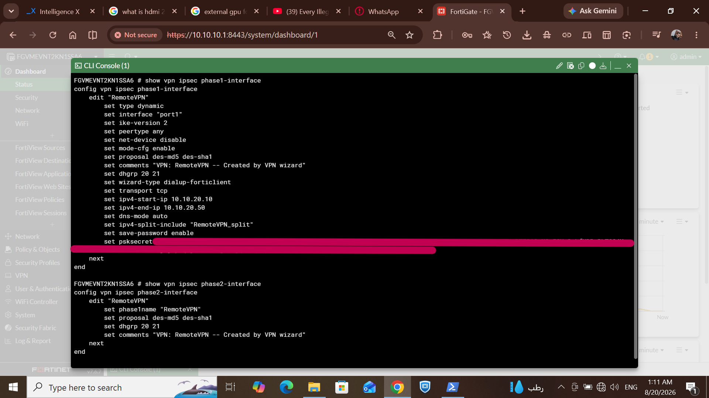
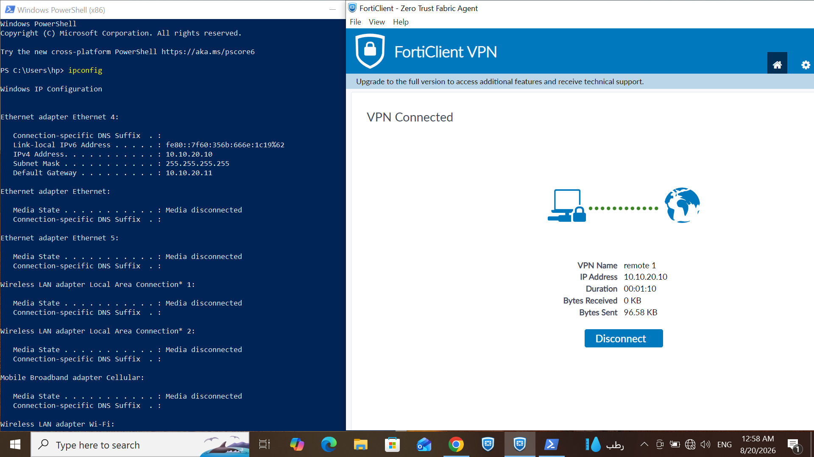
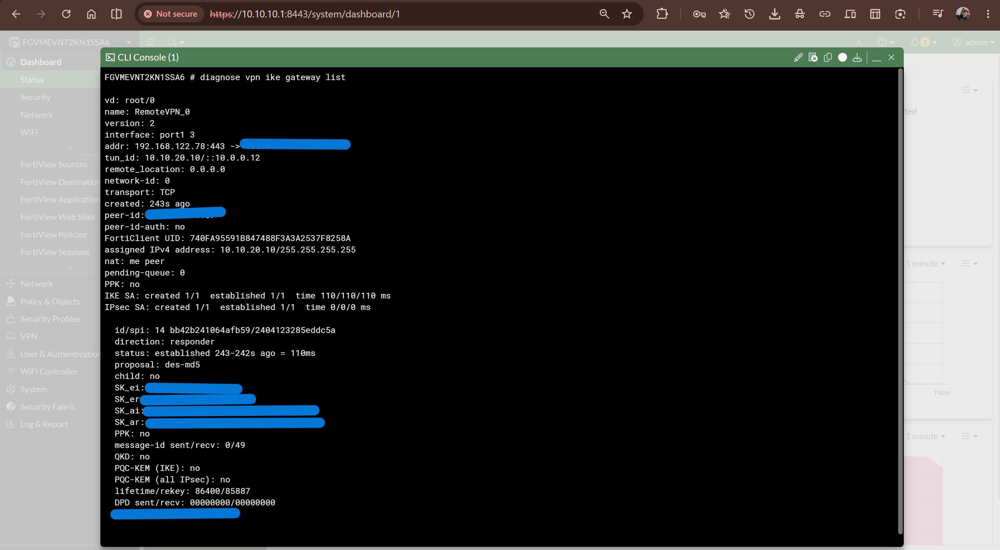
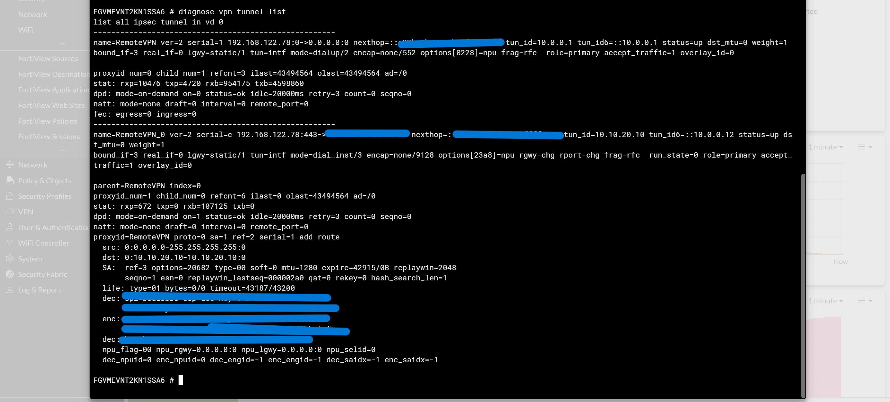
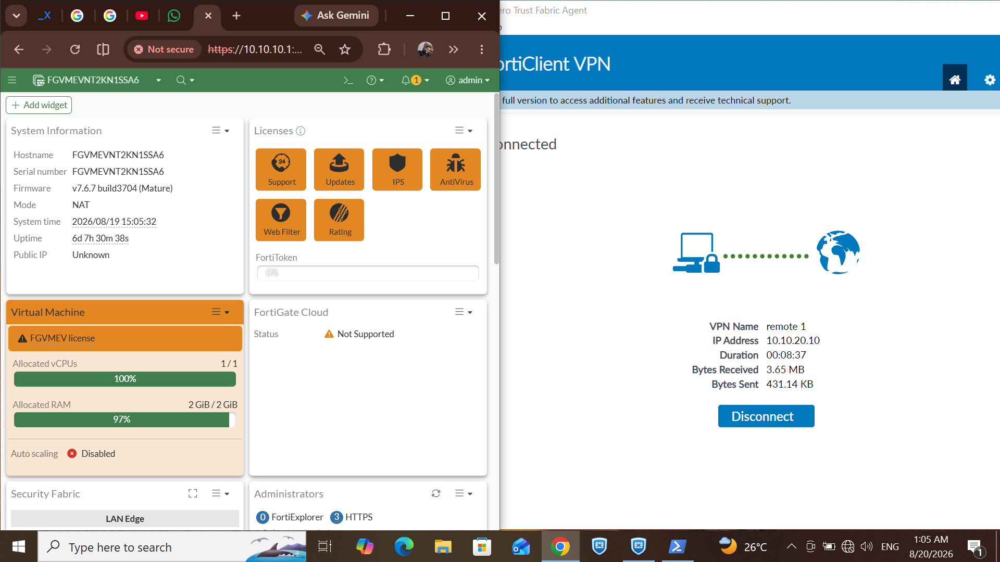
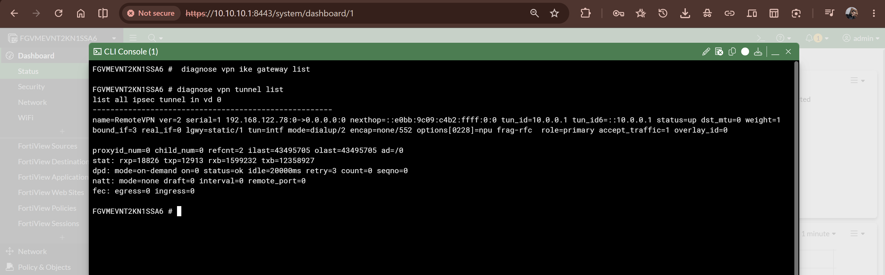

# FortiGate Remote Access VPN — IPsec over TCP/443

## 1. Objective

This phase adds remote-access VPN capability to the FortiGate security edge implemented in the SIEM Monitoring Home Lab.

The objective was to establish a native FortiGate IPsec remote-access tunnel that allows an external FortiClient endpoint to connect to the lab firewall and receive a VPN address from a dedicated address pool.

The implementation uses **IKEv2/IPsec over TCP/443**.

This document focuses on the implemented configuration and the evidence collected from the FortiGate CLI, FortiClient, and the lab environment.

---

## 2. Existing Network Context

The FortiGate is deployed as a KVM/libvirt virtual machine on the Ubuntu server and sits between the libvirt NAT network and the dedicated physical lab LAN.

The relevant network segments are:

| Component | Address / Network |
|---|---|
| FortiGate WAN (`port1`) | `192.168.122.78/24` |
| FortiGate LAN (`port2`) | `10.10.10.1/24` |
| Lab LAN | `10.10.10.0/24` |
| Remote-access VPN pool | `10.10.20.10 – 10.10.20.50` |
| FortiGate management GUI | HTTPS on `8443` |
| IPsec remote-access listener | TCP/443 |

The FortiGate WAN interface uses the libvirt NAT network as its upstream connection. The LAN interface connects to the dedicated physical lab subnet.

> **Current project boundary:** The existing VMware-based Windows infrastructure (DC01 and WIN11) remains behind the VMware `vmnet8` NAT layer and has not been directly migrated onto the FortiGate `10.10.10.0/24` LAN. The VMware guests are not individually addressed on the FortiGate LAN. Their network path can traverse the physical Windows host and L2/access-point segment to reach the FortiGate-controlled network. Direct migration of the VMware guests to the FortiGate LAN is planned for a later phase and is outside the scope of this document.

---

## 3. Protocol Selection

The remote-access implementation uses **IKEv2/IPsec transported over TCP/443**.

The important implementation decision was to use TCP transport rather than relying only on the traditional UDP-based IPsec transport.

The final FortiGate configuration explicitly shows:

```text
set ike-version 2
set transport tcp
```

The live IKE diagnostic also identifies the active connection as:

```text
transport: TCP
```

The active gateway session shows the FortiGate receiving the connection on:

```text
192.168.122.78:443
```

This provides direct evidence that the deployed remote-access session is using TCP/443.

---

## 4. VPN Architecture

The resulting remote-access path is:

```text
External Client
      |
      | FortiClient
      | IKEv2 / IPsec over TCP/443
      |
      v
FortiGate WAN (port1)
192.168.122.78
      |
      v
FortiGate
      |
      +---- Remote-access VPN
      |     10.10.20.10 - 10.10.20.50
      |
      v
FortiGate LAN (port2)
10.10.10.1
      |
      v
Dedicated Lab LAN
10.10.10.0/24
```
> **Network-path clarification:** The VPN terminates on the FortiGate. The existing VMware guests remain behind VMware `vmnet8` NAT and are not direct FortiGate LAN clients. This document therefore does not claim that the current VPN provides direct access to DC01 or WIN11 as individually addressed `10.10.10.x` hosts.

The VPN client receives an address from the configured remote-access pool.

---

## 5. FortiGate IPsec Configuration

The remote-access tunnel is named `RemoteVPN`.

The captured Phase 1 configuration establishes the following:

- IKE version: **IKEv2**
- Interface: **`port1`**
- VPN type: **dynamic**
- Wizard type: **FortiClient dial-up**
- Transport: **TCP**
- Address pool start: **`10.10.20.10`**
- Address pool end: **`10.10.20.50`**
- Split-include configuration: **`RemoteVPN_split`**
- DH groups: **20 and 21**
- Configured proposals: **`des-md5`** and **`des-sha1`**

The Phase 2 configuration uses the `RemoteVPN` Phase 1 interface and the same configured proposal family.

### Configuration evidence



> **Security note:** The original CLI output contained the configured PSK material. The public evidence image has that value redacted. Credentials and cryptographic secrets are intentionally not included in this repository.

---

## 6. Client Connection

The remote endpoint connects using **FortiClient VPN**.

The client evidence shows an active VPN connection with:

- VPN name: `remote_1`
- Assigned VPN address: `10.10.20.10`
- Connection state: **VPN Connected**

The corresponding Windows network configuration shows the VPN adapter using:

```text
IPv4 Address: 10.10.20.10
Subnet Mask: 255.255.255.255
Default Gateway: 10.10.20.11
```

### Client connection evidence



This establishes that the FortiGate successfully assigned an address from the configured remote-access pool.

---

## 7. IKE and IPsec Security Association Verification

The live FortiGate diagnostic output provides direct evidence that the VPN negotiation completed successfully.

The `diagnose vpn ike gateway list` output identifies:

```text
version: 2
transport: TCP
assigned IPv4 address: 10.10.20.10/255.255.255.255
IKE SA: created 1/1 established 1/1
IPsec SA: created 1/1 established 1/1
```

This confirms that both the IKE Security Association and IPsec Security Association were successfully established.

### IKE gateway diagnostic



Sensitive peer/session information and cryptographic key material have been redacted from the public evidence.

---

## 8. IPsec Tunnel Verification

The `diagnose vpn tunnel list` command provides a second, independent verification of the active tunnel.

The captured output identifies the dynamic remote-access instance:

```text
name=RemoteVPN_0
...
tun_id=10.10.20.10
status=up
...
mode=dial_inst
...
accept_traffic=1
```

The diagnostic also contains live packet counters, demonstrating that the tunnel is carrying traffic.

### Tunnel diagnostic



Cryptographic ESP/AH key material contained in the original diagnostic output has been redacted before publication.

---

## 9. Traffic Through the VPN

The FortiClient evidence shows the tunnel carrying traffic while connected.

The captured session displays:

- VPN state: **Connected**
- Assigned address: `10.10.20.10`
- Received traffic: **3.65 MB**
- Sent traffic: **431.4 KB**

At the same time, the FortiGate management interface is reachable from the VPN-connected client.

### Connected client and FortiGate management access



This provides practical evidence that the VPN is not merely negotiating successfully: traffic is passing through the established tunnel.

---

## 10. Baseline / Initial Tunnel State

A separate diagnostic capture was retained as a baseline showing the FortiGate VPN state before the successful client session.

This is useful for documenting the transition from the initial configuration state to an established remote-access session.

### Baseline evidence



---

## 11. Verification Summary

The implementation was verified at multiple layers rather than relying solely on the FortiClient GUI.

| Verification | Result |
|---|---|
| FortiClient connection | **Connected** |
| VPN address assignment | **`10.10.20.10`** |
| IKE version | **IKEv2** |
| Transport | **TCP** |
| Listener | **TCP/443** |
| IKE SA | **Established** |
| IPsec SA | **Established** |
| IPsec tunnel | **Up** |
| Tunnel traffic | **Confirmed by counters** |
| FortiGate GUI access through VPN | **Observed** |

The combination of client-side, FortiGate configuration, IKE diagnostic, and tunnel diagnostic evidence provides a complete verification chain for the implemented VPN.

---

## 12. Security Considerations

The public documentation intentionally excludes sensitive material captured during troubleshooting and verification.

The following information was redacted from the published screenshots:

- Pre-shared key material
- IKE session key material
- IPsec ESP/AH cryptographic key material
- The external peer IP address where it was not required as evidence

The configuration details that describe the implementation itself—such as IKEv2, TCP transport, the VPN address pool, proposals, and tunnel state—remain visible because they are required to explain and reproduce the lab design.

---

## 13. Current Scope and Limitations

This implementation establishes remote access to the FortiGate/lab network, but it does **not** yet represent the final SIEM lab topology.

In particular:

1. The Windows Server (`DC01`) and Windows 11 client remain behind the VMware `vmnet8` NAT layer.

2. They are not individually addressed or directly attached to the FortiGate-controlled `10.10.10.0/24` LAN.

3. Their network path can traverse the physical Windows host and L2/access-point segment to reach the FortiGate-controlled network.

4. Kali Linux is not currently part of the deployed lab topology.

5. Direct migration of the existing VMware infrastructure to the FortiGate LAN, and subsequent validation of VPN access to those hosts, will be documented as a later implementation phase.

This boundary is intentional: the VPN implementation is documented as a completed FortiGate remote-access capability, while direct migration of the VMware infrastructure and validation of VPN access to those hosts remain subsequent implementation phases.

---

## 14. Result

The FortiGate remote-access VPN was successfully implemented using **IKEv2/IPsec over TCP/443**.

The collected evidence confirms:

- successful FortiClient connection,
- assignment of the VPN address `10.10.20.10`,
- IKEv2 negotiation,
- established IKE and IPsec Security Associations,
- an active IPsec tunnel,
- traffic passing through the tunnel, and
- access to the FortiGate management interface while connected.

The VPN therefore provides the remote-access foundation for the next stages of the lab, where the existing Windows infrastructure can eventually be migrated into the FortiGate-controlled network and incorporated into the broader SIEM monitoring architecture.
