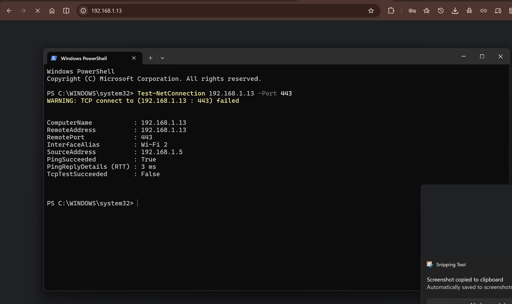
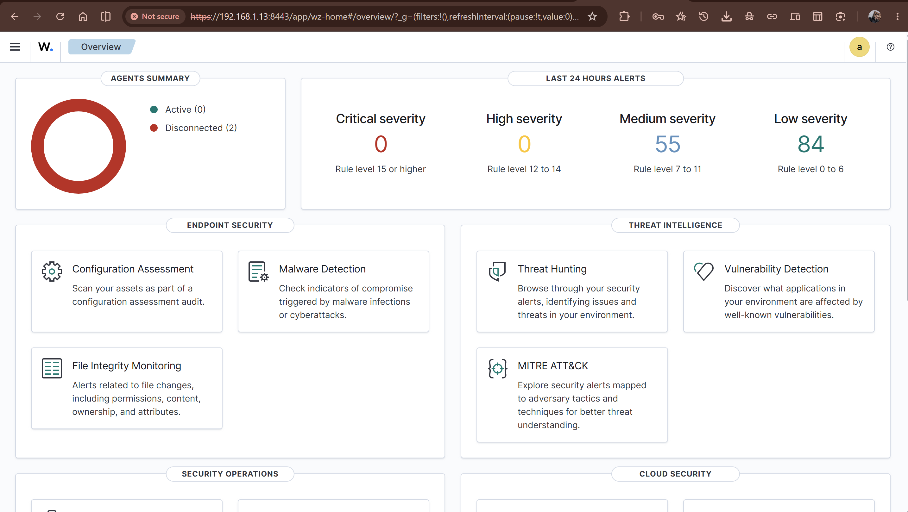

# Wazuh Dashboard Port Migration — TCP/443 to TCP/8443

## 1. Objective

This change documents the migration of the Wazuh Dashboard HTTPS listener from **TCP/443** to **TCP/8443**.

The change was required after the FortiGate remote-access VPN implementation introduced an existing TCP/443 forwarding path on the Ubuntu virtualization host.

The objective was to restore reliable access to the Wazuh Dashboard without disrupting the already validated FortiGate IKEv2/IPsec-over-TCP/443 implementation.

The migration changes only the Wazuh Dashboard listening port. Wazuh's existing TLS configuration and SIEM services remain unchanged.

---

## 2. Existing Environment

The Wazuh platform is deployed natively on the Ubuntu server:

```text
Ubuntu Server
amr-server
192.168.1.13

        |
        +---- Wazuh Manager
        +---- Wazuh Indexer
        +---- Wazuh Dashboard
```

The Wazuh Dashboard was originally configured to listen on:

```text
HTTPS / TCP 443
```

The same Ubuntu host also provides the network path used by the virtualized FortiGate.

The FortiGate WAN interface is:

```text
192.168.122.78
```

and its remote-access VPN uses:

```text
IKEv2 / IPsec over TCP/443
```

The Ubuntu host therefore already contained a DNAT rule forwarding inbound TCP/443 traffic from the physical Wi-Fi interface to the FortiGate:

```text
TCP/443
    |
    v
Ubuntu host
    |
    +---- DNAT ---> 192.168.122.78:443
                         |
                         v
                    FortiGate-VM
```

This created a conflict between the original Wazuh Dashboard port and the FortiGate TCP/443 forwarding path.

---

## 3. Problem Identification

After the FortiGate network-security and remote-access configuration was implemented, access to the Wazuh Dashboard from the Windows host was tested using:

```powershell
Test-NetConnection 192.168.1.13 -Port 443
```

The result was:

```text
ComputerName     : 192.168.1.13
RemoteAddress    : 192.168.1.13
RemotePort       : 443
InterfaceAlias   : Wi-Fi 2
SourceAddress    : 192.168.1.5
PingSucceeded    : True
PingReplyDetails (RTT) : 3 ms
TcpTestSucceeded : False
```

The important distinction was that ICMP connectivity remained available while TCP/443 was not reachable.

### Initial client-side evidence



The test demonstrated that the host itself was reachable, but the Wazuh Dashboard could not be reached from the Windows client through TCP/443.

---

## 4. Wazuh Service Verification

The failure was investigated from the Ubuntu server rather than assuming that the Wazuh service itself was unavailable.

The Dashboard was tested locally using:

```bash
curl -k -I https://127.0.0.1:443
```

The Dashboard returned:

```text
HTTP/1.1 302 Found
location: /app/login?
osd-name: amr-server
x-frame-options: sameorigin
cache-control: private, no-cache, no-store, must-revalidate
set-cookie: security_authentication=; Max-Age=0; Expires=Thu, 01 Jan 1970 00:00:00 GMT; HttpOnly; Path=/
content-length: 0
Date: Tue, 25 Aug 2026 23:35:22 GMT
Connection: keep-alive
Keep-Alive: timeout=120
```

The same response was obtained when accessing the server's LAN address:

```bash
curl -k -I https://192.168.1.13:443
```

Result:

```text
HTTP/1.1 302 Found
location: /app/login?
osd-name: amr-server
```

The HTTP `302 Found` response confirmed that the Wazuh Dashboard application was functioning locally.

The problem was therefore not a failed Wazuh Dashboard service.

---

## 5. NAT Investigation

The Ubuntu host's NAT table was inspected with:

```bash
sudo iptables -t nat -L PREROUTING -n -v --line-numbers
```

The relevant rule was:

```text
2     3682  200K DNAT  tcp  --  wlx503dd1c68f59 *  0.0.0.0/0  0.0.0.0/0
       tcp dpt:443 to:192.168.122.78:443
```

This showed that TCP/443 traffic arriving through the physical Wi-Fi interface was being forwarded to the FortiGate WAN address:

```text
192.168.122.78:443
```

The rule was part of the FortiGate remote-access implementation and was required to preserve the previously validated IKEv2/IPsec-over-TCP/443 design.

### Resulting architecture

```text
                         Ubuntu / amr-server
                         192.168.1.13
                               |
              +----------------+----------------+
              |                                 |
          TCP/8443                           TCP/443
              |                                 |
              v                                 v
      Wazuh Dashboard                    DNAT / Forwarding
      192.168.1.13:8443                        |
                                                v
                                        FortiGate WAN
                                        192.168.122.78:443
```

The appropriate solution was therefore to move the Wazuh Dashboard rather than remove or modify the FortiGate TCP/443 forwarding required by the VPN implementation.

---

## 6. Port Availability Check

Before changing the Dashboard configuration, TCP/8443 was checked on the Ubuntu host:

```bash
sudo ss -lntp | grep ':8443'
```

No existing listener was returned.

This confirmed that TCP/8443 was available for the Wazuh Dashboard.

---

## 7. Configuration Change

The Wazuh Dashboard configuration was located in:

```text
/etc/wazuh-dashboard/opensearch_dashboards.yml
```

The original configuration contained:

```yaml
server.host: 0.0.0.0
server.port: 443
server.ssl.enabled: true
server.ssl.key: "/etc/wazuh-dashboard/certs/dashboard-key.pem"
server.ssl.certificate: "/etc/wazuh-dashboard/certs/dashboard.pem"
```

Only the Dashboard port was changed:

```yaml
server.port: 8443
```

The TLS configuration was left unchanged.

The resulting configuration was verified with:

```bash
sudo grep -E '^server\.port:' \
/etc/wazuh-dashboard/opensearch_dashboards.yml
```

Result:

```text
server.port: 8443
```

---

## 8. Service Restart and Validation

The Wazuh Dashboard service was restarted:

```bash
sudo systemctl restart wazuh-dashboard
```

Service status was then checked:

```bash
sudo systemctl status wazuh-dashboard --no-pager
```

The service reported:

```text
Active: active (running)
```

The listening sockets were then checked:

```bash
sudo ss -lntp | grep -E ':443|:8443'
```

The resulting listener was:

```text
LISTEN 0      511      0.0.0.0:8443      0.0.0.0:*    users:(("node",pid=1128291,fd=19))
```

This confirmed that the Wazuh Dashboard had successfully moved to TCP/8443.

---

## 9. Local Application Verification

The Dashboard was tested locally on the new port:

```bash
curl -k -I https://127.0.0.1:8443
```

The application returned:

```text
HTTP/1.1 302 Found
location: /app/login?
osd-name: amr-server
x-frame-options: sameorigin
cache-control: private, no-cache, no-store, must-revalidate
set-cookie: security_authentication=; Max-Age=0; Expires=Thu, 01 Jan 1970 00:00:00 GMT; HttpOnly; Path=/
content-length: 0
Date: Tue, 25 Aug 2026 23:54:15 GMT
Connection: keep-alive
Keep-Alive: timeout=120
```

The same application-level response previously observed on TCP/443 was therefore reproduced successfully on TCP/8443.

This confirmed that the port migration did not prevent the Dashboard from serving HTTPS traffic.

---

## 10. Remote Client Verification

Connectivity was then tested from the Windows client:

```powershell
Test-NetConnection 192.168.1.13 -Port 8443
```

The result was:

```text
ComputerName     : 192.168.1.13
RemoteAddress    : 192.168.1.13
RemotePort       : 8443
InterfaceAlias   : Wi-Fi 2
SourceAddress    : 192.168.1.5
PingSucceeded    : True
TcpTestSucceeded : True
```

### Remote connectivity evidence



The Wazuh Dashboard was subsequently accessed successfully from the Windows client using:

```text
https://192.168.1.13:8443
```

The Wazuh Dashboard loaded normally and displayed the existing SIEM interface and alert data.

---

## 11. Final Port Allocation

The final host-level port allocation is now:

| Service | Address | Port | Purpose |
|---|---|---:|---|
| Wazuh Dashboard | `192.168.1.13` | `8443/TCP` | HTTPS management interface |
| FortiGate forwarding path | Ubuntu host | `443/TCP` | Forwarding to FortiGate WAN |
| FortiGate WAN | `192.168.122.78` | `443/TCP` | IKEv2/IPsec over TCP/443 |

### Port-number clarification

TCP/8443 is also used by the FortiGate administrative GUI, but the two services are hosted on different systems:

```text
FortiGate GUI
10.10.10.1:8443

Wazuh Dashboard
192.168.1.13:8443
```

There is therefore no actual port conflict. TCP port numbers are local to their respective hosts. The use of `8443` in both services should not be interpreted as a shared listener or collision.

---

## 12. Verification Summary

| Verification | Result |
|---|---|
| Wazuh Dashboard service | **Active** |
| Wazuh Dashboard responding locally on TCP/443 (pre-fix) | **Confirmed** |
| TCP/443 from Windows client (pre-fix) | **Failed** |
| Existing TCP/443 DNAT rule identified | **Confirmed** |
| TCP/8443 available before migration | **Confirmed** |
| Dashboard port changed to `8443` | **Completed** |
| Wazuh Dashboard service restart | **Successful** |
| Dashboard listening on `0.0.0.0:8443` | **Confirmed** |
| Local HTTPS response on TCP/8443 | **Confirmed** |
| Windows client TCP/8443 connectivity | **Successful** |
| Wazuh Dashboard accessible through browser | **Successful** |
| FortiGate TCP/443 path preserved | **Yes** |

---

## 13. Security and Operational Considerations

The migration does not disable HTTPS.

The Wazuh Dashboard continues to use:

```yaml
server.ssl.enabled: true
```

and the existing Dashboard certificate and private key:

```text
/etc/wazuh-dashboard/certs/dashboard.pem
/etc/wazuh-dashboard/certs/dashboard-key.pem
```

Only the listening port was changed.

The browser may continue to display a certificate warning because the lab uses its existing certificate configuration and the access is performed directly against the private IP address. This does not indicate that HTTPS has been disabled.

No Wazuh credentials or cryptographic secrets were added to the repository as part of this change.

---

## 14. Result

The Wazuh Dashboard port migration was successfully completed.

The original TCP/443 accessibility problem was traced to the coexistence of the Wazuh Dashboard and the FortiGate TCP/443 forwarding path on the Ubuntu virtualization host.

Rather than modifying the already validated FortiGate remote-access implementation, the Wazuh Dashboard was moved to TCP/8443.

The final state is:

```text
Wazuh Dashboard
    |
    +---- HTTPS :8443
    |
    v
192.168.1.13


FortiGate Remote Access
    |
    +---- TCP/443
    |
    v
Ubuntu DNAT
    |
    v
192.168.122.78:443
    |
    v
FortiGate-VM
```

The Wazuh Dashboard is operational and remotely accessible on TCP/8443, while the FortiGate TCP/443 VPN path remains available for the next stage of the project.

---

## 15. Next Phase

With the port conflict resolved, the lab is ready to proceed to the next integration phase:

**FortiGate → Wazuh security telemetry integration.**

The next phase will establish a telemetry path between the FortiGate network-security layer and the existing Wazuh SIEM, followed by validation of log ingestion, parsing, alert generation, and eventual correlation with the existing Windows endpoint telemetry.
