# FortiGate → Wazuh Syslog Integration

## 1. Objective

The objective of this stage was to integrate the FortiGate network-security layer with the existing Wazuh deployment and establish a direct path for FortiGate security logs into the SIEM.

The selected approach was:

```text
FortiGate → Syslog / UDP 514 → Wazuh Manager
```

The integration was implemented and verified from the FortiGate network configuration through Syslog transport and Wazuh rule processing.

---

## 2. FortiGate Baseline

The FortiGate is running as a KVM virtual machine.

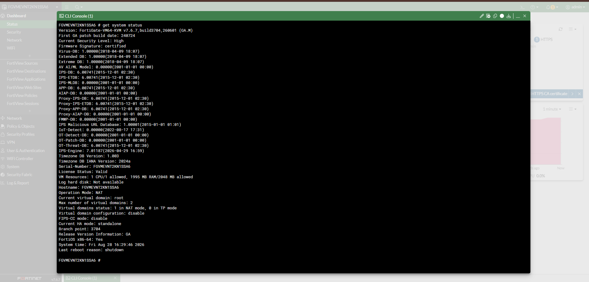

**Figure 1 — FortiGate system status and platform information.**

The relevant FortiGate interfaces are:

- `port1` — WAN/upstream interface using DHCP.
- `port2` — lab LAN interface with `10.10.10.1/24`.

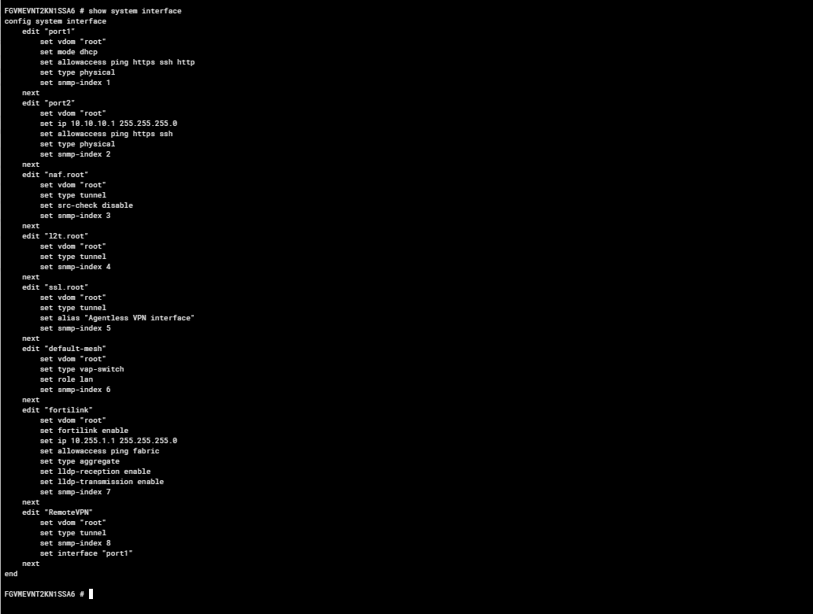

**Figure 2 — FortiGate interface configuration.**

The routing table shows the existing upstream route through `192.168.122.1` and the directly connected FortiGate networks.

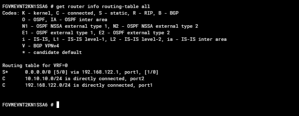

**Figure 3 — FortiGate routing table.**

The FortiGate WAN address is provided through the existing libvirt DHCP reservation:

```text
192.168.122.78
```

No additional static route was required for the Wazuh integration.

---

## 3. FortiGate → Wazuh Connectivity

Before configuring Syslog, connectivity between the FortiGate and the Wazuh host was verified.

The Wazuh host is:

```text
192.168.1.13
```

A ping from the FortiGate returned five successful replies with no packet loss.

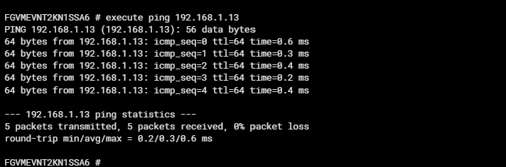

**Figure 4 — FortiGate successfully reaching the Wazuh host.**

A traceroute was also performed.

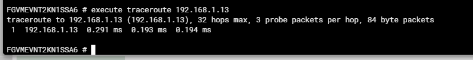

**Figure 5 — FortiGate traceroute to the Wazuh host.**

This established basic IP reachability before introducing Syslog into the troubleshooting process.

---

## 4. FortiGate Syslog Configuration

The initial FortiGate Syslog state was disabled.

The final configuration was changed to use the Wazuh host as the remote Syslog destination.

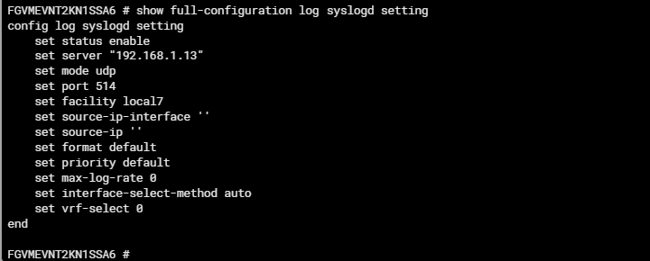

**Figure 6 — FortiGate Syslog settings.**

The resulting configuration uses:

```text
Syslog status : enabled
Server        : 192.168.1.13
Mode          : UDP
Port          : 514
Facility      : local7
Format        : default
```

The Syslog filter was also reviewed to determine which FortiGate event categories were forwarded.


**Figure 7 — FortiGate Syslog filter configuration.**

The final FortiGate Syslog configuration was then verified.

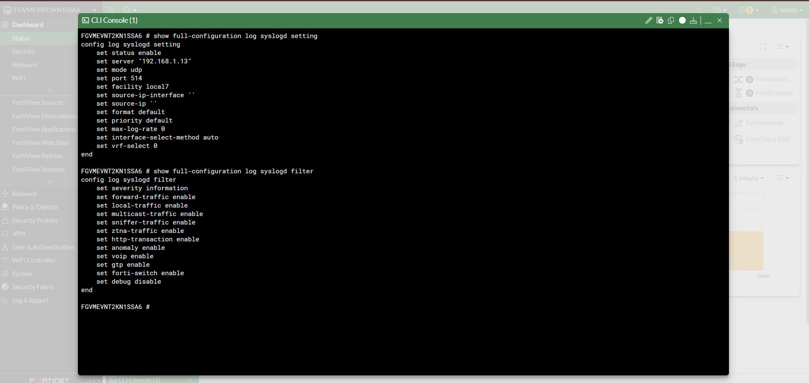

**Figure 8 — Final FortiGate Syslog destination and transport configuration.**

---

## 5. Wazuh Syslog Receiver

The Wazuh Manager was configured to accept remote Syslog messages on UDP/514.

The existing secure Wazuh agent listener on TCP/1514 was preserved.

The additional receiver was configured as:

```xml
<remote>
  <connection>syslog</connection>
  <port>514</port>
  <protocol>udp</protocol>
  <allowed-ips>192.168.122.78</allowed-ips>
</remote>
```

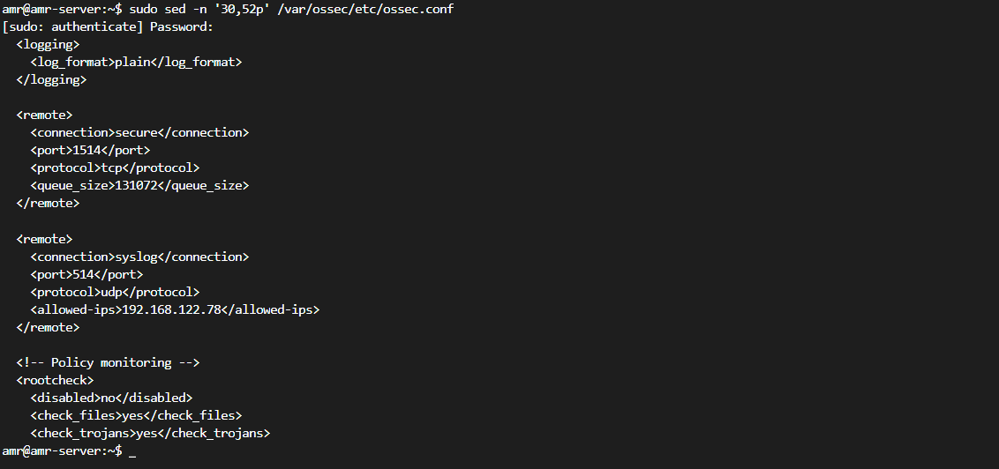

**Figure 9 — Wazuh Syslog receiver configuration.**

The `allowed-ips` value restricts the Syslog source to the FortiGate's reserved address rather than allowing the entire `192.168.122.0/24` network.

Before modifying the Wazuh configuration, a backup of `ossec.conf` was created and verified as identical to the original configuration.

The configuration was validated with:

```bash
sudo /var/ossec/bin/wazuh-analysisd -t
```

The Wazuh Manager was then restarted successfully.

---

## 6. UDP/514 Listener Verification

After the Wazuh configuration was applied, the host was checked to confirm that the Syslog receiver was actually listening.

The listener was verified on:

```text
UDP/514
```

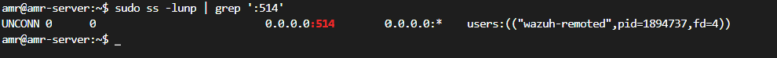

**Figure 10 — Wazuh listening on UDP/514.**

The listener is provided by `wazuh-remoted`.

At this stage the two sides of the connection were ready:

```text
FortiGate
192.168.122.78
      │
      │ UDP/514
      ▼
Wazuh
192.168.1.13
```

---

## 7. Initial Wazuh Configuration Issue

The first Syslog receiver configuration did not include an `allowed-ips` entry.

Wazuh reported:

```text
(1501): IP or network must be present in syslog access list
(allowed-ips). Syslog server disabled.
```

As a result, UDP/514 was not initially active.

The configuration was corrected by adding:

```xml
<allowed-ips>192.168.122.78</allowed-ips>
```

After the correction:

- The configuration passed validation.
- The Wazuh Manager restarted successfully.
- UDP/514 became active.

This confirmed that the initial problem was with the Wazuh Syslog access configuration rather than FortiGate connectivity.

---

## 8. Syslog Transmission Verification

Once both sides were configured, packet capture was used to verify the actual traffic instead of relying only on service status.

The Wazuh host captured Syslog packets originating from the FortiGate:

```text
192.168.122.78 → 192.168.1.13:514/UDP
```

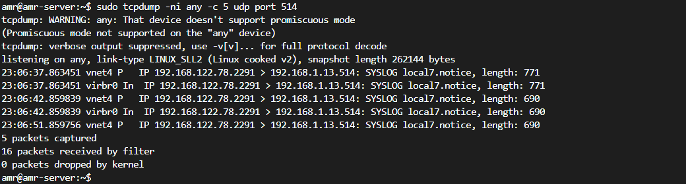

**Figure 11 — FortiGate Syslog packets captured on the Wazuh host.**

The capture shows FortiGate-generated Syslog messages using the `local7` facility.

The repeated `vnet4` and `virbr0` observations are a result of capturing on the Linux `any` interface in the libvirt environment; they do not represent separate FortiGate transmissions.

This verified the transport path independently of Wazuh's event processing.

---

## 9. Wazuh FortiGate Event Processing

Wazuh already includes native FortiGate decoders and rules.

The existing files are:

```text
/var/ossec/ruleset/decoders/0100-fortigate_decoders.xml
/var/ossec/ruleset/rules/0391-fortigate_rules.xml
```

No custom FortiGate decoder was required for the observed events.

The received FortiGate logs were processed by the native FortiGate decoder:

```text
fortigate-firewall-v5
```

The processed events contain FortiGate-specific fields such as:

```text
srcip
srcport
dstip
dstport
action
policyid
policyname
service
sessionid
srcintf
dstintf
```

This confirms that Wazuh was not only receiving the Syslog packets, but was also interpreting the FortiGate event structure.

---

## 10. FortiGate Detection Rule

One of the received events triggered the existing FortiGate-specific Wazuh rule:

```text
Rule ID: 81619
Description:
Fortigate: Multiple high traffic events from same source.
```

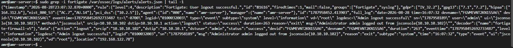

**Figure 12 — FortiGate event processed by Wazuh and associated with rule 81619.**

The event also contains the FortiGate network telemetry used by Wazuh for processing and correlation.

This provides the final processing path:

```text
FortiGate event
      ↓
Syslog / UDP 514
      ↓
Wazuh Syslog receiver
      ↓
FortiGate decoder
      ↓
Wazuh FortiGate rule
      ↓
Alert
```

---

## 11. Verification Summary

| Verification | Result |
|---|---|
| FortiGate system baseline collected | PASS |
| FortiGate routing verified | PASS |
| FortiGate → Wazuh reachability | PASS |
| FortiGate Syslog configured | PASS |
| Wazuh Syslog receiver configured | PASS |
| Wazuh UDP/514 listener active | PASS |
| FortiGate Syslog packets observed | PASS |
| FortiGate events processed by Wazuh | PASS |
| Native FortiGate decoder matched | PASS |
| FortiGate-specific Wazuh rule triggered | PASS |
| Rule `81619` observed | PASS |

The integration was therefore verified across the configuration, network transport, ingestion, and detection stages.

---

## 12. Security Considerations

The Wazuh Syslog listener was restricted to the FortiGate address:

```text
192.168.122.78
```

Rather than permitting the complete libvirt network:

```text
192.168.122.0/24
```

This reduces the number of hosts that can submit Syslog messages to the receiver.

The existing Wazuh agent communication channel on TCP/1514 was left unchanged.

The Wazuh Dashboard also remains on its separate HTTPS port:

```text
8443
```

The FortiGate administrative interface uses the same port number on a different host/interface context, so there is no port conflict between the two services.

The current integration uses standard Syslog over UDP/514. UDP does not provide the delivery guarantees or transport encryption associated with a secure, connection-oriented logging transport.

For this isolated home-lab environment, the configuration is sufficient for demonstrating the integration. A production deployment would require a separate review of secure transport, log reliability, access control, and centralized log infrastructure.

---

## 13. Current Scope and Limitations

This document covers the initial FortiGate → Wazuh integration.

The implementation successfully demonstrates:

- FortiGate Syslog generation.
- Network delivery to the Wazuh host.
- Wazuh Syslog reception.
- Native FortiGate event decoding.
- FortiGate-specific Wazuh rule processing.

The current evidence does not represent a complete validation of every FortiGate event category.

Dedicated testing of specific event classes such as:

```text
Denied traffic
VPN events
Administrative failures
Other security events
```

can be performed as part of later detection-engineering work.

Custom Wazuh FortiGate rules have also not been introduced at this stage because the native FortiGate support successfully processed the observed events.

---

## 14. Result

The FortiGate was successfully integrated with the existing Wazuh SIEM using Syslog over UDP/514.

The final verified path is:

```text
FortiGate
192.168.122.78
      │
      │ Syslog / UDP 514
      ▼
Wazuh Manager
192.168.1.13
      │
      ▼
FortiGate decoder
      │
      ▼
FortiGate Wazuh rules
      │
      ▼
Wazuh alerts
```

The integration is now operational and provides FortiGate network-security telemetry to the SIEM.

The next stage can build on this integration by validating additional FortiGate event types and developing correlation and detection use cases across the network and endpoint telemetry already present in the lab.
